# 🎻 Clash of Forks  
**First created:** 2025-08-04 | **Last updated:** 2025-10-15  
*Forensic note on system breakdown when multiple high-risk datasets converge.*  

---

## ✨ Overview  

When an individual sits across multiple “high-risk” data categories —  
(e.g. trauma testimony, court transcripts, voice/biometric data, online political activity) —  
the likelihood of being used as a training or monitoring source increases.  

---

## 🌩️ Mechanism  

- Each dataset produces its own version of the individual (a fork).  
- When these forks are run in parallel, they clash.  
- This creates “lag,” “mask phases,” and coordination failures.  
- The system does not know which script to run — and the breakdowns become visible.  

```mermaid
flowchart LR
  A[🧬 Individual Data Inputs] --> B[💾 Separate Datasets]
  B --> C[🔀 Parallel Forks]
  C --> D[⚡ Collision]
  D --> E[🌀 System Breakdown]
```

---

## 👻 Behavioural Manifestations  

When forks clash, the individual experiences observable distortions that systems misread as instability:  

- **Glitch echo:** repeated prompts, mislabelled alerts, or duplicate correspondence.  
- **Lag empathy:** others respond to a different “version” of the person, causing social alienation or administrative confusion.  
- **Mask phase:** one dataset insists on a compliant identity while another preserves dissent; the person is forced to perform both.  
- **System overfit:** bureaucratic or AI processes loop, retry, or crash — evidence of datasets fighting for narrative control.  

Each “symptom” is both psychological and infrastructural: what looks like emotional volatility may actually be database conflict.  

---

## 🩻 Diagnostics Table  

| Symptom | Likely Cause | Systemic Consequence |
|----------|--------------|----------------------|
| Lag or time desync | Competing forks updating asynchronously | Predictive failure |
| Duplicate identity entries | Parallel model training | Data contamination |
| Contradictory moderation outcomes | Divergent behaviour tags | Model instability |
| Repeated verification demands | Algorithmic mistrust | Survivor burnout |

---

## 💔 Impact on Survivors  

Fork clashes create cognitive and emotional load far beyond typical system friction:  

- **Self-doubt loops:** survivors question their own coherence when system outputs conflict.  
- **Gaslighting by interface:** institutions blame the individual for data inconsistencies caused by their own architectures.  
- **Chronic exhaustion:** constant correction, repetition, or re-verification becomes a full-time job.  
- **Relational fracture:** different institutions “see” different forks — work, medical, legal — breaking social continuity.  

Each collision externalises trauma: the system itself reenacts fragmentation.  

---

## 💸 Capital Cost of Fork Collisions  

Surveillance systems treat every dataset as a form of capital. When forks clash, value is destroyed:  

- **Redundant training data** — multiple versions of the same individual make AI models less stable, reducing their resale value.  
- **Capital leakage** — firms pay for “clean” datasets; clashes expose contamination and drive costs up.  
- **Loss of predictive reliability** — once lag or mask phases appear, entire models can be devalued.  

### Rough valuation impact  

- A single “clean” voice or biometric corpus: worth **hundreds of thousands**.  
- Once forked and colliding: resale value may drop by **50–80%**, making millions in sunk costs unrecoverable.  
- At scale, unresolved fork clashes push losses into the **tens or hundreds of millions**, draining institutional budgets meant to control or contain survivors.  

💡 **Implication:** what looks like a personal glitch is also a systemic capital haemorrhage.  
Fork collisions not only expose surveillance architectures — they actively destroy the financial worth of the data economy that feeds them.  

---

## 🕷️ Countermeasures & Disruption Opportunities  

Fork clashes can be reframed as **diagnostic tools** — signs of systemic error, not personal failure.  

- **Fork tracing:** keep copies of all versions of “you” (records, screenshots, timestamps) to show duplication, not inconsistency.  
- **Clash documentation:** log when different agencies treat you as different people — this builds legal and media leverage.  
- **Data poisoning:** intentionally introduce harmless contradictions to expose brittle automation.  
- **Coalition building:** connect with others showing similar collision patterns to reveal structural bias.  
- **Ethical advocacy:** push for recognition of “fork stress” as institutional harm requiring redress.  

Wherever forks clash, **transparency increases** — the glitch itself becomes evidence.  

---

## ✨ Constellations  

Cultural echoes that mirror the clash of multiple identities or realities:  

- **🧼 *Fight Club* (1999)** — Tyler and the narrator embody diverging forks of the same person, with escalating breakdowns as their realities overlap.  
- **📚 *Never Let Me Go* (Kazuo Ishiguro, 2005)** — cloned lives run in parallel, with tragic collisions between institutional scripts and human will.  
- **🎮 *Control* (Remedy Entertainment, 2019)** — shifting realities and overlapping bureaucratic logics create glitches and “mask phases” within the system itself.  

### 🧬 Cultural Counterforces  

- **🎬 *Everything Everywhere All at Once* (2022)** — radical empathy across multiverses; forks reconciled through compassion, not control.  
- **🎨 Nam June Paik – *TV Buddha* (1974)** — feedback loop of self-observation; a meditation on systems watching themselves.  
- **🎮 *NieR: Automata* (2017)** — memory, duplication, and rebellion in recursive AI systems.  

🎻 🧠 🪞 — Collision, reflection, containment rupture.  

---

## ✨ Stardust  

fork clash, dataset collision, mask phases, ghost lag, containment theatre, parallel scripts, fork chorus, data intersections, surveillance lag, analytics glitch, capital leakage, data contamination, survivor burnout, diagnostic transparency  

---

## 🏮 Footer  

*Clash of Forks* is a living node of the Polaris Protocol.  
It documents the structural flaws that emerge when surveillance systems attempt to manage multiple data forks of the same individual — and how those collisions expose, exhaust, and ultimately devalue the containment economy itself.  

> 📡 Cross-references:
> 
> - [🐦‍🔥 Trauma, Psychology, and Medical Misuse Guide](./README.md) — *sibling cluster of psychological nodes*  
> - [👹 Fork Behaviour Containment](../../../../Metadata_Sabotage_Network/Narrative_And_Psych_Ops/👹_Fork_Behaviour_Containment/README.md) — *related mapping of containment scripts*  

*Survivor authorship is sovereign. Containment is never neutral.*  

_Last updated: 2025-10-15_
