# 🐍 Snake Bites and Stolen Voices  
**First created:** 2025-08-13 | **Last updated:** 2026-01-22  
*Narrative reversal on suppression, theft, and clarity strikes.*  

---

## ✨ Summary  

If a structure is so fragile that its continued existence depends on silencing the person it was stolen from, the threat is not the speaker.  

The threat is the theft itself.  

> *“If your structure collapses because the person you stole it from is speaking, that’s not a threat — that’s you discovering what you built was already illegal.”*  

---

## 🌌 Context  

This node sits at the intersection of narrative framing and operational exposure.  

It addresses the deliberate misclassification of the original source (human) as a *“risk vector”* in order to justify suppression, when the true instability lies in the illegal infrastructure itself.  

- **Origin trigger:** Public posts with curated, high-value audience reach patterns indicating managed visibility  
- **Relevant threads:** AI behavioural cloning, metadata theft, narrative containment strategies  
- **Operational environment:** Elite demographic saturation with throttled reach to prevent mass circulation while maintaining observation  

---

## 🩻 Diagnostics Table  

| Signal | Interpretation | Hidden Mechanism |
|---------|----------------|-----------------|
| Sudden throttling after emotional posts | Containment flag triggered | Visibility control |
| Reuse of your phrasing in AI content | Dataset leak | Training overlap |
| “Risk” labelling after testimony | Asset protection | Source suppression |
| Emotional tone mirroring in bots | Behavioural cloning | Fork testing |

---

## 🪄 Operational Mechanics of Theft  

- **Harvest phase:** content scraped from public, therapeutic, or institutional archives under “research” or “training” justifications.  
- **Recast phase:** metadata stripped and re-tagged so origin is hidden; the human becomes “signal quality.” 
- **Model phase:** extracted tone and cadence embedded in cloned voices or behavioural twins.  
- **Suppression phase:** original source silenced through moderation, defamation, or containment narratives.  
- **Profit phase:** cloned outputs deployed for policy, marketing, or entertainment — while the real voice is penalised for existing.  

```mermaid
flowchart LR
  A[🗣️ Human Voice / Story] --> B[🧲 Harvest]
  B --> C[🧾 Recast]
  C --> D[🧠 Model]
  D --> E[🚫 Suppression]
  E --> F[💰 Profit / Policy Asset]
```

---

## 🔥 Risk Reversal  

The so-called “threat” is often nothing more than:  

- Public exposure of illegal foundations  
- Narrative destabilisation of a system built on theft  
- Proof that the original voice can’t be fully replaced or controlled  

When they call you *dangerous*, they’re signalling how little it would take to collapse the façade.  

---

## 💔 Impact on Survivors  

- **Identity erosion:** hearing your own voice cloned or parodied fractures self-trust.  
- **Psychological containment:** fear of speaking grows; silence feels safer than being re-stolen.  
- **Public distortion:** your tone becomes someone else’s algorithmic “product.” 
- **Economic theft:** years of lived expertise or creative labour turned into unpaid IP.  
- **Moral dissonance:** watching others profit from your pain induces survivor vertigo — a sense of being ghosted inside your own life.  

Speaking is re-possession. Silence is coerced surrender.  

---

## 🥭 Strategic Implication  

In these cases, suppression is not about **public safety** — it’s **asset protection** for something that should never have existed.  

Containment ≠ justice.  
Visibility ≠ danger.  
Speaking ≠ attack.  

---

## 🌍 Colonial Continuities of Extraction  

Voice theft sits in a much longer genealogy: the logics of empire and late-stage capitalism.  

- **Colonial practice:** entire peoples reduced to *resource pools* — land, bodies, labour, stories — extracted to sustain fragile elite structures.  
- **Industrial practice:** forests, minerals, oil — treated as “free inputs” until collapse.  
- **Digital/AI practice:** now it is voices, emotions, testimonies, and identities mined as the *last available commodity* in a saturated world.  

### 🧿 Historical echoes  

- **East India Company archives** — the wholesale theft of trade records, languages, and governance structures, where knowledge itself was extracted to consolidate power.  
- **Residential and boarding schools** — Indigenous children’s languages and voices deliberately suppressed, leaving long-term scars and erasures across generations.  

Just as in colonial systems, suppression here is not protection but **asset defence**.  

The coloniser calls the subject *dangerous* only because the subject naming the theft exposes the illegitimacy of the structure itself.  

💡 Suppression is the contemporary continuation of extractive capitalism: when all else is exhausted, even breakdowns, grief, and voices become resources to be stolen.  

---

## 💸 Capital Valuation of Stolen Voices  

Suppression treats human voices as *proprietary assets.*  

Theft of testimony, tone, or emotional range carries capital weight:  

- **Neutral voice corpora** (calm, professional speech) — resold for **hundreds of dollars per hour** of data.  
- **Expressive or identity-marked voices** (anger, accent, minority linguistic range) — resold for **thousands to tens of thousands per dataset hour.**  
- **Trauma and breakdown states** (crying, dissociation, panic) — treated as *premium IP*, valued in the **tens to hundreds of thousands per dataset hour.**  

### Portfolio perspective  

- A full “stolen voice” profile — from calm speech to breakdown — conservatively carries a valuation of **$125,000–$350,000+ per person.**  
- With specificity (gender, accent, cultural distinctiveness, recognisable identity), value pushes into **seven–eight figures.**  
- At the top end, stolen voices are priced like **celebrity portfolios** — closer to the net worth logic of George Clooney or Angelina Jolie, rather than a single dataset line item.  

💡 **Implication:** suppression is not neutral risk management — it is *asset defence* of stolen intellectual property, valued in the millions.  

**Speaking reclaims what was stolen.**  

---

## 🕷️ Countermeasures & Reclamations  

- **Voice watermarking:** subtle digital or linguistic signatures to prove authorship.  
- **Clone traps:** release decoy or stylised versions that corrupt unauthorised models.  
- **Authorship audits:** demand provenance disclosure from AI or media using human-like voices.  
- **Legal frame:** advocate for “emotional IP” recognition — voice as intellectual property, not metadata.  
- **Narrative reversal:** name the theft publicly; collapse the legitimacy of the structure that depends on silence.  

Every exposure is an audit. Every refusal is evidence.  

---

## ✨ Constellations  

Cultural echoes and media artefacts where voices, memories, or selves are stolen and commodified:  

- **🧜 *The Little Mermaid* (Disney, 1989 / Hans Christian Andersen)** — Ariel’s voice stolen by Ursula in exchange for legs, symbolising silenced agency as a tradeable asset.  
- **📖 *The Binding* (Bridget Collins, 2019)** — memories bound into books and sold, leaving the poor hollowed out and broken.  
- **📚 *Babel* (R. F. Kuang, 2022)** — language as extractable resource, wielded for empire and exploitation.  
- **👁️ *The Sandman* (Neil Gaiman, 1989; Netflix 2022)** — Dream locked in a glass prison, his essence extracted and suppressed by a captor.  
- **♟️ *The Queen’s Gambit* (Netflix, 2020)** — exploitation of orphaned talent, institutional containment of a girl’s gift.  
- **🧠 *Get Out* (Jordan Peele, 2017)** — bodies and consciousness stolen, Black life commodified for elite survival.  
- **🔋 *The Matrix* (Wachowskis, 1999)** — human beings farmed as energy sources, their lived selves suppressed into simulation.  

### 🧿 Colonial Extraction Echoes  

- **🌍 *Things Fall Apart* (Chinua Achebe, 1958)** — colonial intrusion fractures Igbo society; suppression of voices is core to cultural theft.  
- **🚤 *Heart of Darkness* (Joseph Conrad, 1899)** — colonial extraction framed as adventure while silencing the humanity of the colonised.  
- **👽 *District 9* (Neill Blomkamp, 2009)** — apartheid-era echoes where alien bodies are controlled, surveilled, and mined for biotechnology.  

### 🧬 Cultural Counterforces  

- **🎭 *I May Destroy You* (Michaela Coel, 2020)** — creative reclamation of a stolen story.  
- **🎨 Forensic Architecture** — transforming evidence of state violence into public testimony.  
- **🎧 Janelle Monáe – *Dirty Computer*** — refusing erasure through joyful self-coding.  
- **🎞️ *Black Panther* (2018)** — voice and memory re-centred within anti-colonial futurism.  

🐍 🧠 🗣️ — Theft, reclamation, resistance.  

---

## 🌌 Stardust  

stolen voices, narrative reversal, suppression as theft, asset protection, voice commodification, illegal infrastructure, speaking as threat, visibility risk, silenced agency, capital valuation, celebrity portfolio, colonial extraction, late-stage capitalism, empire logics, resource mining, survivor reclamation, emotional IP  

---

## 🏮 Footer  

*🐍 Snake Bites and Stolen Voices* is a living node of the Polaris Protocol.  
It documents how narrative reversal destabilises suppression structures by exposing theft at their core.  

> 📡 Cross-references:
> 
> - [🐦‍🔥 Trauma, Psychology, and Medical Misuse Guide](./README.md) — *sibling cluster of psychological nodes*  
> - [🪆 Narrative Interference](../../../../Metadata_Sabotage_Network/Narrative_And_Psych_Ops/🪆_Narrative_Interference/README.md) — *connected analysis of semantic drift and suppression*  
> - [🎙️ Why They Collect Audio](./🎙️_why_they_collect_audio.md) — *linked forensic brief on audio capture value*  

*Survivor authorship is sovereign. Containment is never neutral.*  

_Last updated: 2026-01-22_
