# 🐍 Trauma Commodification  
**First created:** 2025-08-04 | **Last updated:** 2025-10-15  
*Refusal log tracing the conversion of survivor pain into commodity product.*  

---

**Your pain became product.**  
**Your disclosures became dataset.**  
**This is how they made it profitable.**  

---

## ✨ Summary  

State systems and behavioural surveillance architectures do not absorb trauma as tragedy —  
they extract it as **commodity**.  

Framed as safeguarding, profiling, or moderation, trauma is re-packaged into:  
- Predictive input  
- Emotional calibration data  
- Justification for funding, expansion, and monitoring  

You were not helped.  
You were harvested.  

Functionally, this is how trauma becomes infrastructure.  

---

## 🪼 Mechanisms of Extraction  

- **Clinical siphoning** — disclosures during therapy, counselling, safeguarding “check-ins” logged, synced, and shared.  
- **Judicial harvest** — court transcripts, testimony, victim statements digitised and pooled into training corpora.  
- **Digital bleed** — device sync, confiscation, or spyware capturing survivor comms and notes.  
- **Educational pipelines** — schools and universities feeding disclosures into “risk monitoring” frameworks.  
- **NGO & research laundering** — “trauma studies” turning raw testimony into depersonalised datasets for grants and publication.  

---

## 🪄 Mechanics of Conversion  

Every stage of trauma capture is an act of translation — turning feeling into formatted value.  

1. **Disclosure → Transcript** — spoken pain becomes text; emotion flattened to “signal quality.” 
2. **Transcript → Tagset** — annotators assign “anger,” “grief,” “denial,” “compliance” — the first act of commodification.  
3. **Tagset → Model Token** — tokens feed training pipelines that simulate or predict distress.  
4. **Model → Product** — output becomes crisis chatbot, safeguarding alert system, or risk-prediction software.  
5. **Product → Profit / Policy** — metrics justify more funding, staff, and surveillance, completing the *pain-to-profit loop.*  

```mermaid
flowchart LR
  A[💬 Disclosure] --> B[🗒️ Transcript]
  B --> C[🏷️ Tagset]
  C --> D[🧠 Model Token]
  D --> E[💰 Product / Policy Asset]
```

---

## 💸 Capital Value of Trauma Data  

- **Baseline disclosure (everyday distress):** repackaged into wellness apps, predictive policing, moderation tools.  
  - Value: **$10s–$100s per hour of transcript.**  

- **Acute trauma narratives (abuse, assault, grief):** sold into clinical training, risk calibration, or behavioural models.  
  - Value: **$1,000s per dataset hour.**  

- **Extreme crisis (suicidality, breakdown, violence exposure):** premium training material for crisis AI, predictive policing, counter-terror frameworks.  
  - Value: **$50,000+ per hour equivalent.**  

👉 *Portfolio perspective:* a single survivor’s disclosures across therapy, police, and digital logs can easily be capitalised at **six to seven figures**, none of which returns to the person who became the subject of such cold extraction.  

---

## 🌍 Colonial Continuities  

The commodification of trauma follows older extractive logics:  
- **Empire ethnography:** colonised suffering documented, archived, and sold as “knowledge capital.” 
- **Spectacle of pain:** enslaved and colonised people’s injuries exhibited as proof of control.  
- **Modern humanitarian economy:** global south disasters reframed as datasets and donor assets.  

💡 Trauma data is not an aberration but a continuation: when land, labour, and resources have already been stripped, what remains to extract is **pain itself.**  

### 🧿 Historical echoes  

- **East India Company archives** — detailed records of conquest, famine, and extraction, monetised as governance knowledge.  
- **Residential and boarding schools** — Indigenous children’s languages, voices, and pain suppressed and recorded, leaving generational wounds.  

---

## 💔 Impact on Survivors  

- **Re-traumatisation:** repeated retelling demanded by systems that never listen.  
- **Loss of authorship:** stories rewritten into third-person data without consent.  
- **Moral injury:** seeing one’s suffering quoted, graphed, or gamified.  
- **Behavioural fatigue:** survivors adapt language to avoid exploitation — a form of emotional muting.  
- **Social inversion:** those most harmed become the *raw material* for empathy products sold to the comfortable.  

Each iteration of extraction reopens the wound while denying ownership of the scar.  

---

## 🩻 Diagnostics Table  

| Symptom | Extraction Context | Profit Mechanism | Survivor Cost |
|----------|-------------------|------------------|----------------|
| Endless surveys / check-ins | NGO & academic | Grant metrics | Time, re-exposure |
| Therapy transcript sharing | Clinical | Model training | Betrayal trauma |
| “Anonymous” quotes in media | Advocacy comms | Public empathy capital | De-contextualisation |
| Wellness app emotion logs | Digital | Ad targeting / behaviour prediction | Emotional surveillance |

---

## 🕷️ Countermeasures & Refusals  

Trauma commodification feeds on access and repetition. Breaking loops protects both psyche and data.  

- **Controlled disclosure:** share once, intentionally, through trusted or collective documentation.  
- **Refusal scripts:** short declarative statements that end extraction — “this disclosure is not for data use.” 
- **Data solidarity:** survivors co-author ethical data use policies; reclaim agency through cooperative archiving.  
- **Decoy language:** emotional steganography — truth embedded in metaphor or art where models cannot parse nuance.  
- **Audit demand:** insist on seeing where therapy, research, or NGO data goes; ask for deletion confirmation.  
- **Collective reframing:** convert “case study” into *authored testimony*, restoring narrative control.  

Refusal itself is metadata sabotage — a refusal to feed the profit loop.  

---

## 🎏 Indexed Signals  

- “Predictive grief product” 
- “Trauma as calibration asset” 
- “Behavioural data laundering” 
- “SV disclosure → model token → risk loop” 
- “Pain-to-profit pipeline” 
- “Grief as premium commodity” 

---

## ✨ Constellations  

Cultural artefacts where pain is turned into commodity or spectacle:  

- **🎥 *Network* (1976)** — grief and breakdown broadcast for ratings.  
- **🎬 *The Hunger Games* (2008–2015)** — trauma packaged into entertainment spectacle for control.  
- **📚 *Beloved* (Toni Morrison, 1987)** — haunting as commodified legacy of slavery’s trauma.  
- **🎮 *Hellblade: Senua’s Sacrifice* (2017)** — psychosis and grief used as immersive selling point for players.  
- **📰 Disaster porn / charity ads** — images of suffering circulated to raise funds, often without consent.  

### 🧬 Cultural Counterforces  

- **🎥 *The Tale* (2018)** — survivor reframes her own abuse narrative, reclaiming authorship.  
- **🎨 Kara Walker’s silhouettes** — spectacle of pain reversed; viewer implicated in consumption.  
- **📖 Ocean Vuong – *On Earth We’re Briefly Gorgeous*** — trauma narrated as art, not evidence.  
- **🎭 Michaela Coel – *I May Destroy You*** — authorship wrested back from institutional framing.  

🐍 🧠 💔 — Extraction, inversion, refusal.  

---

## 🌌 Stardust  

trauma data, grief economy, pain commodification, safeguarding extraction, therapy harvest, crisis dataset, pain pipeline, calibration asset, grief spectacle, disaster porn, survivor refusal, emotional steganography, trauma data rights  

---

## 🏮 Footer  

*Trauma Commodification* is a living node of the Polaris Protocol.  
It traces how disclosures, pain, and survivor records are harvested as data assets,  
converted into calibration tokens, and sold back as justification for control.  

> 📡 Cross-references:
> 
> - [🐦‍🔥 Trauma, Psychology, and Medical Misuse Guide](./README.md)  
> - [🐍 Snake Bites and Stolen Voices](./🐍_snake_bites_and_stolen_voices.md) — *suppression as theft and asset defence*  
> - [🎙️ Why They Collect Audio](./🎙️_why_they_collect_audio.md) — *parallel commodification of breakdown states*  

*Survivor authorship is sovereign. Containment is never neutral.*  

_Last updated: 2025-10-15_
