# 🧠 Humiliation as Governance  
**First created:** 2025-09-27 | **Last updated:** 2025-10-15  
*Marking and degrading the “other” as a systemic tactic of European governance.*  

---

## ✨ Definition  

Humiliation is not incidental.  
In European governance, humiliation has been a deliberate tactic — a way of marking populations as “other,” externalising them, and making ridicule itself a containment system.  

Where taxation or census systems in other empires (e.g. the *dhimmi* category in Islamic law) primarily structured fiscal and legal subordination, European practice went further: **humiliation was the tool, and violence its frequent outcome.**  

---

## ⏳ Historical Anchors  

- **Inquisition-era Spain** → Jewish and Muslim women, and sex workers, forced to wear red skirts or dresses as visible markers of “impurity.” 
- **Pointed hats** → Medieval Jewish men compelled to wear tall pointed hats — the lineage of the “witch’s hat” as a ridicule marker.  
- **Venice ghetto** → The Jewish quarter, from which the word *ghetto* derives, imposed curfews, water restrictions, and unsafe underground work routes. Jews were cut off from civic infrastructure and marked as diseased or dangerous.  
- **Nazi Germany** → The Magen David (yellow star) badges were not a novel invention, but a continuation of centuries of European humiliation-marking, now scaled into industrialised extermination.  

---

## ⚖️ Clarification: Dhimmi vs European Humiliation  

The *dhimmi* system under Islamic rule created a separate legal status for Jews and Christians. They paid the **jizya** tax, faced restrictions, and sometimes clothing rules. This was discriminatory and unequal — but its core function was **fiscal and legal subordination**. A sultan wanted the taxes; death served no purpose.  

By contrast, **European systems made humiliation the governing tactic itself**:  
- Badges, hats, and skirts to mark impurity.  
- Ghettos and segregated spaces to isolate.  
- Ritual and cultural misinterpretations (e.g. *Kol Nidre* prayers framed as duplicity; Jewish law on lending reframed as greed and usury).  
- Popularised stereotypes in culture (e.g. Shylock in *Merchant of Venice*).  

These distortions incubated tropes of **greed, duplicity, and dual loyalty** that were not just humiliating but lethal: they fed pogroms, expulsions, and executions across Spain, Germany, France, and Eastern Europe.  

**Key distinction:**  
- *Dhimmi* = discriminatory subordination, few executions tied directly to status.  
- *European humiliation* = systemic marking that escalated into routinised violence and, eventually, extermination.  

Using *dhimmi* as a rejoinder to minimise European antisemitism erases this difference. Far fewer died under *dhimmi* law, while European humiliation-marking repeatedly became the staging ground for pogroms.  

---

## 🔁 Containment Loops  

Humiliation produced feedback cycles:  

- **Segregation → survival → suspicion**  
  Jewish ghettos had lower Black Death mortality due to ritual hand-washing. Survival was reframed as “proof of guilt,” intensifying persecution.  
- **Marking → ridicule → exclusion → pogrom**  
  Badges and hats externalised communities, invited mockery, and made them visible targets for violence.  
- **Repetition → normalisation**  
  Once humiliation becomes systemic, repetition turns it from “blunder” into governance policy.  

---

## 🪢 Containment Loop: Humiliation as Governance  

```mermaid
flowchart LR
    M[🔖 Marking<br>Badges, hats, ghettos] --> 
    R[😡 Ridicule<br>Externalisation & mockery] --> 
    E[🚫 Exclusion<br>Isolation from community life] --> 
    P[🔥 Pogroms<br>Expulsions & violence] --> 
    N[♻️ Normalisation<br>Repetition as policy] --> M
```

---

## 🔗 Polaris Relevance  

- Shows containment as psychological: humiliation itself becomes governance.  
- Modern continuities:  
  - Asylum systems where applicants queue in public for hours.  
  - Welfare offices designed to shame recipients.  
  - Social media moderation erasing vernacular as “non-standard.” 
- Survivors know humiliation is not an accident of bureaucracy; it is engineered to enforce compliance.  

---

## 🧭 Survivorship Insight  

When humiliation repeats, it ceases to be accident and becomes policy.  
Survivors feel it personally, but it is structural: designed to externalise, stigmatise, and control.  

---

## 🌌 Constellations  

🧠 🔖 🔥 🪢 — This node maps humiliation as a deliberate governance tactic, from medieval badges to systemic containment loops.  

---

## ✨ Stardust  

humiliation, governance, antisemitism, containment loops, european history, pogroms, ghettos, ridicule, dhimmi comparison, systemic violence, survivor testimony  

---

## 🏮 Footer  

*Humiliation as Governance* is a living node of the Polaris Protocol.  
It traces the European lineage of humiliation-marking from medieval badges to Nazi stars, distinguishing it from other systems of subordination and showing how humiliation was weaponised into violence.  

> 📡 Cross-references:
> 
> - [🗝️ Deliberate Cultural Violation](../../🦕_Elder_Influencers/🗝️_Politics_Memory_Work/🗝️_deliberate_cultural_violation.md) — *repeated violation of faith and ritual as governance*  
> - [🌀 Forced Migration as Governance](../../🦕_Elder_Influencers/🛟_Borders_Boats_Walls/🌀_forced_migration_as_governance.md) — *displacement as control*  
> - [🧠 Psychological Containment](../../../../Metadata_Sabotage_Network/Narrative_And_Psych_Ops/🧠_Psychological_Containment/README.md) — *wider tactics of containment by shame, waiting, and ridicule*  

*Survivor authorship is sovereign. Containment is never neutral.*  

_Last updated: 2025-10-15_  
