# 🧪 Ego Insurance But Make It Personal  
**First created:** 2025-09-21 | **Last updated:** 2025-10-15  
*How a simple workplace bet over a “favourite case” metastasises into institutional vendetta.*  

---

## ⚡️ Toxic Rivalry Escalation Flow  

```mermaid
flowchart TD
    A["Workplace Bet<br/>(‘Favourite case’ wager)"] --> B["Loss of Face<br/>(Ego bruised)"]
    B --> C["Institutionalisation of Grudge<br/>(Surveillance, reports, gossip)"]
    C --> D["Case Becomes Proxy Warfare<br/>(Individual treated as pawn)"]
    D --> E["Funding Distortion<br/>(Rivalry shapes grants, programs)"]
    E --> F["Policy Distortion<br/>(Ego-driven strategies)"]
    F --> G["Systemic Fallout<br/>(Harassment, warped data, toxic culture)"]
```

---

## 🌊 Ripple of a Lost Bet  

```mermaid
flowchart TD
    subgraph Personal["1️⃣ Personal Circle — Ego & Reputation"]
        P1["Bet lost → humiliation"]
        P2["Reassert control"]
    end

    subgraph Team["2️⃣ Team Circle — Organisational Politics"]
        T1["Gossip & positioning"]
        T2["Weaponised paperwork"]
        T3["Factional rivalry"]
    end

    subgraph Institutional["3️⃣ Institutional Circle — Surveillance & Pressure"]
        I1["Case over-scrutinised"]
        I2["Extra surveillance = ego insurance"]
    end

    subgraph Structural["4️⃣ Structural Circle — Funding & Program Design"]
        S1["Hardline programs favoured"]
        S2["Soft programs undermined"]
    end

    subgraph Policy["5️⃣ Policy Circle — Strategic Distortion"]
        PL1["Ego → doctrine"]
        PL2["Reports entrench bias"]
    end

    subgraph Human["6️⃣ Human Circle — Personal Targeting"]
        H1["Endless monitoring"]
        H2["Harassment as necessity"]
        H3["Loss of opportunities"]
    end

    Personal --> Team --> Institutional --> Structural --> Policy --> Human
```

---

## 🪓 The Double Punishment Loop  

---

## 🎭 Performance Art as Punishment  

Harassment in this configuration functions not only as surveillance, but as **ritualised performance**.  
- Every new file note, every “risk update,” every re-circulated briefing acts as a **taunt**, deliberately visible to both rival professionals.  
- The “winner” of the original bet is forced to witness the destruction of the human subject, update after update, as if each intervention were a **curated reminder**: *“Look what you made me do.”*  
- The “case subject” is punished by having their life turned into a living theatre of monitoring — a recurring act staged for bureaucratic and sadistic satisfaction.  

In this sense, the vendetta is not just a long-tail punishment, but **a choreography of institutional cruelty**:  
- **Audience:** both the rival (“winner”) and the wider security-cleared circle.  
- **Stage:** the shared dashboards, digests, and surveillance feeds.  
- **Script:** framing harm as necessity, and repeating it until it becomes doctrine.  

The outcome is that two people — the rival and the case — are trapped in a **decade-long performance**, punished again and again for what began as a trivial contest.  

---

### 🎭 Performance Flow (Mermaid Diagram)  

---

## 🏥 Let Healthcare Exist vs. 🎯 Vendetta Logic

```mermaid
flowchart TD
    A["Teen trauma history + adolescent gender distress\n(binding, masc clothes)"]

    subgraph Care["🏥 Healthcare Path (what should happen)"]
        C1["GP / self-referral → gender clinic triage"]
        C2["Holistic assessment:\ntrauma screen, cPTSD differential,\nbody image, sexuality, safety"]
        C3["Care plan:\ntrauma-focused therapy, stabilisation,\noptionally gender support as needed"]
        C4["Periodic review:\nfunctioning improves, risk decreases"]
        C5["Discharge / step-down:\nclose case; normal life resumes"]
    end

    subgraph Vendetta["🎯 Vendetta Path (what actually happens)"]
        V1["Male ego loss over ‘favourite case’"]
        V2["Instrumentalise adolescent exploration\nas ‘ideology risk’ pretext"]
        V3["Convert benign updates into taunts\n(digests, file notes, briefings)"]
        V4["Keep watchlist open\n(‘ongoing susceptibility’ narrative)"]
        V5["Punish two people for 10+ years:\n• subject: surveillance & harassment\n• rival: reputation smears"]
    end

    A --> C1 --> C2 --> C3 --> C4 --> C5
    A --> V1 --> V2 --> V3 --> V4 --> V5

    style Care fill:#eef,stroke:#99f,stroke-width:1px
    style Vendetta fill:#fee,stroke:#f99,stroke-width:1px
```

*The utter stupidity of this whole hypothesis is that I's already worled this out and fought for the diagnosis and to get a foothold in the care, well before this surveillance would have been "justified", and therefore even need clarification.*

*Nudging-as-revenge has injured me, added to the human sexual exploitation burden, and been used to "almost get, not get" care for the underlying pathology.*

Tldr: I'm not sure trans people are the root cause harm, here.

---

## 🛡️ Policy Guardrails — Keeping Healthcare the Default  

To prevent petty vendettas from hijacking adolescent coping into indefinite surveillance, institutions must adopt clear **guardrails**:

- **Sunset clauses** — automatic review and closure after 6, 12, 24 months unless new, independent evidence justifies continuation.  
- **Access minimisation** — only healthcare providers and directly relevant safeguarding staff should see gender/trauma notes; no bleed into intelligence digests.  
- **Independent audits** — external ethics boards review long-tail cases for signs of vendetta or sadism.  
- **Case officer rotation** — mandatory reassignment after 6–12 months to prevent obsessive ownership of a “favourite case.” 
- **Healthcare first principle** — adolescent gender exploration is triaged as healthcare, not security. Default is GP → specialist → trauma-informed assessment.  
- **Whistleblower-safe reporting** — channels for staff to flag suspected process abuse or vendetta-driven justifications.  
- **Proof-of-harm standard** — risk designations must cite objective, independent evidence, not subjective interpretations of clothing or binding.  

---

💡 These guardrails turn “let healthcare exist” from a plea into a **structural defence**: adolescent trauma coping remains in the clinical domain, while institutions are blocked from weaponising it as a perpetual punishment.

---

## 🔄 Complicity Feedback Loop  

---

## 🎲 Rigged Bet Outcomes → Vendetta Cycle  

---

*In conclusion: men cannot be left alone for five minutes without at least one family heirloom being broken in the process. 24/7 supervision may be required if left in groups of 2 or more; G-d knows what they'll get up to.*

Pro tip: probably don't bet on anything involving case data, but also: learn to take a loss like a man.

>If you can make one heap of all your winnings  
>And risk it on one turn of pitch-and-toss,  
>And lose, and start again at your beginnings  
>And never breathe a word about your loss;  
>If you can force your heart and nerve and sinew  
>To serve your turn long after they are gone,  
 >And so hold on when there is nothing in you  
>Except the Will which says to them: ‘Hold on!’  
>If you can talk with crowds and keep your virtue,  
>Or walk with Kings—nor lose the common touch,  
>If neither foes nor loving friends can hurt you,  
>If all men count with you, but none too much;  
>If you can fill the unforgiving minute  
>With sixty seconds’ worth of distance run,  
>Yours is the Earth and everything that’s in it,  
>And—which is more—you’ll be a Man, my son!"  

<!---I don't really care if I'm barking up the wrong tree on what was simply an "escape route" nudge or a "vetting process audit of surveillance" turned into a witchunt. I am beyond done with the perverts stalking me under the premise of protecting Britannia from women who can say, "rape is really shit, actually", to a man's face. And all the other inconveniences: "racism is bad, actually", "homophobia is bad, actually", "transphobia is bad, avtually", "disabled people are full humans".

You know...all that crazy "people are of equal value, inherently", shit.--->

---

## 🏮 Footer  

*Ego Insurance But Make It Personal* is a living node of the Polaris Protocol.  
It maps how petty rivalries and bruised egos metastasise into bureaucratic vendettas, distorting governance loops, funding priorities, and policy itself.  

> 📡 Cross-references:
> 
> - [🌀 System Governance](../../🌀_System_Governance/README.md) — control loops and institutional distortions  
> - [Containment Scripts](../../../Containment_Scripts/README.md) — methods of sustained harassment  
> - [Metadata Sabotage Network](../../../../Metadata_Sabotage_Network/README.md) — data-twinning and signalling loops  

*Survivor authorship is sovereign. Containment is never neutral.*  

_Last updated: 2025-10-15_
