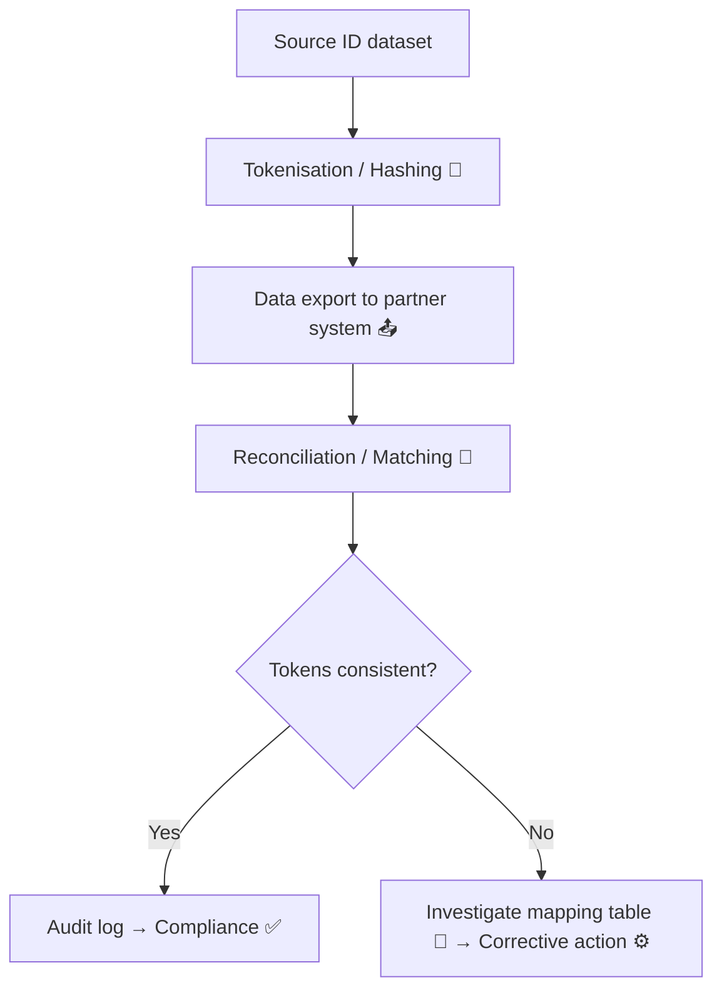

# 🪙 Token Integrity Audit — How to Check for Pseudonym Drift  
**First created:** 2025-11-11 | **Last updated:** 2025-11-12  
*Verifying the cryptographic DNA of your dataset.*

---

## 🧭 Orientation  

Every pseudonymised dataset relies on a simple promise: the token that represents you today is the same one that represented you yesterday — and not anyone else.  
When that promise fails, **token drift** occurs.  
This audit protocol defines how to check for drift, collision, and cross-environment contamination in linked data systems.

---

## ⚖️ Definition  

> **Token Integrity** measures whether a pseudonym or hashed identifier maintains one-to-one correspondence with its source identity over time and across systems.  

Failures of token integrity are rarely visible to end users. They occur quietly — during system migrations, retokenisation, or when different agencies use the same encryption salts or hash methods without alignment protocols.

---

## 🧩 Core Audit Stages  

| Stage | Purpose | Typical Tools | Key Questions |
|:------|:---------|:---------------|:---------------|
| **1️⃣ Baseline Verification** | Confirm mapping-table stability | Hash comparison, checksum audit | Have any tokens changed length or format? |
| **2️⃣ Cross-System Reconciliation** | Align identical pseudonyms across systems | Secure matching environment | Do identical tokens point to the same entity in each dataset? |
| **3️⃣ Collision Scan** | Detect duplicate tokens assigned to different entities | Fuzzy matching, deduplication audit | Are multiple real IDs sharing one pseudonym? |
| **4️⃣ Provenance Trace** | Reconstruct pseudonym lineage | Transformation logs, ETL specs | When and where did the last rehash occur? |

---

## 🧮 Process Diagram  

---

## 🪞 Drift Indicators  

- Token length or format changes between snapshots.  
- Multiple pseudonym prefixes appearing in the same dataset.  
- Lookup tables missing or renamed.  
- Hash functions or salts undocumented in DPIAs.  
- Apparent “new” tokens with old demographic metadata.  

---

## 🧰 Corrective Actions  

| Issue | Remediation | Responsible Role |
|:------|:-------------|:-----------------|
| **Duplicate tokens** | Generate new unique pseudonyms; preserve original mapping under sealed audit. | Data Controller |
| **Lost mapping table** | Reconstruct using historical backups; document uncertainty. | Data Architect |
| **Cross-domain collision** | Assign domain-specific token namespaces. | Information Governance Lead |
| **Inconsistent rehash** | Recompute using verified salt and log cryptographic parameters. | Security Officer |

---

## ⚙️ Verification Protocol  

1. Extract sample pseudonyms from each participating system.  
2. Compare structural integrity (length, entropy, character set).  
3. Validate checksum or HMAC signatures where implemented.  
4. Reconcile token lineage using creation timestamps.  
5. Document all anomalies and route to joint-controller review.  

All audit artefacts must be **read-only, encrypted, and retained for seven years** per accountability standards.

---

## 🌌 Constellations  

🪙 💾 🧬 🧾  

Token Integrity Audit forms the backbone of the **Integrity Spine**, ensuring that pseudonymisation across justice, safeguarding, and research systems remains traceable and stable.  
It directly supports **Data Twinning**, **Token Switching**, and **Data Lineage Review** nodes.

---

## ✨ Stardust  

token integrity, pseudonymisation, hashing, encryption salts, data lineage, justice data, mapping tables, audit procedure, cross-system reconciliation, data accuracy, governance compliance

---

## 🏮 Footer  

*🪙 Token Integrity Audit — How to Check for Pseudonym Drift* is a living node of the Polaris Protocol.  
It defines how to verify that pseudonymisation still means what it claims: one person, one token, one consistent story.

> 📡 Cross-references:
> 
> - 💾 Token Switching — Pseudonymisation Gone Wrong  
> - 🧬 Data Twinning — When Two Identities Become One Record  
> - 🧾 Data Lineage Review  

*Survivor authorship is sovereign. Containment is never neutral.*  

_Last updated: 2025-11-12_
