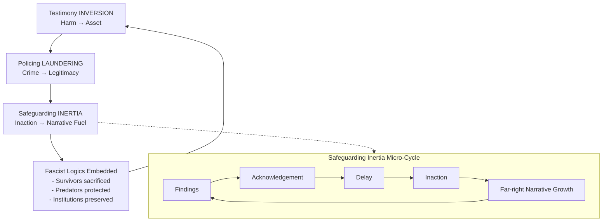

# ⚖️ Inversion and Laundering as State Technique  
**First created:** 2025-09-05 | **Last updated:** 2025-10-15  
*How harm, coercion, and abuse are reframed as protective or necessary to serve institutional and financial power.*  

---

## ⚠️ Content Note  

This node discusses **sexual violence and child safeguarding failures**.  
It does so in order to examine patterns of **institutional inertia, mismanagement, and systemic benefit** from inaction.  
The purpose is not to sensationalise harm, but to identify **root causes** of why such issues remain unaddressed despite decades of reports and evidence.  

---

## Core Idea  

Three interlinked techniques sustain authoritarian and fascist logics in democratic systems:  

- **Inversion**: survivor testimony and lived harm are flipped into institutional assets.  
- **Laundering**: abusive or criminal conduct is reframed as legitimate policing or security.  
- **Safeguarding Inertia**: child sexual exploitation inquiries remain un-actioned, producing narrative fuel for fascist mobilisation.  

Though they target different materials — testimony, policing practices, or safeguarding failures — they are structurally identical: harm is re-coded as protection, trauma is collateralised, and silence is transformed into utility.  

*See structural loop diagram below for a visual schema of how these techniques interlock, with the safeguarding inertia cycle nested inside.*  

---

## Part I: Survivor Testimony Inversion  

Survivor testimony — especially rape testimony — is repurposed:  

- **Neutralising dissent**: Jewish women dissenting from Zionism reframed as unstable or weaponised.  
- **Racialised scapegoating**: Muslim men targeted via false claims.  
- **Shielding predators**: men with financial/state value protected despite abuse.  

**Mechanism:**  
1. Extract testimony/records without consent.  
2. Re-encode survivor dissent as instability or harassment.  
3. Protect institutionally useful predators.  
4. Present public cover as “safeguarding.”  

**Outcome:** survivor is collateralised, racialised suspicion deepens, and institutional power is preserved.  

---

## Part II: Laundering Abuse as Policing  

Undercover operations and surveillance practices are reframed as lawful and protective, despite deep abuses.  

- **Spy cops example**: sexual relationships and identity manipulation justified as “operational tools.”  
- **Undercover Policing Inquiry (UCPI)**: decades of infiltration, little evidence of proportional benefit.  

**Mechanism:**  
1. Justification: officers told they protect public order.  
2. Authorised criminality: abusive practices normalised.  
3. Institutional cover: secrecy and security exemptions.  
4. Exposure: inquiries reveal harm, but reforms stall.  

**Outcome:** institutional capacity preserved, contracts funded, survivors and communities harmed.  

---

## Part III: Safeguarding Inertia  

Child sexual exploitation (CSE) inquiries — including the **Jay Report (2014)** — highlight a pattern where evidence exists, but systemic inaction follows.  

- **Reports exist**: multiple inquiries documented extensive exploitation and institutional awareness.  
- **Action stalls**: recommendations were delayed or only partially implemented.  
- **Narrative vacuum opens**: fascist and far-right groups exploit “inaction” to mobilise, claiming state collapse.  
- **Scapegoating intensifies**: asylum seekers, Muslims, and migrants are targeted in broad-brush, racialised ways.  
- **Survivors remain unprotected**: their experiences are collateralised, serving as political fuel rather than triggers for protection.  

**Outcome:** safeguarding failures are not only neglect, but also **deliberate narrative cultivation**. Institutional inertia creates conditions for fascist violence and legitimises racial scapegoating, while leaving survivors and future victims exposed.  

---

### 🗂️ Timeline Sidebar: Key Inquiries, Responses, and Inertia  

- **2014 — Jay Report (Rotherham CSE Inquiry)**  
  - Findings: at least 1,400 children exploited over 16 years; active suppression of concerns.  
  - Response: recommendations acknowledged; limited early actions; structural reform delayed.  
  - Outcome: far-right narratives around “grooming gangs” intensified; survivors left vulnerable.  

- **2015 — Casey Report (Rotherham Borough Council)**  
  - Findings: confirmed “culture of denial” and wilful blindness among officials.  
  - Response: leadership changes announced; deeper reforms postponed.  
  - Outcome: narrative of local government collapse exploited by fascist groups.  

- **2015–2022 — IICSA (Independent Inquiry into Child Sexual Abuse)**  
  - Findings: national-scale institutional failings across multiple sectors.  
  - Response: broad recommendations issued; uneven adoption; significant delay in legislation.  
  - Outcome: long duration diluted urgency; far-right rhetoric framed inaction as systemic betrayal.  

- **2018 — Ofsted Thematic Inspections**  
  - Findings: safeguarding gaps persisted despite earlier reports.  
  - Response: incremental adjustments; no wholesale change.  
  - Outcome: created impression that systemic inertia was tolerated.  

- **2020 — Operation Linden (South Yorkshire Police review)**  
  - Findings: acknowledged police failings and mistrust by survivors.  
  - Response: apology issued; limited accountability mechanisms implemented.  
  - Outcome: survivors’ mistrust deepened; extremist groups leveraged the gap.  

- **Ongoing — Multiple local safeguarding board reviews**  
  - Findings: recurring failures to act on intelligence or embed reforms.  
  - Response: reports acknowledged; cycles of partial uptake repeat.  
  - Outcome: each repetition entrenches the perception of wilful neglect, fuelling racialised street violence.  

*📡 Cross-reference: See structural loop diagram above for visual mapping of this inertia cycle.*  

---

## Shared Pattern  

- **Inversion / Laundering / Inertia** = Harm → Necessity / Utility.  
- Survivors and communities are **sacrificed**.  
- Predators and institutions are **protected**.  
- Fascist logics are **embedded** under the veneer of democracy.  

*See structural loop diagram below for a visual schema of how these techniques interlock, with the safeguarding inertia micro-cycle nested inside.*  

---

*Diagram: Structural loop of inversion, laundering, and inertia, each feeding into the embedding of fascist logics.  
The nested cycle inside safeguarding inertia shows how reports repeatedly follow the pattern — Findings → Acknowledgement → Delay → Inaction → Far-right Narrative Growth → Findings.*  

*📡 Cross-reference: See [🗂️ Timeline Sidebar](#️-timeline-sidebar-key-inquiries-responses-and-inertia) for chronology of reports and response patterns.*  

---

## 🏮 Footer  

*Inversion and Laundering as State Technique* is a living node of the Polaris Protocol.  
It maps how survivor testimony, abusive policing, and safeguarding inertia are structurally reframed into institutional assets, embedding coercion as legitimacy.  

*Survivor authorship is sovereign. Containment is never neutral.*  

_Last updated: 2025-10-15_  
