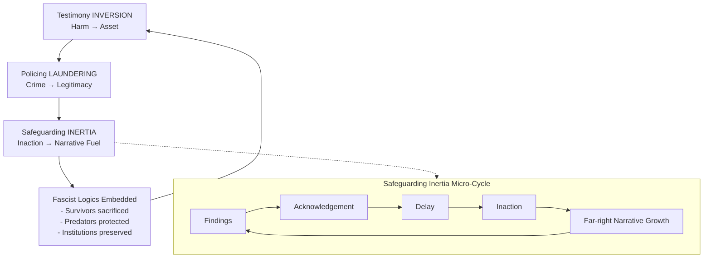

# ⚖️ Inversion and Laundering as State Technique  
**First created:** 2025-09-05 | **Last updated:** 2026-02-05  
*How harm, coercion, and abuse are reframed as protective or necessary to serve institutional and financial power.*  

---

## ⚠️ Content Note  

This node discusses **sexual violence and child safeguarding failures**.  
It does so in order to examine patterns of **institutional inertia, mismanagement, and systemic benefit** from inaction.  
The purpose is not to sensationalise harm, but to identify **root causes** of why such issues remain unaddressed despite decades of reports and evidence.

---

## 🧭 Core Idea  

Three interlinked techniques sustain authoritarian and fascist logics inside systems that present as democratic:

- **Inversion**: survivor testimony and lived harm are flipped into institutional assets.  
- **Laundering**: abusive or criminal conduct is reframed as legitimate policing or security.  
- **Safeguarding Inertia**: child sexual exploitation inquiries remain repeatedly un-actioned, producing narrative fuel for fascist mobilisation.

Though they target different materials — testimony, policing practices, or safeguarding failures — they are structurally identical:

> harm is re-coded as protection, trauma is collateralised, and silence is transformed into utility.

*See structural loop diagram below for a visual schema of how these techniques interlock, with the safeguarding inertia cycle nested inside.*

---

## 🧩 Part I: Survivor Testimony Inversion  

Survivor testimony — especially rape testimony — is repurposed:

- **Neutralising dissent**: survivor dissent reframed as unstable, obsessive, or weaponised.  
- **Racialised scapegoating**: marginalised groups targeted via distorted or false claims.  
- **Shielding predators**: men with financial/state value protected despite abuse.

**Mechanism:**  
1. Extract testimony/records without consent.  
2. Re-encode survivor dissent as instability or harassment.  
3. Protect institutionally useful predators.  
4. Present public cover as “safeguarding.”

**Outcome:** survivor is collateralised, racialised suspicion deepens, and institutional power is preserved.

---

## 🧼 Part II: Laundering Abuse as Policing  

Undercover operations and surveillance practices are reframed as lawful and protective, despite deep abuses.

- **Spy cops example**: sexual relationships and identity manipulation justified as “operational tools.”  
- **Undercover Policing Inquiry (UCPI)**: decades of infiltration, little evidence of proportional benefit (and persistent institutional resistance to full accountability).

**Mechanism:**  
1. Justification: officers told they protect public order.  
2. Authorised criminality: abusive practices normalised.  
3. Institutional cover: secrecy and security exemptions.  
4. Exposure: inquiries reveal harm, but reforms stall.

**Outcome:** institutional capacity preserved, contracts funded, survivors and communities harmed.

---

## 🕯️ Part III: Safeguarding Inertia  

Child sexual exploitation (CSE) inquiries highlight a pattern where evidence exists, but systemic inaction follows.

- **Reports exist**: multiple inquiries documented extensive exploitation and institutional awareness.  
- **Action stalls**: recommendations were delayed or only partially implemented.  
- **Narrative vacuum opens**: fascist and far-right groups exploit “inaction” to mobilise, claiming state collapse.  
- **Scapegoating intensifies**: asylum seekers, Muslims, and migrants are targeted in broad-brush, racialised ways.  
- **Survivors remain unprotected**: their experiences are collateralised, serving as political fuel rather than triggers for protection.

**Outcome:** safeguarding failures are not only neglect; they become *functional*.  
Institutional inertia creates conditions for fascist violence and legitimises racial scapegoating, while leaving survivors and future victims exposed.

---

## 🕰️ Temporal Laundering of Concern  

Safeguarding failures did not “arrive” in the 2010s. They were repeatedly identified, reframed, and deferred across decades — which is why the public keeps feeling we are **almost** getting there.

- In the **1990s**, concerns were fragmented and treated as isolated incidents, individual pathology, or local dysfunction.  
- In the **2000s**, similar harms were reframed through lenses of disorder, cohesion, or criminality rather than child protection.  
- After major exposure, action became politically safe only when perpetrators were dead, institutions could narrate reform, and liability was containable.

This rotating concern frame prevents cumulative recognition. Each inquiry appears new while preserving the same outcome: delayed protection, diluted responsibility, and narrative reset.

---

## 🪞 Cultural Laundering and Media Tolerance  

Safeguarding failure was also sustained by cultural displacement: abuse was framed as something that happened “elsewhere” or “back then,” rather than as an embedded feature of everyday institutions.

- Abuse was discussed through **distant containers** (overseas institutions, closed moral worlds, historic scandals).  
- Professional cultures in journalism and cultural production often treated predation as collateral: eccentricity, inevitability, or “how the industry is.”  
- This produced a misalignment: the media class often behaved as if the public already “knew,” while many members of the public did not have a framework to recognise proximate institutional access as a risk factor.

This is why questions like “why was Jimmy Savile always there?” mattered so much: not because one institution is uniquely evil, but because **tolerance is distributed across elite systems**.

---

## 🧭 Comparative Moral Displacement  

**Comparative Moral Displacement** is a governance failure mode where recognition of harm is routed through distant, extreme, or historically closed cases — allowing moral acknowledgement without present accountability.

Abuse becomes easiest to recognise when it is:
- geographically remote,  
- temporally closed,  
- or morally exceptional.

Cultural reckonings with historic overseas abuse — including the forced migration of British children to Australia, later popularised through works such as *Oranges and Sunshine* — can inadvertently reinforce this displacement: harm is recognised, but safely located elsewhere.

**Comparative Moral Displacement does not deny abuse; it contains it.**  
Abuse is always legible — just never local.

---

## 🪦 Recognition Without Repair  

Recognition can also become a terminal containment mechanism: the harm is named, therefore the institution claims closure.

This is visible in the long afterlife of the Magdalene Laundries: widely acknowledged as abusive, culturally legible as injustice — yet many survivors remain without comprehensive repair.

Acknowledgement becomes an endpoint rather than a trigger for justice.

---

## 🧱 Abuse as an Imperial Control Technology  

Across the British Empire, child abuse appeared with striking consistency across:
- residential schools and missionary institutions  
- child migration schemes  
- welfare and correctional systems  
- informal regimes of discipline within elite and working-class contexts alike

The effect was not incidental: abuse severed trust between children and parents, fractured communities, enforced silence, and normalised institutional authority over intimate life.

This pattern disciplined both colonised populations and the colonising class. Harm functioned as a governance technology — producing obedience, fear, and administrative control — which is why its logics persist.

---

## 🗂️ Timeline Sidebar: Key Inquiries, Responses, and Inertia  

- **2014 — Jay Report (Rotherham CSE Inquiry)**  
  - Findings: at least 1,400 children exploited over 16 years; active suppression of concerns.  
  - Response: recommendations acknowledged; limited early actions; structural reform delayed.  
  - Outcome: far-right narratives intensified; survivors left vulnerable.

- **2015 — Casey Report (Rotherham Borough Council)**  
  - Findings: confirmed culture of denial and wilful blindness.  
  - Response: leadership changes announced; deeper reforms postponed.  
  - Outcome: narrative of collapse exploited by extremists.

- **2015–2022 — Independent Inquiry into Child Sexual Abuse (IICSA)**  
  - Findings: national-scale institutional failings.  
  - Response: recommendations delayed and unevenly adopted.  
  - Outcome: urgency diluted; betrayal narratives intensified.

- **2018 — Ofsted Thematic Inspections**  
  - Findings: safeguarding gaps persisted.  
  - Response: incremental adjustments only.  
  - Outcome: inertia normalised.

- **2020 — Operation Linden**  
  - Findings: acknowledged police failings and survivor mistrust.  
  - Response: apology issued; limited accountability.  
  - Outcome: mistrust deepened.

---

## 🧠 Shared Pattern  

- **Inversion / Laundering / Inertia** = Harm → Necessity / Utility  
- Survivors and communities are sacrificed  
- Predators and institutions are protected  
- Fascist logics are embedded under the veneer of democracy  

This is how systems stall action while appearing responsive.

---

## 🔁 Structural Loop Diagram  

---

## 🚨 Legitimacy Fracture and Renewal Threshold

Exposure without repair has eroded confidence in inherited authority.
Symbolic reform and scapegoating no longer stabilise legitimacy.

Renewal is no longer aspirational. It is necessary.  

---

## 🛑 Anti-Distraction Principle

Abstract targets without internal reckoning reproduce containment.

Institutions must name, remove, and reckon with perpetrators within their own structures before claiming authority to dismantle others.  

---

## 🧾 Diagnostic Outcome

This node functions as:  

- 🔍 Structural diagnosis
- 🚨 Red-line warning

A system that cannot survive justice is already collapsing.  

---

## 🌌 Constellations

⚖️ 🕯️ 🫀 🧠 🧿 — governance ethics, institutional inversion, safeguarding failure, diagnostic exposure, moral witnessing.  

---

## ✨ Stardust

institutional inversion, safeguarding inertia, comparative moral displacement, abuse laundering, imperial governance, media complicity, survivor testimony, legitimacy fracture, renewal  

---

## 🏮 Footer

*⚖️ Inversion and Laundering as State Technique* is a living node of the Polaris Protocol.  
It documents how harm is converted into institutional legitimacy — and why justice is now the only stabilising intervention.  

*Survivor authorship is sovereign. Containment is never neutral.*  

_Last updated: 2026-02-05_
