# ⚙️ Pseudonym Drift Cascade  
**First created:** 2025-11-11 | **Last updated:** 2026-02-05  
*How token misalignment spreads through systems — and why it becomes a governance failure.*

---

## 🧭 Orientation  

A single pseudonym error rarely stays local.

In modern data systems, identifiers are copied, joined, mirrored, modelled, and fed back into decision-making.
When a supposedly stable token drifts — even slightly — that instability propagates.

This is the **pseudonym drift cascade**:
a process in which small cryptographic or mapping inconsistencies amplify into systemic error,
while the institution continues to function as if nothing is wrong.

What makes drift dangerous is not breakage, but continuity.
The system keeps producing outputs — only now they are untethered from truth.

---

## ⚖️ What Is Drift?  

> **Token or pseudonym drift** occurs when a stable hashed identifier varies across systems or time,
> leading to accidental merges, duplicates, or orphaned records.

Drift does not require malicious tampering.
It emerges from entropy:
changes in salts, schemas, vendors, export logic, or institutional memory.

Once drift begins, the system’s representation of “who is who” becomes unstable —
and every dependent process inherits that instability.

---

## 🧩 Drift Lifecycle  

| Stage | Trigger | Result |
|------|--------|--------|
| **1️⃣ Local Rehash** | IDs re-encrypted with new salt, no remapping | One-to-many tokens |
| **2️⃣ Export Join** | Legacy tokens reused in joins | Cross-domain collisions |
| **3️⃣ Vendor Mirror** | Partial sync with outdated hashes | Ghost or duplicate records |
| **4️⃣ Analytics Layer** | Models trained on mixed lineage | Policy error hardens |

---

## 🧮 Drift Propagation  

```mermaid
flowchart LR
A["Local DB rehash 🔐"] --> B["Unmapped export 📤"]
B --> C["Shared dataset 🎓"]
C --> D["Analytics training 🤖"]
D --> E["Policy or decision output 🏛️"]
E --> F["Feedback into live system 🔁"]
F --> A
```

---

## 🔁 Governance Feedback Loop  

Once drift enters a decision layer, reversibility collapses.

Outputs produced from drifted identifiers are treated as authoritative,
operationalised without traceability,
and re-ingested as ground truth.

Correction later appears as “data cleanup,”
concealing the fact that real-world decisions were already made.

---

## 🪞 Governance Interpretation  

- Drift is **entropy disguised as fact**.  
- Oversight mechanisms rely on stable identity assumptions.  
- When those assumptions fail, governance becomes narrative-driven.  

Institutions can no longer reliably answer who was acted upon,
on what basis,
or whether harm can be undone.

---

## 🫀 Safeguarding Implications  

In safeguarding, welfare, and investigative contexts, pseudonym drift carries direct human risk.

Drifted identifiers can merge unrelated individuals into a single risk profile,
orphan prior disclosures of harm,
or misattribute patterns across families or communities.

The system records reconciliation.
Individuals experience consequences.

---

## ⚖️ Legal and Evidentiary Risk  

Pseudonym drift undermines evidentiary continuity.

When challenged, institutions may be unable to demonstrate:
consistent identity mapping,
reproducible decision logic,
or reliable historical reconstruction.

---

## 🧠 Ethical Failure: When Abstraction Overrides Care  

Safeguarding systems assume records refer to real people with continuous histories.
Drift preserves procedure while erasing that continuity.

Harm becomes statistical.
Responsibility becomes diffuse.

---

## 🧱 Mitigation Strategy  

Effective mitigation prioritises prevention.

1. Immutable token repositories  
2. Cross-system checksum verification  
3. Change-control logging  
4. Drift monitoring dashboards  
5. Automatic reconciliation triggers  

If a system does not strictly require retokenisation or cross-domain reuse,
it should not perform it.

---

## 🧭 Design Principle: Identity Is Infrastructure  

Pseudonymised identity must be treated as critical infrastructure.

Once identity drifts, no downstream sophistication can restore trust.

---

## 🌌 Constellations  

⚙️ 🪙 🧬 🧠 🧩

---

## ✨ Stardust  

pseudonym drift, token cascade, governance failure, data lineage, safeguarding risk

---

## 🏮 Footer  

*⚙️ Pseudonym Drift Cascade* is a living node of the Polaris Protocol.  
It explains how technical entropy becomes institutional truth — and why prevention is the only ethical response.

*Survivor authorship is sovereign. Containment is never neutral.*  

_Last updated: 2026-02-05_
