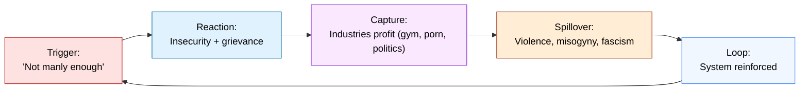
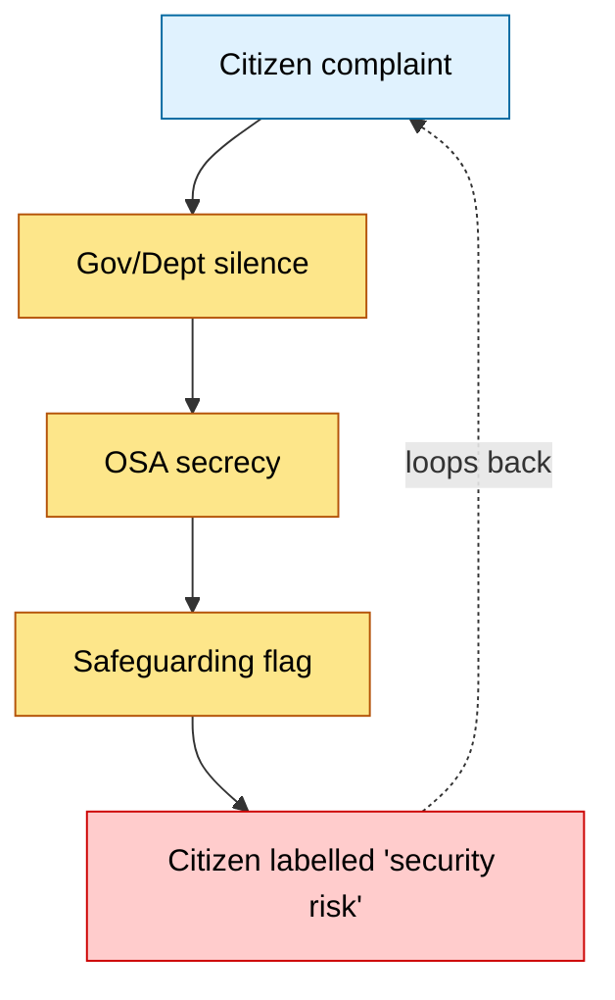

# 🌀 Masculinity Extraction ↔ Governance Containment  
**First created:** 2025-09-06 | **Last updated:** 2025-10-15  
*A diagnostic of how capitalism profits from men’s insecurity while governance denies and silences the harms that follow.*  

---

## ✨ Sections
1. [Extraction Loop (Economy)](#1-extraction-loop-economy)  
2. [Containment Loop (Governance)](#2-containment-loop-governance)  
3. [Citizen Forking](#3-citizen-forking)  
4. [Closing Frame](#4-closing-frame)  

---

## 💰 Extraction Loop (Economy)

Capitalism thrives on making men feel insufficient:

- **Trigger:** “You’re not manly enough.” 
- **Reaction:** insecurity, grievance, defensive consumption.  
- **Capture:** industries monetise churn (supplements, guns, porn, politics).  
- **Spillover:** men lash out → misogyny, violence, fascism.  
- **Result:** patriarchy + capitalism both strengthened.

[🔝 Back to top](#🌀-masculinity-extraction-↔-governance-containment)

---

## 🏛 Containment Loop (Governance)

Governance fails to confront this volatility:

- **Assumes male restraint:** “reasonable man” as baseline.  
- **Downplays structural drivers:** treats harms as individual choice.  
- **Silences survivors:** OSA secrecy + proof burden.  
- **Re-absorbs risk as safeguarding:** complainant flagged instead of abuser.  

[🔝 Back to top](#🌀-masculinity-extraction-↔-governance-containment)

---

## 🍴 Citizen Forking

Together, the loops converge:

- **Economy** extracts men’s insecurity into profit + violence.  
- **Governance** refuses structural accountability, reassigns risk.  
- **Citizen** ends up forked: silenced, flagged, contained.  

---

## 🪬 Closing Frame

- Extraction loop = **money made from men’s emotions.**  
- Containment loop = **liability hidden by governance opacity.**  
- Outcome = **citizens (esp. women) trapped in harassment even before it is extreme.**

---

## 🏮 Footer

*Masculinity Extraction ↔ Governance Containment* is a living node of the Polaris Protocol.  
It documents how economic systems profit from male volatility while governance structures deny or silence its harms.  

*Survivor authorship is sovereign. Containment is never neutral.*  

_Last updated: 2025-10-15_  

