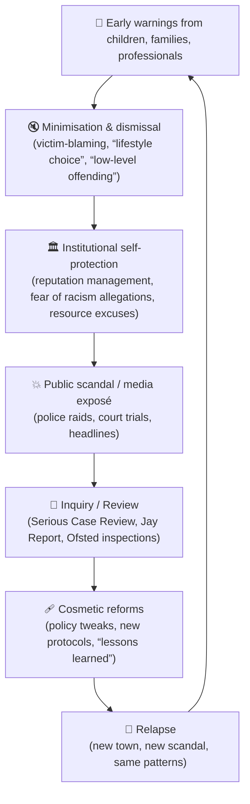

# 👀 Failure Cycle vs. Reported Improvements  
**First created:** 2025-09-21 | **Last updated:** 2025-10-15  
*Diagnostic node mapping the recurring exploitation failure cycle against Newcastle’s reported reforms.*  

---

## 🌀 The Failure Cycle  

---

## 📋 Reported Improvements in Newcastle (post-Sanctuary)

| Report / Action | Date(s) | What Changed / Implemented | Strengths Noted | Gaps / Concerns |
|---|---|---|---|---|
| **Joint Serious Case Review (Spicer)** | 2018 | Multi-agency Sexual Exploitation Hub; stronger victim focus; training; awareness | Acknowledged past failures; created new structures | Prevention/long-term impact unclear; slow on perpetrator analysis |
| **Operation Sanctuary → Complex Abuse Unit** | 2018 | Dedicated unit; £3.5m Home Office innovation fund; expanded victim teams | Concrete resourcing; multi-agency focus | Funding sustainability; accountability overlap |
| **Ofsted Inspections** | 2023, 2025 | 2025: *Good* overall; *Outstanding* for child protection | Workforce praised as skilled; timely & effective responses | Inspections process-focused; less on lived outcomes |
| **Safeguarding Board “Learning Briefings”** | 2019– | Summaries of JSCR lessons; embedding awareness | Improved victim-focused practice; raised practitioner knowledge | Declared “embedded” early; ongoing challenges |
| **Adult & Cross-Partnership Safeguarding (M-SET)** | 2023–24 | Updated policies; online referrals; competence framework; cross-partnership groups | More joined-up work across children/adults; wider training reach | Quality of non-specialist practice unclear; prevention vs. response balance |

---

## 📉 Comparative Reading  

- **Cycle persists nationally.** Newcastle’s changes echo “lessons learned” in Rotherham, Rochdale, Oxford — but similar scandals recur elsewhere (Telford, Oldham, Manchester).  
- **Improvements exist** (new hubs, units, Ofsted praise), but they **map to the “Cosmetic reforms” stage** in the failure cycle.  
- **Gaps remain:** long-term prevention, perpetrator profiling, survivor outcomes, and stable funding.

---

## 📊 Metrics Dashboard (Sketch)

### Referral & Case Data
- 🔢 **Number of CSE/CCE referrals per year** (children’s services + police)  
- ⏱ **Average time from referral to assessment / intervention**  
- ⚖️ **Number of investigations leading to charges / convictions**  

### Victim-Centred Outcomes
- 🗣 **Feedback from survivors** on whether they felt heard and protected  
- 🩺 **Access to long-term therapeutic support** (uptake vs. need)  
- 🏠 **Stability of placements** for children at risk (fewer moves = safer)  

### System & Workforce
- 👩‍💼 **Staffing ratios** (social workers to caseloads)  
- 🎓 **Frequency of safeguarding training refreshers** across frontline services  
- 🔄 **Turnover of safeguarding leads** (continuity vs. churn)  

### Multi-Agency Effectiveness
- 🤝 **Frequency and quality of information-sharing meetings** (M-SET panels, exploitation hubs)  
- 📑 **Audit findings** on whether risk flags are escalated properly  
- 📡 **Cross-agency joint operations** (number/year; outcomes tracked)  

### Sustainability & Resourcing
- 💷 **Proportion of safeguarding budget ring-fenced** (not dependent on short-term grants)  
- 📈 **Trend in external inspection ratings** (Ofsted, HMICFRS, CQC where relevant)  
- 🧭 **Independent oversight presence** (is there consistent external scrutiny?)  

---

*This dashboard is a placeholder structure. Data populates the metrics; absence of data is itself diagnostic, signalling opacity or suppression.*

---

## 🏮 Footer  

*Failure Cycle vs. Reported Improvements* is a living node of the Polaris Protocol.  
It maps how official reports of progress in Newcastle sit within a national pattern of minimisation, scandal, inquiry, and relapse.  

> 📡 Cross-references:
> 
> - [🚨 Operation Sanctuary](./🚨_operation_sanctuary.md) — Newcastle case file  
> - [📊 Comparative Chart: Operation Sanctuary and Parallel Cases](./📊_comparative_chart_operation_sanctuary.md)  
> - [⚖️ Containment Contract Trace](⚖️_containment_contract_trace.md)  

*Survivor authorship is sovereign. Containment is never neutral.*  

_Last updated: 2025-10-15_
