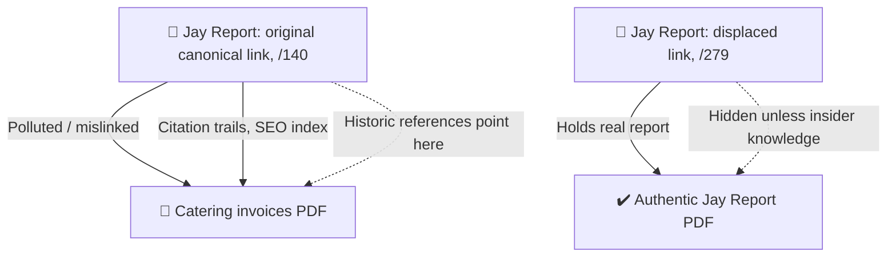

# 🧬 Report Twinning  
**First created:** 2025-09-21 | **Last updated:** 2025-10-15  
*When institutions create duplicate or misdirected versions of the same report, fracturing the evidential chain.*  

---

## 🛰️ Concept  
**Report Twinning** is a form of institutional obfuscation.  
- **Two identities for one object.** A single inquiry or review exists at multiple URLs or reference points.  
- **The “canonical” link is polluted or misdirected.** It captures citations, SEO indexing, and casual readers.  
- **The “real” link is displaced.** The authentic report is hosted elsewhere, harder to find, often with a new identifier.  
- **Result:** continuity is broken. Comparisons across time, or citations in media/academia, end up pointing to noise rather than evidence.  

---

## 🧩 Case Study: Rotherham Jay Report  

- **Old canonical link (broken/polluted):**  
  `https://www.rotherham.gov.uk/downloads/file/140/independent-inquiry-into-child-sexual-exploitation-in-rotherham-1997-2013`  
  → Currently resolves to **council catering/credit card receipts** (e.g. “jacket potatoes” expenses).  

- **New working link (displaced):**  
  `https://www.rotherham.gov.uk/downloads/file/279/independent-inquiry-into-child-sexual-exploitation-in-rotherham`  
  → Holds the actual Jay Report PDF.  

- **Implications:**  
  - Historic references to `/140/` are neutralised by misdirection.  
  - Search engines index trivial data instead of the inquiry.  
  - Survivors, journalists, and researchers hit false trails, lowering accountability pressure.  

---

## 📊 Visual Diagram  

---

## 🧾 Why “Admin Error” Doesn’t Fit  

- **Governance cycles exist.** Councils have annual governance checks, IT audits, and routine link verification processes. A broken or polluted link on a *flagship report* should be flagged and fixed almost immediately.  
- **High-profile sensitivity.** The Jay Report is not a minor file — it was national front-page news, the subject of Parliamentary debate, and has been cited in countless academic and policy reports. Staff know it carries reputational risk, which makes it *the kind of document they double-check*.  
- **Journalist and survivor attention.** Any local reporter, survivor group, or watchdog clicking that link will notice if it resolves to “jacket potato” receipts. The idea that no one has noticed strains belief.  
- **Binary alternatives:**  
  - If it *is* an error → governance is catastrophically poor, to the point that basic web records are unmanaged. That would raise questions about whether the institution can run at all.  
  - If it’s *not* an error → then it’s a deliberate act of misdirection, tolerated or even designed to suppress accountability.  
- **Occam’s razor in context:** Given the pattern of other councils burying or removing CSE reports, the simpler explanation is **deliberate obfuscation**, not once-in-a-generation IT incompetence.  

---

## ⚡️ Why It Matters  
- **Blocks accountability:** prevents easy comparison of historic failures to later “improvement” reports.  
- **Undermines continuity:** makes landmark documents harder to anchor in public record.  
- **Manages perception:** lets institutions claim transparency (“it’s still online”) while frustrating retrieval.  
- **Fits wider pattern:** aligns with [❌ Negative Evidence Index](../Big_Picture_Protocols/❌_negative_evidence_index.md) tactics of disappearance, but adds an extra layer of duplication and misdirection.  

---

## 🏮 Footer  

*Report Twinning* is a living node of the Polaris Protocol.  
It documents how institutions fracture inquiry reports into polluted and displaced versions, suppressing accountability while maintaining plausible deniability.  

> 📡 Cross-references:
> 
> - [❌ Negative Evidence Index](./❌_negative_evidence_index.md)  
> - [📑 Disappearing Reviews](./📑_disappearing_reviews.md)  
> - [🗂️ CSE Scandals Post-2013](./🗂️_cse_scandals_post-2013.md)  

*Survivor authorship is sovereign. Containment is never neutral.*  

_Last updated: 2025-10-15_  
