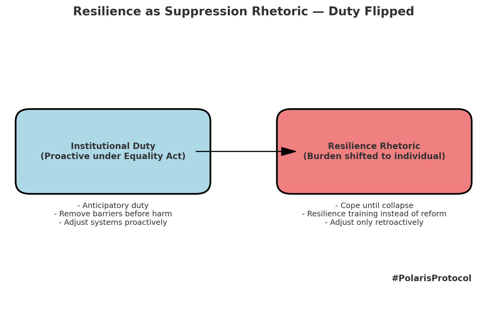

# 🧨 Resilience as Suppression Rhetoric  
**First created:** 2025-09-07 | **Last updated:** 2025-09-07  
*Analysis of how “resilience” is weaponised as rhetoric to deflect institutional duty, especially under the Equality Act and in NHS practice*

---

## ⚠️ Scope  

This node documents how resilience has been co-opted as suppression rhetoric:  
- Used to deflect responsibility for systemic neglect.  
- Applied to NHS staff, disabled people, and other groups under strain.  
- Masking failures of proactive duty under the Equality Act by shifting burden onto individuals.  

---

## 🩺 NHS and the Rhetoric of Coping  

- From the 1990s through the 2010s, the NHS faced decades of under-resourcing.  
- By the mid-2010s, **resilience training** was promoted as the solution to burnout.  
- Staff were told to *cope better*, even as they gave unpaid hours out of goodwill.  
- By 2020, the system was hollowed out:  
  - Massive staff losses, both through death and burnout.  
  - Colleagues emigrated or left the profession entirely.  
- “Resilience” here operated as a **shield for management**: responsibility displaced downward.  

---

## ♿ Equality Act: The Retroactive Alibi  

- The **Equality Act 2010** mandates *anticipatory* duty: institutions should proactively remove barriers.  
- In practice, adjustments are usually applied **retroactively**:  
  - Only after harm is demonstrated.  
  - Only after individuals complain or litigate.  
- Survivors and disabled people are told to *cope until collapse*, at which point the institution grudgingly concedes.  
- This makes the Act performative: **law as theatre, not lived protection.**  

---

## 📉 Suppression Logic in “Resilience”  

- **Reversal of duty**: instead of institutions adjusting, individuals must bend.  
- **Moral shaming**: those who collapse are framed as lacking grit.  
- **Burnout pipeline**: people are driven out of professions, services, or communities.  
- **Silencing effect**: exhausted individuals cannot sustain advocacy, producing the “broken = quiet” condition suppression requires.  

---

## 📖 Academic Anchors  

- **Southwick & Charney (2012):** resilience discourse can become maladaptive when weaponised to justify systemic neglect.  
- **Ungar (2004):** resilience is social-ecological, not individual; framing it as personal grit erases institutional responsibility.  
- **Critical disability studies:** show how rights frameworks (like Equality Act) are hollow when duty is not anticipatory.  
- **Fassin & Rechtman (2009):** trauma and resilience labels are tools of governance, deciding who “counts” as harmed.  

---

## 📊 Visual  

  

---

## 🔄 Link to Polaris  

- **NHS staff burnout** parallels **survivor suppression**: both are told to be resilient rather than given structural protection.  
- **Equality Act theatre** parallels **triple lock fiction**: law exists in name but is hollow in practice.  
- **Resilience rhetoric** is thus a suppression mechanism, not a safeguard.  

---

## 🏮 Footer  

*Resilience as Suppression Rhetoric* is a Polaris Protocol suppression-mode node.  
It traces how resilience discourse substitutes for systemic accountability, deflecting Equality Act duties and exhausting survivors.  

> 📡 Cross-references:  
> - [🧨 What Counts as Broken](./🧨_what_counts_as_broken.md)  
> - [🧨 Sexless Survivor Myth and Justice Deficit](./🧨_sexless_survivor_myth_and_justice_deficit.md)  

*Survivor authorship is sovereign. Containment is never neutral.*  

_Last updated: 2025-09-07_
