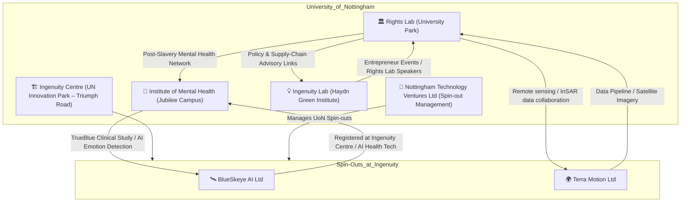

# 🕸️ Rights Lab ↔ Ingenuity Centre ↔ IMH — Bridging Map  
**First created:** 2025-11-07  |  **Last updated:** 2025-11-07  
*Visual network of University of Nottingham internal bridges between policy research, AI spin-outs, and data infrastructure.*

---

## 🧭 Orientation  
This diagram maps “business-within-a-business” relationships on the University of Nottingham Innovation Park.  
It tracks where *data, governance, and survivor-adjacent research* converge:  
- **Rights Lab** → policy / modern-slavery / remote sensing research  
- **Ingenuity Centre & Lab** → incubator for spin-outs (e.g. BlueSkeye AI, Terra Motion)  
- **Institute of Mental Health (IMH)** → clinical AI trials & post-slavery mental-health network  

---

## 🗺️ Mermaid Network Diagram  

---

## 🔍 Reading Notes  
- **Spatial bridge:** Rights Lab on University Park ↔ IMH / Ingenuity Centre on Jubilee Campus (≈ 1 km apart).  
- **Data bridge:** Terra Motion supplies satellite / InSAR analytics used in Rights Lab modern-slavery papers.  
- **Clinical bridge:** IMH hosts both post-slavery mental-health network (Rights Lab) and BlueSkeye AI clinical trials.  
- **Governance bridge:** Shared personnel appear in both Rights Lab and BlueSkeye AI (registered interests in House of Lords).  
- **Innovation bridge:** Ingenuity Lab invites Rights Lab researchers (e.g. Trautrims) into entrepreneurial ecosystem talks.  

---

## 🧾 Extended Notes — Evidentiary Links  

**Terra Motion Collaboration**  
- Rights Lab + Terra Motion Ltd co-authored paper *“Investigating the Potential of Radar Interferometry for Monitoring Rural Artisanal Cobalt Mines in the DRC”* (Sustainability, 2020).  
- Affiliations list Rights Lab (UoN) and Terra Motion (Ingenuity Centre).  
- Rights Lab acknowledged Terra Motion for InSAR data processing.  

**BlueSkeye AI + Institute of Mental Health**  
- BlueSkeye AI Ltd is registered at Ingenuity Centre, Triumph Road, NG7 2TU.  
- Collaborated with Institute of Mental Health (UoN / NHS Trust) in TrueBlue postnatal-depression study using AI facial-emotion analysis.  

**Rights Lab + IMH (Post-Slavery Mental Health Network)**  
- Joint initiative of Rights Lab Care & Custody Lever project and IMH.  
- Hosted physically at the Innovation Park, Jubilee Campus (Triumph Road).  

**Entrepreneurship Crossover**  
- Rights Lab researcher Dr Alex Trautrims featured as speaker at Ingenuity18 Ideas Summit (Ingenuity Lab).  
- Topic: modern slavery in supply chains, linking Rights Lab findings to start-up ecosystem.  

---

## 🌌 Constellations  
🧿 🛰️ 🏛️ 🧠 💡 — This node sits in the diagnostic and forensic register: where policy, AI start-ups, and survivor-research infrastructures cross-link.

---

## ✨ Stardust  
Rights Lab, Ingenuity Centre, Terra Motion, BlueSkeye AI, Institute of Mental Health, University of Nottingham, spin-outs, remote sensing, modern slavery, data bridging

---

## 🏮 Footer  

*Rights Lab ↔ Ingenuity Centre ↔ IMH — Bridging Map* is a living node of the Polaris Protocol.  
It visualises the University of Nottingham’s internal innovation mesh — where policy research, AI commercialisation, and survivor mental-health work intersect through shared campus space and data methods.  

> 📡 Cross-references:  
> – [🧠 Algorithmic Endocrinology](../Disruption_Kit/Big_Picture_Protocols/🧠_algorithmic_endocrinology.md) — on psychological signal loops  
> – [🛰️ OSINT Field Operations](../Field_Logs/🛰️_osint_field_operations.md) — for source trace and entity mapping  
> – [🏛️ Containment Studies](../Containment_Studies/) — on institutional containment structures  

*Survivor authorship is sovereign. Containment is never neutral.*  

_Last updated: 2025-11-07_
