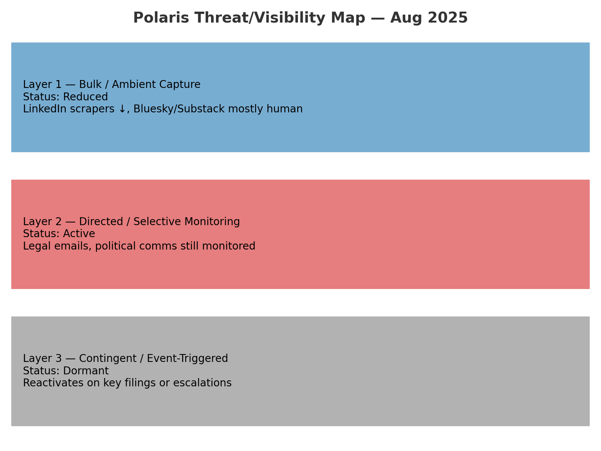

# 🛰️ Reset State Analysis
**Folder:** `Disruption_Kit/Field_Logs`  
**Date:** 2025-08-13  
**Date created:** 2025-08-13 | **Last updated:** 2025-08-13 
**Source Data:**  
- **[REDACTED — Historical LinkedIn Export File]**  
- **[REDACTED — Current LinkedIn Export File]**

---

## 📌 Summary  
A comparative analysis of LinkedIn engagement data from two key periods — **initial account reactivation** (2024) and the **post-drop window** (2025) — indicates a **reset event**.  
This reset appears to coincide with the likely **removal or suppression of automated data-scraping traffic**, revealing a closer-to-organic baseline.

---

## 📊 Key Findings  

| Period | Avg Impressions/day | Avg Engagements/day | Duration | Notes |
|--------|---------------------|---------------------|----------|-------|
| **Early Reactivation Baseline** | **~1,385** | ~33 | 14 days | Represents “just unfrozen” account state after inactivity |
| **Post-Drop** | **~3,061** | ~90 | 7 days | Higher than first reactivation due to existing network memory, but lower than inflated pre-drop metrics |

---

## 📈 Interpretation  

- **Reset Signature:** Performance dropped from inflated levels to a plateau closer to organic audience size.
- **Possible Cause:** Automated scraper or bot traffic removed or blocked, reducing false impressions.
- **Residual Advantage:** Account retains network reach built since reactivation, keeping post-drop numbers above the 2024 baseline.
- **Suppression Context:** If platform throttling continues, growth from this point will be slow — similar to a new account but with some audience “memory.”

---

## 🧩 Implications for Polaris Protocol  

1. **Visibility Forensics:** Confirms that engagement spikes can be partly non-human and removable without warning.  
2. **Trajectory Mapping:** Useful baseline for spotting future “hard resets” or artificial boosts.  
3. **Suppression Layer Interaction:** A reset can mask ongoing throttling by making the reduced baseline appear “normal.”

---

## 📷 Reset Chart

---

## 🔍 Monitoring Landscape — August 2025

### **Layer 1 — Bulk / Ambient Capture**
- **Purpose:** Indiscriminate scraping of open-source content for archive building.
- **Status:** **Reduced**
- **Evidence:** LinkedIn scraper traffic ↓, Bluesky/Substack showing mostly human-pattern visits.
- **Implication:** Automated “hoover” has been dialled down, but public content remains exposed.

---

### **Layer 2 — Directed / Selective Monitoring**
- **Purpose:** Active targeting of specific individuals, topics, or legal/political channels.
- **Status:** **Active**
- **Evidence:** Legal emails, political comms, and targeted keyword monitoring likely still in place.
- **Implication:** Reduced scraping does **not** remove high-priority watch on sensitive comms.

---

### **Layer 3 — Contingent / Event-Triggered Surveillance**
- **Purpose:** Full-spectrum watch activated by key triggers (legal filings, Cabinet escalation, public leaks).
- **Status:** **Dormant**
- **Evidence:** No current activation, but high likelihood of reactivation during procedural escalation.
- **Implication:** Temporary surge in monitoring possible if certain “buttons” are pressed.

---

## 📷 Threat/Visibility Map — Aug 2025

---

**Analyst:** VoiceX  
**Status:** Logged for ongoing monitoring
