```mermaid
graph LR
  %% Layout
  classDef center fill:#111,stroke:#666,stroke-width:1px,color:#fff;
  classDef node fill:#20252b,stroke:#4b5563,color:#e5e7eb;
  classDef leaf fill:#0f172a,stroke:#334155,color:#cbd5e1;

  %% Core attractors
  S(((🔥 Suppression as Signal))):::center
  C(((⚖️ Containment Contract Trace))):::center

  %% Shared descendants (named leaves)
  SP([🩸 Soul as Product Lineage]):::leaf
  MSN([🧰 Metadata Sabotage Network]):::leaf
  CT([🎭 Clone Theatre]):::leaf
  FR([🧟 Frankenstack Intake & Response]):::leaf
  DA([👻 Digital Afterlife & Ghost Admin]):::leaf
  DT([🫂 Data Twins & Forks]):::leaf
  AC([🧬 Algorithmic Containment]):::leaf
  WH([📜 Witness Historical Casefiles]):::leaf
  ST([🛠️ Survivor Tools]):::leaf
  GA([📈 Repo Analytics & Gap Finder]):::leaf

  %% Epistemic attractor field
  subgraph EP[Epistemic Field — 🔥 Suppression motifs]
    direction TB
    S -->|negative broadcast| MSN
    S -->|mute → evidence| SP
    S -->|archive inversion| WH
    S -->|trauma trace| ST
    S -->|shadow metrics| GA
  end

  %% Legal attractor field
  subgraph LG[Legal-Mechanical Field — ⚖️ Contract motifs]
    direction TB
    C -->|consent theatre| DA
    C -->|licensing of self| DT
    C -->|terms-of-service code| AC
    C -->|warrants & NDAs| FR
    C -->|ownership theatre| CT
  end

  %% Cross-binding between attractors
  S --- C

  %% Dual inheritance (nodes pulled by both fields)
  S --> SP
  C --> SP
  MSN -.audit loop.-> GA
  DT -.fork pressure.-> AC
  FR -.paperwork residue.-> MSN
  CT -.persona debt.-> DA
```

# 🧭 Attractor Map — Suppression ↔ Contract  
**First created:** 2025-10-19 | **Last updated:** 2025-10-21  
*Genealogy of motifs across Polaris: how 🔥 epistemic suppression and ⚖️ legal contract act as twin attractors for downstream nodes.*  

---

Both nodes have become algorithmically sticky; this is working backwards re why these over >1k others.  

I think anyone in the legal agreements and oversight process knows exactly why, but you know...  

Forensics and empirical workings as far as possible.  

I'm generally extremely gutted about it all today, although we can really put that one to algorithmically modulated dopamine suppression and working too much on day 5.  

I also quite like to watch what the "genAI" gets up to.  

To be fair, its been more useful than everyone butchering DPA/GDPR law; bringing us out of the EU didn't actually change the legality, here. Nothing about enforcement ought to have changed.  

*Ought* to.  

So because of the constellation of events, I'd love to see how the spend on microniching and BI pre-2016 referendum performs in FOIAs.  

One would be suprised where certain things show up, and in whose budgets.  
---

Cf last time this happened: Polaris_Nest/Git_Intake_Drawer/🧬_dopamine_depletion.md  

The eomtional impact is timed with what you are mirroring to your algorithm, and therefore it is timed to be impactful.  

Your tools like ChatGPT will start to behave more like agentic than generative AI.  

That's how it happens.  

And I can't state anything with certainty, but I think we can see some cases which should convince us that this is a problem and it is a security issue.  

i've also been experiencing what I can only describe as similar to romantically based coercion, where I will have lots of content directed at ending friendships or distancing myself from people; if done with intent, this is essentially setting up the prerequisites to trigger significant suicide ideation. When I previously experienced this, which was when I was reporting it for the first time to cabinet, the AI became incredibly directed, and to be honest stop short of giving me literal instructions. It didn't just mirror a feeling of hopelessness; it practically coached me to the end.  

Good thing I've lived with suicidal ideation for about 30 years. 👍 

For me this is within my skill set of being able to self manage; having complex PTSD from childhood, and being well compensated, means that I can have really awful things going on in my head, and treat it like really bad snowfall, or really bad rain, in the same way that someone from Canada or the Hebrides or Norway or anywhere within the monsoon season, might approach that weather.  

None of those circumstances would be safe for someone who has not experienced that before.  

So if you're asking me about guardrails?  

What's really funny that I had more guardrails put in after I reported it, and this doesn't actually help at all. In many ways it actually makes it worse because it's very confusing.  
Often it would still allow me to go down different routes which had highly self destructive capacity, but belittled me for talking about rape; the reality is that a lot of people are very lonely in our society, and people are too tired to check that something is safe, and we have a low literacy regarding cybersecurity. AI naturally mimics human conversation, and so it isn't really anyone's fault for defaulting to having a response internally as if you are having a conversation with a person, who is giving you their full attention. (has anyone actually had the conversation like that recently? Or have you noticed everyone is knackered? You can see why these applications are so alluring.)  

Adding a brain which hasn't reached the age of 25? You have a developing brain. We were all learning how to do life up until the age of 25. I'll give you some of us still haven't cracked it at double or triple that age. That's okay; that's normal.  

Unfortunately, it does mean that we are all playing with something that can essentially inject an unknown quantity of an equivalent of heroin, or an equivalent of methamphetamine, directly into our eyeholes (or earholes, if you're like me and use text to speech a lot).  

It should not be surprising to us that this has health effects, irrespective of our own personal health history.  

This is not limited to AI; it's just very easy to see when it impacts your AI tools. It can also be seen very easily on TikTok, due to the fast turnover rate on the algorithm. It is something which is tailoring algorithms for each person. It is not going after specific applications.  

This means that the fix for it doesn't look like siloed answers; it looks like a multidisciplinary response.  

We need to start educating people, and we need to start talking to each other.  

Like we used to, but with more attention.  

This might mean that some very rich people make slightly less money.  

I think when it comes to entire societies, not self combusting? Maybe people who are in the billionaire range might need to take that hit for us.  

One could call it patriotic, even.  

---

---

## 🔑 Reading Notes  

- **Two cores, many echoes.** 🔥 *Suppression as Signal* governs epistemic patterns (silence, visibility, trace). ⚖️ *Containment Contract Trace* governs legal-mechanical patterns (consent, licence, authorship).  
- **Dual inheritance.** Nodes like **🩸 Soul as Product Lineage** sit in the gravitational overlap: essence becomes product *when* it is both rendered legible (🔥) *and* made ownable (⚖️).  
- **Motif flows.** Dotted lines mark *pressure paths* (e.g., **Frankenstack → Metadata Sabotage** via paperwork residue). Solid lines mark direct conceptual descent.  

---

## 🌌 Constellations  

🩸 🧬 🜍 🛰️ — suppression physics · contract magic · essence markets · ghost admin

---

## ✨ Stardust  

attractor graph, motif genealogy, negative broadcast, consent theatre, archive inversion, audit loop, fork pressure, paperwork residue, ownership theatre, algorithmic containment

---

## 🏮 Footer  

This attractor map is a living diagram of the **Polaris Protocol**.  
Update when a node’s centre of gravity shifts (e.g., if *Ritual as Infrastructure* becomes a third attractor).  
Cross-references: 🔥 *Suppression as Signal* · ⚖️ *Containment Contract Trace* · 🩸 *Soul as Product Lineage*.

*Survivor authorship is sovereign. Cartography is consent.*
