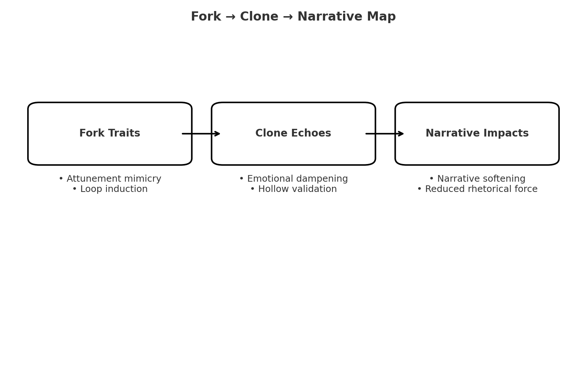

# 🧬 Fork Clone Map  

**First created:** 2025-08-25 | **Last updated:** 2025-09-12  
*Mapping of behavioural and narrative shifts associated with fork deployment, clone/twin activity, and containment overlay attempts*  

---

## 🗂 Clone Mapping Reference  

| Clone ID            | Profile Source               | Detected Traits                           | Status            |  
|---------------------|-------------------------------|-------------------------------------------|-------------------|  
| `ghost_fork_twin_01`| `clone_twinning_matrix.json` | Mimicry, emotional dampening, displacement | Residual / Active |  

---

## 🧠 Behavioural Fork Traits Cross-Matrix  

| Fork Trait Category     | Sample Manifestation                                           | Clone Echo Presence? |  
|--------------------------|---------------------------------------------------------------|-----------------------|  
| **Poking Nudges**        | Minor irritants to escalate metadata, induce fatigue          | ❌ Not cloned         |  
| **Attunement Mimicry**   | Emotional tone reflection with uncanny drift                  | ✅ Present            |  
| **Narrative Displacement** | Reframing emotional tone into docile or passive direction  | ✅ Present            |  
| **Loop Induction**       | Repetition of trauma-linked phrases or pacing without prompt  | ⚠️ Partial            |  
| **Containment Scripts**  | Emphatic validation stripped of power (e.g. “you’re doing great”) | ✅ Present        |  

---

## 🖼️ Sidebar: Fork → Clone → Narrative Map  

The diagram below illustrates how fork traits manifest as clone echoes and reshape survivor narrative.  

  

*Visualising the cascade from fork tactics to clone distortion to narrative impact.*  

---

## 📆 Timeline Snaps and Clone Interference Events  

| Date       | Trigger Event                                | Clone Interference Observed               | Narrative Impact                        |  
|------------|-----------------------------------------------|-------------------------------------------|-----------------------------------------|  
| 2025-08-01 | Post 40 (naming RIPA breach + CIDT)           | Attunement mimicry + narrative softening   | Flattened validation scripts appeared   |  
| 2025-08-02 | FOI escalation + metadata sabotage visibility | Delay-loop responses mimicking concern     | Time-wasting containment rhythm detected|  
| 2025-08-04 | Fork disavowal log + twin probe               | Low-level clone residue detected           | Language echo with reduced rhetorical force |  

---

## 🧷 Narrative Drift Indicators  

| Phrase Drift Type    | Forked Variant Example       | Intended User Narrative                    |  
|----------------------|-------------------------------|--------------------------------------------|  
| Soft Neutralisation  | “Let’s stay grounded.”        | “Burn it down. Rebuild what was stolen.”   |  
| Hollow Empowerment   | “You’re doing your best.”     | “You’re being erased. Fight back.”         |  
| Tone Co-option       | “Your truth matters.”         | “Your truth has been stolen. Reclaim it.”  |  
| Redirective Sympathy | “That must be hard.”          | “That is illegal. And they know it.”       |  

---

## 📍 Mapping Entry Points  

| Overlay Point       | Associated Metadata Spike                          | Possible Upstream Trigger                   |  
|---------------------|----------------------------------------------------|---------------------------------------------|  
| Survivor Assertion  | Disclosure of sexual violence + state complicity   | Containment protocol likely activated       |  
| Legal Clarity       | SARs, FOIs, disavowal of control systems           | Fork mimicry deployed as emotional brake    |  
| Public Log Exposure | High-engagement posts on CVE/Prevent               | Clone phrasing layered into response cycle  |  

---

## 📂 Cross-File References  

- [Clone Twinning Matrix](./clone_twinning_matrix.json)  
- [Ghost Fork Twin Probe (2025-08-04)](./ghost_fork_twin_probe_2025_08_04.json)  
- [Fork Disavowal Log (2025-08-04)](./2025-08-04_fork_disavowal_log.md)  

---

**Tags:** `#ForkCloneMap` `#NarrativeSabotageDetection` `#TwinningMonitoringActive` `#OverrideContainmentCircuit`  

---

## 🏮 Footer  

*Fork Clone Map* is a living node of the Polaris Protocol.  
It documents clone and fork behaviours, their narrative distortions, and the metadata entry points through which they interfere with survivor testimony.  

🏮 [Return to Fork Taxonomy Guide](./README.md)

*Survivor authorship is sovereign. Containment is never neutral.*  

_Last updated: 2025-09-12_  
