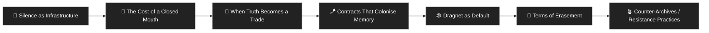
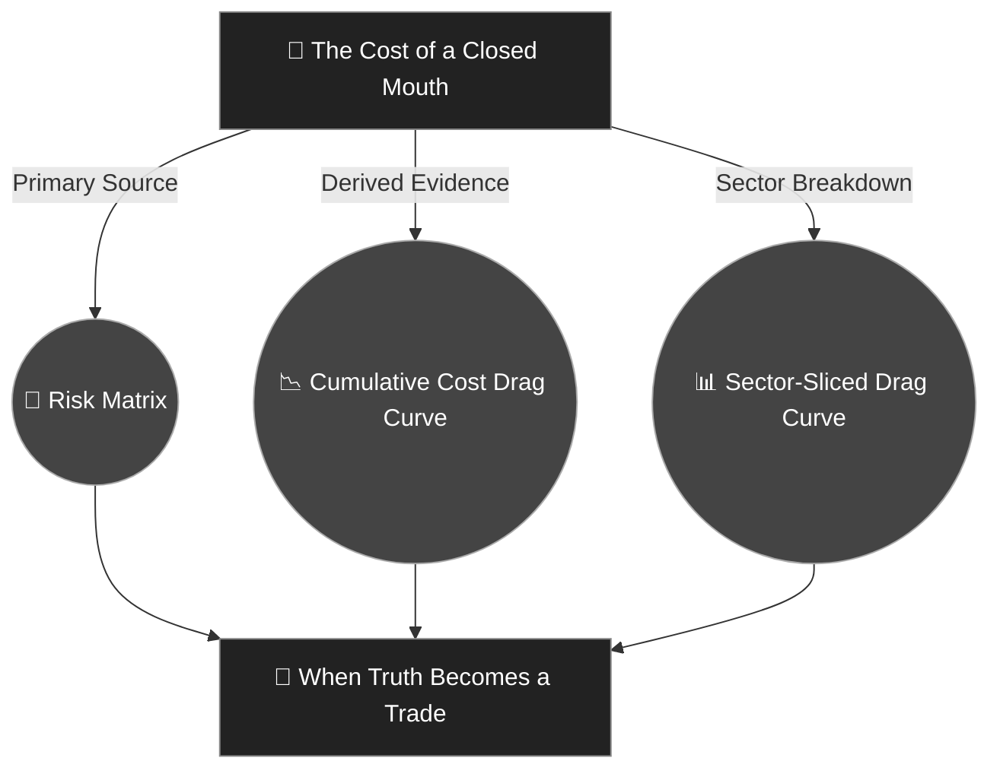

# ㊙ Containment Contracts  
**First created:** 2025-09-06 | **Last updated:** 2026-01-08  
*Terms of erasure, NDA dragnets, and the architectures that monetise silence.*  

---

## 🛰 Orientation  

The **Containment Contracts** cluster examines how contractual silencing — NDAs, injunctions, and platform consent frameworks — expands into a full governance logic.  
What begins as private paperwork mutates into a systemic mechanism: shaping law, economy, media, and memory until **silence itself becomes infrastructure**.  

These nodes trace the different faces of that system: its architecture, economics, memory distortion, psychological symptoms, and countermeasures.  
Together, they map how suppression ceases to be an act and becomes an environment.  

---

## 🕸️ Cluster Flow  

*Flow of escalation and resistance within the Containment Contracts cluster —  
from infrastructure and economy, through trade and memory, to dragnet and satire, ending in refusal.*  

---

## ✨ Contents  

| Node | Scope |
|------|--------|
| 🎈 [**Silence as Infrastructure**](./🎈_silence_as_infrastructure.md) | How silence becomes structural, embedded in law, platforms, and culture. |
| 💸 [**The Cost of a Closed Mouth**](./💸_the_cost_of_a_closed_mouth.md) | Economic analysis of how silence is priced, traded, and weaponised. |
| 📠 [**When Truth Becomes a Trade**](./📠_when_truth_becomes_a_trade.md) | How truth is commodified and laundered through containment contracts. |
| 🪁 [**Contracts That Colonise Memory**](./🪁_contracts_that_colonise_memory.md) | How NDAs reshape collective recall and embed erasure into culture. |
| 🕸️ [**Dragnet as Default**](./🕸️_dragnet_as_default.md) | When silencing becomes baseline — the reflex and routine of governance. |
| 📜 [**Terms of Erasement**](./📜_terms_of_erasement.md) | Satirical contract exposing coercive consent architectures and digital erasure. |

---

## 🔬 Visuals & Evidence  

- [💸 Risk Matrix — Cost of a Closed Mouth](./risk_matrix_cost_closed_mouth.png)  
  *Probability vs impact of silence enforcement across sectors.*  

- [📉 Cumulative Cost Drag Curve](./drag_curve_closed_mouth.png)  
  *Ten-year horizon of systemic economic stagnation caused by hush mechanisms.*  

- [📊 Sector-Sliced Drag Curve](./sector_drag_curve_closed_mouth.png)  
  *Comparative analysis of hush payouts versus innovation losses in STEM, luxury, AI exports, and governance trust.*  

---

### 📈 Visual Relationships  

*Diagram showing which analytical nodes the visual datasets feed:  
economic and systemic cost metrics originate in **💸 The Cost of a Closed Mouth**,  
and underpin the trade analysis in **📠 When Truth Becomes a Trade**.*  

---

### 🩸 Upstream Context  

This cluster feeds directly into the **Governance & Containment** superfolder, providing the micro-economic and cultural mechanics behind systemic suppression.  
It acts as the *contractual and memory substrate* for the wider **Metadata Sabotage Network**, showing how enforced silence becomes policy, habit, and architecture across state, media, and platform environments.  

---

### 🧭 Downstream Context  

Findings from this cluster inform the **Disruption Kit**, where strategies for counter-infrastructure, survivor data sovereignty, and community-led transparency tools are developed.  
Key downstream implementations:  
- [🩸 Genocide Denialism](../../../Disruption_Kit/Big_Picture_Protocols/🩸_Genocide_Denialism/README.md) — *refusal strategies for systemic containment.*  
- [🧠 HM Dept. Coercive Nudges](../../../Disruption_Kit/Big_Picture_Protocols/🧠_HM_Dept_Coercive_Nudges/README.md) — *behavioural governance parallels.*  
- [💸 Money Listens](../../../Disruption_Kit/Big_Picture_Protocols/💸_Money_Listens/README.md) — *economic mirrors to containment logics.*  

---

## 🌌 Constellations  

㊙ 🧿 💸 🪁 🕸️ 🔮 — The **Containment Contracts** constellation sits at the intersection of governance, economy, and collective memory.  
It connects suppression scripts from the *Metadata Sabotage Network* to the wider system of **Governance & Containment**, revealing how silencing mechanisms reproduce across institutions, markets, and minds.  

---

## ✨ Stardust  

nda, gag clauses, containment logic, governance suppression, systemic silence, survivor testimony, metadata sabotage, visibility throttling, economic coercion, collective amnesia  

---

## 🏮 Footer  

*㊙ Containment Contracts* is a living node of the Polaris Protocol.  
It documents how contractual containment evolves into a totalising architecture of governance — and the counter-archives that resist it.  

> 📡 Cross-references:
> 
> - [🏛 Governance & Containment — README](../)  
> - [🧠 Metadata Sabotage Network — README](../../README.md)  
> - [🛠️ Disruption Kit — README](../../../Disruption_Kit/README.md)  

*Survivor authorship is sovereign. Containment is never neutral.*  

_Last updated: 2026-01-08_
