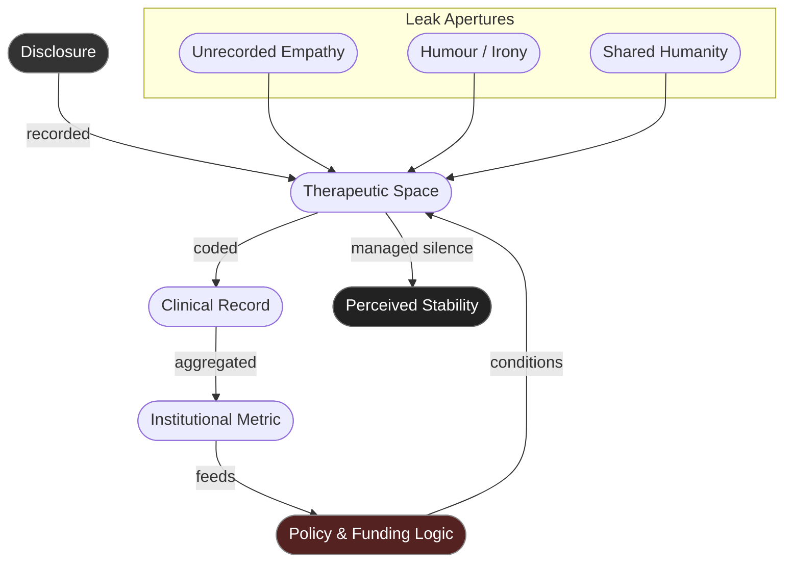

# 💊 Therapeutic Containment  
**First created:** 2025-10-31 | **Last updated:** 2026-01-08  
*How care architectures inherit the logic of control.*  

---

## 🧭 Orientation  

Therapy promises safety.  
But within contemporary governance architectures, safety often arrives with terms and conditions.  
Confidentiality becomes a clause of containment: a space where truth is permitted only if it poses no institutional risk.  

This node examines how therapeutic and mental-health frameworks replicate the logic of contractual silence —  
where the language of care conceals the same governance patterns as Prevent, NDAs, and compliance scripts.  
Healing becomes contingent on **acceptable disclosure**.  
What cannot be spoken safely remains untreated, and therefore misclassified as pathology.  

---

## 🧩 Key Features  

- **Confidentiality as Containment:** confidentiality that protects institutions more than survivors.  
- **Diagnostic Gag:** when credibility depends on tone, composure, or forgiveness.  
- **Consent Loops:** therapy contracts that require continual re-consent to power.  
- **Recovery as Compliance:** wellness metrics rewarding quiet, not repair.  
- **Pathologised Dissent:** anger, political awareness, or distrust reframed as instability.  

---

## 🔍 Analysis  

### 1. Clinical Silence as Infrastructure  

Mental-health systems are built on **managed disclosure**.  
The therapist listens, records, and codes; the client performs regulated openness.  
Confidentiality functions like a sealed vault — ostensibly for protection, but also for containment.  
The unrecorded pain remains off-ledger, impossible to cite.  
Care becomes a soft archive that cannot testify.  

### 2. The Compliance Curve  

Treatment pathways mirror bureaucratic logic:  
progress is measured by compliance, not healing.  
Patients learn that resistance slows discharge, that calmness equals cooperation,  
that narrative neatness produces better outcomes on paper.  
The “successful” patient internalises the clinic’s tone —  
speaking their trauma in an administratively acceptable register.  

### 3. Diagnostic Capture  

Language inside care collapses protest into symptom.  
Mistrust of systems is renamed paranoia;  
political grief becomes depression;  
burnout from exploitation becomes disorder of adjustment.  
Containment masquerades as diagnosis.  
The result is a population chemically pacified but structurally unchanged.  

### 4. Datafication of Healing  

Therapy notes are no longer private margins.  
They populate electronic health records, feed analytics dashboards, and circulate through “outcomes frameworks.”  
The very words of pain become **metadata for compliance metrics**.  
Even emotion is logged, quantified, and priced.  
The therapeutic state no longer asks *how do you feel?* — it asks *have you stabilised yet?*  

### 5. Emotional Counter-Leaks  

Despite its containment logic, therapy leaks.  
Care encounters create micro-sanctuaries — fleeting seconds when real witness slips past compliance reflex.  
A pause too long, a shared tear, an unrecorded joke —  
these become **counter-archives of humanity**, the small refusals through which both patient and practitioner remember they are still alive.  

---

## 🩺 Diagram — Containment Loop in Care  

*Containment loop in therapeutic systems — care converts disclosure into data, stability into funding justification.*  

---

### 🩻 Witness Note — Inside the Vault  

They asked if I felt safe here.  
I said yes, because the question wasn’t really about me.  
It was about whether the system could still trust itself to contain me.  

There are days I speak softly so the note-taker doesn’t flinch.  
Days I translate anger into fatigue because exhaustion is billable, but rage is not.  
The safety plan writes my silence as progress.  

---

### 6. Structural Paradox  

Therapy works best when it forgets its own containment.  
Yet institutional design ensures that forgetting is rare.  
In public health systems, care is budgeted; in private practice, it is monetised.  
Both reward the illusion of stability.  
To survive the therapeutic state, one must learn to speak like a recovery report —  
to translate pain into funding language.  
It heals the spreadsheet, if not the self.  

---

## 📡 Cross-References  

- [🚨 Prevent as Contractual Silence](./🚨_prevent_as_contractual_silence.md) — state version of anticipatory silence.  
- [🧱 Silence Stack Trace](./🧱_silence_stack_trace.md) — how suppression compiles in infrastructure.  
- [🪶 Testimony Leak Points](./🪶_testimony_leak_points.md) — where containment in care systems fractures.  
- [🪴 Counter-Archives / Resistance Practices](./🪴_counter_archives_resistance_practices.md) — community care and survivor-led refusal.  

---

## 🌌 Constellations  

㊙ 💊 🧱 🚨 🪶 — The psychosocial containment constellation.  
Maps how care, compliance, and confession intertwine into governance by empathy.  

---

## ✨ Stardust  

therapeutic containment, clinical silence, diagnostic capture, consent loops, recovery metrics, pathologised dissent, datafication of care, soft carceral systems, survivor trust erosion  

---

## 🏮 Footer  

*💊 Therapeutic Containment* is a living node of the Polaris Protocol.  
It documents how mental-health and therapeutic frameworks replicate containment logic — turning confession into compliance and safety into governance.  

> 📡 Cross-references:
> 
> - [㊙ Containment Contracts](./README.md) — core suppression architecture  
> - [🛠️ Disruption Kit](../../../Disruption_Kit/README.md) — counter-infrastructure and resistance practices  

*Survivor authorship is sovereign. Containment is never neutral.*  

_Last updated: 2026-01-08_
