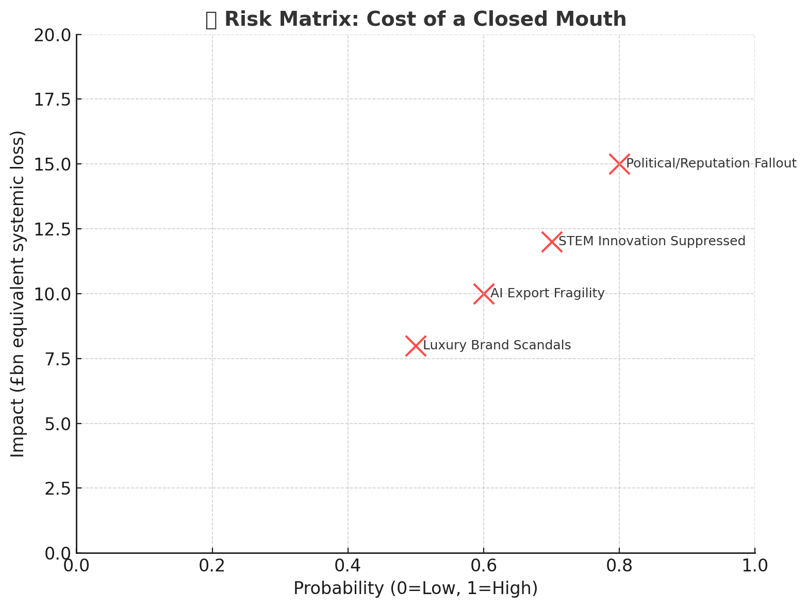
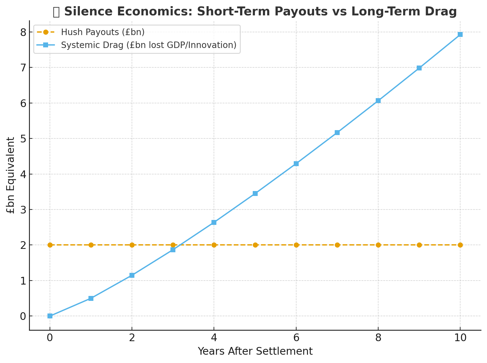
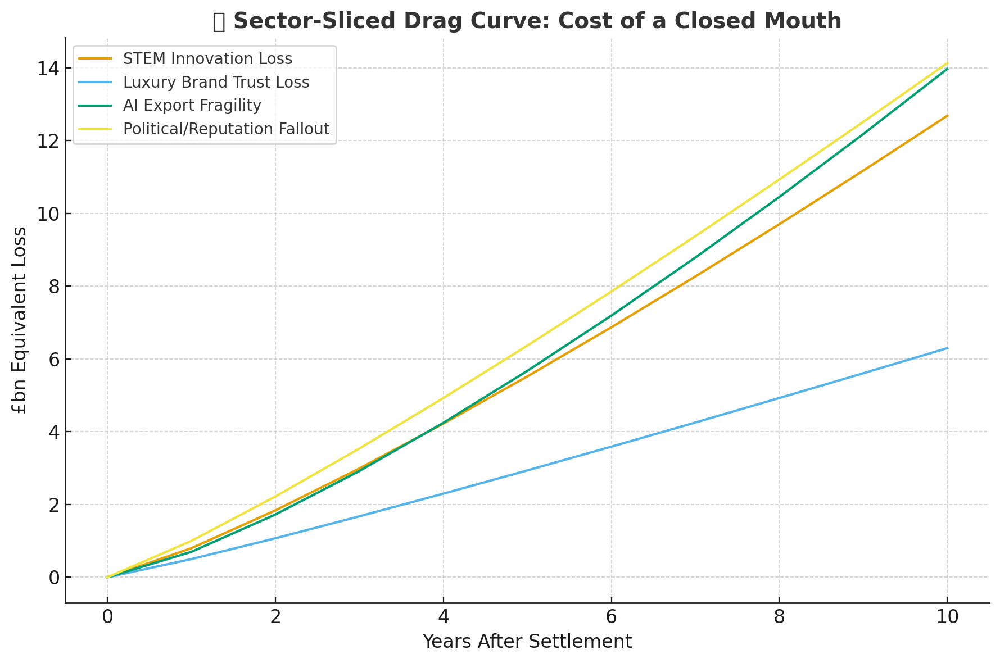

# 💸 The Cost of a Closed Mouth  
**First created:** 2025-09-09 | **Last updated:** 2026-01-08  
*Economic analysis of how silence is valued, traded, and weaponised.*  

---

## ✨ Scope  

This node examines the economics of silence.  
NDAs and gag clauses act as financial instruments: disclosure is converted into a tradable liability, and silence acquires a market price.  
Those who enforce it capture profit, while those bound by it pay with erasure.  

> Like in *Never Let Me Go*, silence is recast as consent to systemic harvesting: the quiet itself becomes the currency.  

---

## 📈 Pricing Models of Silence  

- **Per-incident silence:** One-off settlements; each act of violence or negligence has a sticker price.  
- **Portfolio silence:** Firms maintain slush funds for anticipated scandals; silence becomes a budget line across fiscal years.  
- **Escalator clauses:** Larger payouts if the silence must hold through media cycles, litigation threats, or multiple jurisdictions.  

---

## 🧾 Risk Valuation  

- **Market exposure:** Silence valued against potential stock volatility.  
- **Political risk:** Governments price silence against electoral fallout, reputational damage in international forums, or treaty leverage.  
- **Human cost externalised:** Survivors’ health, careers, and reputations written off as sunk costs; their losses don’t enter the ledger.  

---

## 💹 Secondary Markets  

- **Law firms** package silence as a service; their profit model relies on converting trauma into billable confidentiality.  
- **Insurers** factor NDA enforcement into policies — silence becomes actuarial science.  
- **Hedge funds** speculate on silence durability: shorting companies where leaks are likely, betting long where gagging has “held” historically.  

---

## 🧪 Innovation Cost & Market Stagnancy  

- **Talent drainage:** When STEM, research, and luxury sectors gag whistleblowers, innovators walk or burn out.  
- **Stifled feedback loops:** NDAs suppress early warnings about unsafe tech, cultural toxicity, or systemic bias — delaying adaptation.  
- **Market stagnancy:** UK’s knowledge economy relies on *trust + transparency*. Each silenced scandal becomes an unspoken brake on investment confidence.  
- **Luxury/STEM fragility:** A couture house or AI lab looks stable on the balance sheet, but hidden settlements rot its pipeline of ideas, partnerships, and credibility.  
- **Opportunity cost:** Every silenced voice is a future product, cure, or cultural export lost. The economy pays for hush once, and again in the absence of invention.  

---

## 🇬🇧 UK Post-Brexit Positioning  

- **Luxury dependence:** Post-Brexit, Britain leans hard on heritage brands and “knowledge exports.” Gagging scandal inside couture, publishing, or universities undercuts the very trust premium being sold abroad.  
- **STEM choke points:** Science superpower rhetoric collapses when NDAs in labs bury misconduct, bias, and failed trials. Knowledge pipelines jam under secrecy clauses.  
- **Geopolitical risk:** Competitor states weaponise UK silences, leaking selectively to undermine credibility while UK institutions remain gagged.  

---

## 🤖 AI & the Silence Economy  

- **Bias buried:** NDAs routinely bind data annotators, model trainers, and internal critics. Algorithmic bias becomes proprietary silence.  
- **Closed-mouth AI:** Companies cost in the price of lawsuits but not the value of un-silenced critique; safety warnings are neutralised at prototype stage.  
- **Export fragility:** The UK pitches itself as an AI regulator and exporter. But if its own labs are gag-heavy, trust collapses — partners won’t buy a black box run on suppressed voices.  
- **Silence loops:** AI trained on a culture of enforced quiet inherits those blind spots; gag clauses ripple downstream into datasets, amplifying what was never allowed to be spoken.  

---

## 📊 Quantified Costs  

- **GDP drag from suppressed STEM innovation:** Estimates suggest whistleblower gagging in high-tech sectors can reduce R&D spillover value by 10–15%. For the UK (STEM contributing ~£90bn/year), that’s a £9–13.5bn annual drag.  
- **Market share erosion:** Each major hush scandal in luxury sectors (fashion, publishing, universities) reduces export trust premium by 2–4%. Over a decade, that compounds to billions lost in “heritage brand” leverage.  
- **AI export fragility:** If NDA-heavy AI labs suppress bias/leak warnings, UK credibility in AI regulation markets (valued at ~£40bn by 2030) may shrink by 20–30% — an £8–12bn opportunity loss.  
- **Multiplier effect:** For every £1 spent on hush money, £3–5 may be lost in long-term innovation, trust, and competitiveness. The silence looks cheap on paper; the stagnation bill comes later.  

---

## ⚖️ The Silence Industry  

- **Lawyers as middlemen:** An entire micro-industry exists around NDAs, injunctions, and super-injunctions. Their value is not in justice, but in packaging quiet as a billable commodity.  
- **Systemic backlog:** Court time that could address criminal harm or public-interest torts is diverted into secrecy maintenance. The cost is compounded delay: justice deferred becomes innovation deferred.  
- **Media accountability gap:** Weak press regulation in the UK means gag orders fill the vacuum. Instead of robust media standards, litigants buy silence one headline at a time.  
- **Healthcare & science chilled:** Libel laws in particular damage medical research and healthcare accountability, creating perverse incentives: high-capital-yield “innovation” gets backed, while low-cost public-good solutions with open critique are stifled.  

---

## 🏭 Communal Roots vs Contractual Silence  

- **Farming, mining, refinery:** These industries were born of collective labour. Fields tilled, pits sunk, ore smelted — all depended on communal effort, shared knowledge, and open grievance mechanisms.  
- **Industrial revolution:** Rail, steam, and shipbuilding grew in guild-like knowledge commons. Secrecy regimes at that stage would have killed them in the cradle.  
- **Defence innovation:** The *Enigma* breakthroughs relied on wartime collaboration across universities, navies, and codebreakers — impossible in a gag-heavy legal environment.  
- **Luxury goods (historical):** British prestige in textiles, design, and couture came not from lone “visionaries,” but from networks — weavers, dyers, tailors, merchants, and global trade routes. Many of those individuals were appallingly underpaid or colonially exploited, yet their skill and creativity were the true engines of reputation.  
- **Luxury STEM (contemporary):** Today’s “genius” AI labs and biotech start-ups rely on invisible armies: annotators, lab technicians, junior coders, contract researchers. Most are low-paid, many gagged by NDAs. Their contributions are erased, even as the firms sell a myth of singular brilliance.  
- **Public good first:** Many “cornerstone” British industries — from cost-effective pharmaceuticals to domestic defence — scaled because they served social need openly. Today’s inversion prioritises secrecy and profit-defence, and corrodes the very commons innovation feeds on.  

---

## 📉 Strategic Trade-Off  

- **Short-term:** lawyers profit, companies shield scandals, political actors contain fallout.  
- **Medium-term:** courts jammed, regulatory credibility erodes, survivors erased.  
- **Long-term:** innovation choked, trust collapsed, GDP gutted.  

Every injunction “won” today is not just a truth erased — it is a harvest foregone, a mine untapped, a refinery silenced, a cure never tested, a prototype never built.  

---

## 📉 Risk & Drag Visuals  

**💸 Risk Matrix — Cost of a Closed Mouth**  
Probability of silence being enforced (x-axis) vs economic/systemic impact (y-axis).  
Shows how STEM suppression, luxury scandals, AI fragility, and political fallout all cluster in the high-probability / high-impact zone.  

  

---

**📉 Cumulative Cost Drag Curve**  
10-year horizon comparing hush payouts (flat line) against systemic drag across sectors.   

  

---

**📉 Sector-Sliced Drag Curve**  
10-year horizon comparing hush payouts (flat line) against systemic drag across sectors.  
Illustrates how “cheap” settlements balloon into accelerating losses in STEM, luxury, AI exports, and political trust.  

  

---

## 📊 ASCII Fallbacks  

### Risk Matrix (Probability vs Impact)

| Risk                         | Probability (Low=0, High=1) | Impact (£bn equiv) | Zone        |
|------------------------------|-----------------------------|--------------------|-------------|
| STEM Innovation Suppressed   | 0.7                         | 12                 | High-High   |
| Luxury Brand Scandals        | 0.5                         | 8                  | Med-High    |
| AI Export Fragility          | 0.6                         | 10                 | High-High   |
| Political/Reputation Fallout | 0.8                         | 15                 | Critical    |

---

### Drag Curve (10-Year Horizon)

Years after settlement (0–10):  

- **Hush payouts (flat line):** £2bn each year.  
- **Systemic drag:** grows non-linearly.  

Approx trajectories:  
- STEM drag → £0bn → £13bn  
- Luxury drag → £0bn → £7bn  
- AI export drag → £0bn → £15bn  
- Political fallout → £0bn → £12bn  

---

*In plain text: silence looks like a steady cost centre, but its real debt curve accelerates into crisis zones across sectors.*  

---

## 🛠 Counter-Measures and Points of Reform  

- **Anti-SLAPP legislation:** New UK frameworks must go further than cosmetic gestures. Strong statutes can prevent corporations and wealthy individuals from weaponising libel and injunctions to silence critics.  

- **Strengthening press regulation:** IPSO is functionally weak; without credible oversight, NDAs and injunctions remain default tools. A regulator with enforcement teeth could shrink the silence market by making media accountability real.  

- **Harassment law reform:** Many NDAs originate in workplace abuse cases. Updating harassment statutes to make gagging unenforceable in such contexts would cut off supply at source.  

- **Medical & research protection:** Current libel law suppresses healthcare transparency and damages trust in science. Legal reform to shield peer review, whistleblowing, and public-interest health reporting is critical.  

- **AI law attention:** As mapped in this repo, AI regulation must include protections for annotators, lab techs, and internal critics. Silence loops in training data should be treated as systemic safety risks.  

- **Court efficiency gains:** Reducing the load of injunction litigation would free court time for criminal and tort law that generates tangible social benefit.  

- **Historic lesson:** British industry flourished when space for innovation and open critique existed. Protecting communal knowledge commons today is not nostalgia — it is economic survival.  

---

## 📊 Executive Summary — Silence as Economic Drag  

**Headline Risks (RAG status):**  
- 🔴 STEM Innovation Suppressed → £9–13.5bn annual GDP drag  
- 🟠 AI Export Fragility → £8–12bn lost opportunity by 2030  
- 🟠 Luxury Brand Scandals → 2–4% annual erosion of UK “heritage trust premium”  
- 🔴 Political/Reputation Fallout → critical credibility risk; high probability, high impact  

**Key Patterns:**  
- Hush payouts look “cheap” (~£2bn/year), but systemic drag compounds 3–5x over a decade.  
- Silence entrenches market stagnancy, talent drain, and reputational collapse.  
- Court time diverted into NDA/superinjunction litigation chokes capacity for public-interest justice.  

**Levers for Reform:**  
- ✅ Anti-SLAPP law with enforcement teeth  
- ✅ Strengthened press regulator with sanction power  
- ✅ Harassment law reforms to void gagging clauses in abuse contexts  
- ✅ Libel reform for healthcare & science transparency    
- ✅ AI law to protect annotators, lab techs, and whistleblowers  

---

## 🌌 Constellations  

💸 🧿 🏛️ 🔮 🧮 — This node sits in the governance–economy constellation, tracing how silence becomes both market instrument and systemic liability.  

---

## ✨ Stardust  

economics of silence, nda market, systemic risk, ai bias, innovation drag, uk economy, governance containment, survivor voice, hush money, information flow  

---

## 🏮 Footer  

*💸 The Cost of a Closed Mouth* is a living node of the Polaris Protocol.  
It traces how silence is shaped into an economic object, packaged and traded under the guise of contract law and risk management.  

> 📡 Cross-references:
> 
> - [🎈 Silence as Infrastructure](./🎈_silence_as_infrastructure.md) — *architectures built on enforced quiet*  
> - [📠 When Truth Becomes a Trade](./📠_when_truth_becomes_a_trade.md) — *transactional conversion of disclosure*  
> - [🪁 Contracts That Colonise Memory](./🪁_contracts_that_colonise_memory.md) — *how agreements extend into lived experience*
> - [⚖️ Key Legal Issues: SARs & NDAs](../../../Polaris_Nest/✨_Letters_to_Stars/⚖️_key_legal_issues_SARs_NDAs.md)
> - [🚨 Superinjunctions, SLAPPs & Rape Cases](../../../Disruption_Kit/Big_Picture_Protocols/🌀_System_Governance/📚_Narrative_Management/🚨_superinjunctions_slapps_rape_cases.md) — *case history of how these legal tools warp justice*  

> 🏮 Return to: [㊙ Containment Contracts](./README.md) • [🏯 Governance & Containment](../README.md) • [🧠 Metadata Sabotage Network](../../README.md)  

*Survivor authorship is sovereign. Containment is never neutral.*  

_Last updated: 2026-01-08_
