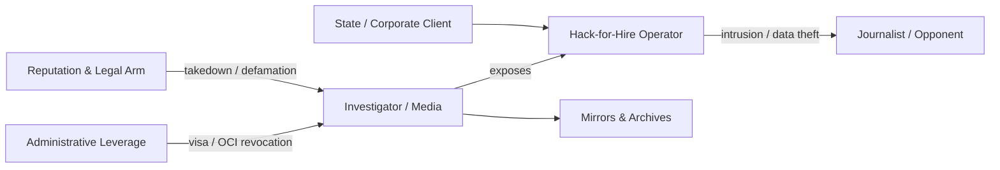

# 🕳️ When the Censor Is a Contractor  
**First created:** 2025-11-05 | **Last updated:** 2026-01-04  
*How hack-for-hire shops and reputation-management lawfare become the outsourced arm of state suppression.*  

---

## 🧭 Orientation  
When a government outsources cyber-offense or information control, the line between state power and private enterprise disappears.  
**Appin**, founded by Rajat and Anuj Khare, became the prototype: a cybersecurity training company that evolved into a *hack-for-hire powerhouse* servicing ministries, corporations, and elites worldwide.  
When journalists exposed it, the response fused **lawfare**, **reputation management**, and **administrative retaliation**—showing how censorship now contracts itself out.

---

## 🧩 Key Features  
- **Outsourced suppression:** state functions executed by private contractors.  
- **Dual industry linkage:** offensive cyber + legal/PR clean-up.  
- **Transnational reach:** suppression of journalists across borders via lawsuits and visa actions.  
- **Denial architecture:** opacity through rebranding, takedowns, and erasure of evidence.  

---

## 🔍 Analysis  

### 1.  Origin and Evolution  
- **2003:** Appin founded in New Delhi as a cybersecurity training outfit.  
- **By 2010:** pivot to providing intrusion services for state and corporate clients.  
- **Reuters** later described it as a *“hack-for-hire powerhouse that stole secrets from executives, politicians, military officials and wealthy elites around the globe.”*  
- Its alumni seeded a network of successor firms that still define India’s hack-for-hire market.

### 2.  Exposure and Retaliation  
- Investigations by *Reuters* and *The New Yorker* mapped Appin’s operations and client base.  
- Following publication, a New Delhi court issued an injunction forcing Reuters to remove its report for months.  
- The journalist who authored it—an overseas citizen of Indian origin—had his OCI card revoked by the Ministry of Home Affairs.  
- Simultaneous waves of cease-and-desist letters and defamation suits hit outlets in multiple jurisdictions.  

### 3.  The Contractor-Lawfare Feedback Loop  

- The **technical act** of intrusion is mirrored by the **legal act** of silencing.  
- Both are executed by contractors, allowing the commissioning state or corporation to deny direct involvement.  
- Each exposure triggers new takedowns, making the suppression self-reinforcing.

### 4.  OSINT Notes  
1. **Archive early** — PDFs + WARC snapshots before legal removal.  
2. **Trace shells** — director names, IP filings, training alumni lists.  
3. **Mirror reporting** — cooperative publication across outlets.  
4. **Track legal filings** — injunction IDs, SLAPP patterns, PR-firm rotations.  
5. **Watch administrative echoes** — travel bans, credential revocations coinciding with exposés.  

### 5.  Political Economy — Mercenary Neutrality, Structural Capture  

Appin’s founders, Rajat and Anuj Khare, do not appear to operate from ideological conviction.  
Their posture is closer to **Black Cube** or **Kroll** than to a partisan security organ:  
commercial, transactional, and opportunistic.  

What looks like political loyalty is usually **contractual gravity** — state agencies are simply the most solvent and least risky customers.  
Once a firm accepts that logic, the incentives begin to mirror authoritarian consolidation even if no ideology is professed.  

> Neutrality becomes indistinguishable from complicity when the market for power is asymmetric.  

In practice, the “mercenary neutrality” of these firms produces three convergences:  

1. **Economic alignment:** governments are the only entities able to pay for continuity, secrecy, and indemnity.  
2. **Regulatory shelter:** operations framed as “national security” enjoy protection from prosecution and disclosure.  
3. **Feedback effect:** the existence of a purchasable suppression service normalises repression as a *commodity*, not a scandal.  

This is capitalism’s quiet coup inside intelligence work: the state no longer monopolises coercion—it outsources it, invoices it, and calls it innovation.  

Appin? NSO?  
It doesn't matter who you are;  
can you afford the services?  

### 6.  Biographical Silence as Signal  

In the Indian business ecosystem, complete biographical quiet is an anomaly.  
Most founders are publicly anchored to region, caste, or school—markers that signal legitimacy.  
The **Khare brothers’ absence from that register** functions less like omission and more like a deliberate security feature.

Three readings coexist:  

1. **Operational shielding.**   
   Low family visibility limits exposure and reduces risk of retaliatory pressure on relatives during litigation or investigation.  

2. **Reputation sanitisation.**  
   By erasing lineage and locality, the founder profile becomes globally marketable: *neutral, technical, de-ethnicised*.  
   It’s the same PR logic that sells surveillance as “innovation.”  

3. **Contractual discretion.**  
   State-linked contractors often self-censor personal identifiers to preserve plausible deniability.  
   When biographical data vanishes while corporate footprints persist, it usually marks **proximity to sensitive state work**.

The silence itself becomes evidence—  
a contour of what can’t safely be named.  

*"We will get the job done"*, sort of logic - we see this in several places, although it is rare enough that to manage the stakeholder who embodies this neutrality can feel a little odd in a wprld so frequently moved around its axis.  

---

## 🌌 Constellations  
🧿 🕳️ ⚖️ 🛰️ — Sits within *Digital Disruption / Lawfare and Reputation Industries / Algorithmic Containment* constellations, mapping suppression that hides behind contractual opacity.

---

## ✨ Stardust  
hack-for-hire, Appin, Rajat Khare, lawfare, reputation management, digital erasure, outsourcing of censorship, administrative weaponisation, investigative journalism, state-contractor nexus  

---

## 🏮 Footer  

*🕳️ When the Censor Is a Contractor* is a living node of the **Polaris Protocol**.  
It documents how private cyber-contractors and reputation-management firms extend state suppression beyond borders through commercial lawfare and administrative coercion.  

> 📡 Cross-references:
> 
> - [🧭 When to Enter the Grey Zone](./🧭_when_to_enter_the_grey_zone.md) — *operational thresholds*  
> - [🫥 When You Don’t Want to Be Seen Touching It](../../../Disruption_Kit/Big_Picture_Protocols/🌀_System_Governance/💫_Containment_Logic/🫥_when_you_dont_want_to_be_seen_touching_it.md)  
> - [📚 The Banned Book Paradox](../../../Disruption_Kit/Big_Picture_Protocols/🪄_Expression_Of_Norms/🎶_Banned_Broadcasts_Cooperative/📚_banned_book_paradox.md)  

*Survivor authorship is sovereign. Containment is never neutral.*  

_Last updated: 2026-01-04_
