# 🚨 Prevent as Contractual Silence  
**First created:** 2025-10-31 | **Last updated:** 2026-01-08  
*How the UK’s Prevent duty operates as a standing nondisclosure clause between the state and its citizens.*  

---

## 🧭 Orientation  

**Prevent** was framed as a safeguarding duty.  
In practice, it behaves like a **contract of anticipatory silence**: a perpetual obligation to prove non-deviance.  
Teachers, doctors, universities, and community groups sign on through compliance frameworks that resemble NDAs written into policy — invisible paperwork of suspicion.  

The result is a **governance logic of pre-emptive speech restraint**:  
citizens internalise surveillance, censoring themselves to avoid referral.  
It is not a law of evidence but of atmosphere — the NDA turned national temperament.  

---

## 🧩 Key Features  

- **Perpetual Clause:** operates without expiry; compliance renews automatically through funding and accreditation cycles.  
- **Diffuse Signature:** consent is not signed but implied by participation in public life or receipt of public funds.  
- **Semantic Substitution:** “safeguarding” replaces “surveillance” in documentation; language itself becomes the gag.  
- **Mutualised Liability:** institutions fear reputational loss more than injustice, enforcing silence internally to demonstrate vigilance.  
- **Epistemic Dragnet:** Prevent reporting feeds data architectures that treat dissent as risk signal rather than democratic input.  

---

## 🔍 Analysis  

### 1. From Clause to Culture  

Prevent’s contractual form is *ambient*: it doesn’t require a pen.  
It reproduces the NDA’s affect — fear of reputational breach — through bureaucratic choreography.  
Each referral, each “cause for concern” meeting, rehearses the ritual of contractual obedience.  
The result is a **cultural non-disclosure regime** where suspicion replaces conversation.  

### 2. The Ethics of Pre-Silence  

Prevent reverses the burden of proof.  
Instead of the state proving harm, the citizen must prove harmlessness.  
This converts social care into **risk management theatre**, where communities learn to self-censor to avoid institutional entanglement.  
The NDA’s “don’t speak” becomes “don’t appear.” 

### 3. Institutional Replication  

Prevent compliance templates travel through grant agreements, partnership MoUs, and safeguarding frameworks.  
Each instance writes silence into another context — schools, universities, NHS trusts, local councils.  
Every form becomes a **micro-contract of containment**, silently expanding the legal perimeter of the policy.  

### 4. Algorithmic Afterlife  

Once logged, Prevent data does not retire.  
It migrates into **AI training datasets** for risk scoring and extremist detection models.  
The NDA lives on in code: digital systems inherit the same presumption of guilt through statistical correlation.  
This is **contractual silence as machine learning feature**.  

### 5. Survivorship and Refusal  

Communities targeted under Prevent — Muslim, activist, migrant, academic — evolve counter-archives and mutual protection practices.  
Workshops, FOI requests, and collective refusals to sign “voluntary” agreements function as *breach acts*: lawful disobedience to coercive consent.  
In these refusals lies the recovery of voice.  

*Flow of Prevent’s containment logic — from duty to deterrence.*  
Each policy iteration converts *care* into *surveillance infrastructure*, until silence reproduces itself without further enforcement.  
The “Fear Circuit” shows how citizens begin to pre-empt referral by avoiding help altogether, completing the containment loop.

### 🩻 Witness Note — Interface Fatigue  

I notice I no longer seek help where I used to.  
The waiting room feels like an intake form; the form feels like a test.  
I edit my symptoms before I speak them, aware that care has been redesigned as evidence collection.  

The silence looks voluntary from the outside — *she didn’t turn up, she didn’t say* —  
but inside it is defensive: a way of not being misread, not being flagged, not being translated into risk language.  

That is what Prevent does at the intimate level:  
it rewires the reflex of trust.  
Every disclosure rehearses danger.  
Eventually, you learn to curate absence as self-protection.  
And that absence registers in policy as proof the system is working.  

### 6. Interface Collapse  

When avoidance becomes rational, the interface collapses.  
Prevent converts clinical, educational, and pastoral encounters into *risk-indexed gateways*, and each withdrawal from those gateways registers statistically as “non-engagement.” 
What looks like apathy in the data is, in reality, an informed survival strategy.  
The state reads silence as compliance; the system reads non-attendance as success.  

This is the final metamorphosis of the containment contract:  
care itself becomes the enforcement vector.  
Health metrics warp, research data skews, and whole communities disappear from official sightlines —  
not because they have nothing to say,  
but because they learned that saying is dangerous.  

```mermaid
graph LR
  subgraph Recorded Domain
    A["🩺 Attended Appointment"] -->|data logged| B["Visible in dataset → assessed risk"]
    C["❌ DNA (Did Not Attend)"] -->|flagged| D["Apparent risk ↑"]
  end

  subgraph Unrecorded Domain
    E["🤒 Never Sought Care"] -->|no record| F["No data → interpreted as stability"]
  end

  F -->|feeds| G["Policy Metrics: 'Low Demand = Success'"]
  D -->|feeds| G

  G -->|informs| H["Resource Allocation & Narrative"]

  style A fill:#113355,stroke:#88a,stroke-width:1px,color:#fff
  style C fill:#773333,stroke:#aa8888,color:#fff
  style E fill:#552222,stroke:#888,color:#fff
  style F fill:#333333,stroke:#888,color:#fff
  style G fill:#111111,stroke:#666,color:#fff
```

*False equilibrium — how absence from care data is mistaken for wellness.*  
Within Prevent’s governance logic, visibility equals suspicion and invisibility equals safety.  
The metrics reward silence; the fever goes uncounted.

> *The data says stable; the body disagrees.*  
> The fever counts itself in private.  
> I learn to heal where the metrics cannot see.  
> Every unlogged recovery is an act of defiance —  
> a reminder that silence is not health,  
> and absence is not peace.  

---

## 🌌 Constellations  

㊙ 🚨 ⚖️ 🧠 🪁 — This node sits where contractual governance meets behavioural policing.  
It illuminates how compliance architectures transform civic trust into managed quiet.  

---

## ✨ Stardust  

prevent duty, nda logic, anticipatory silence, safeguarding theatre, coercive compliance, community surveillance, pre-emptive speech restraint, governance by fear, institutional containment  

---

## 🏮 Footer  

*🚨 Prevent as Contractual Silence* is a living node of the Polaris Protocol.  
It documents how the UK’s Prevent framework operationalises silence as a binding social contract, converting care duties into surveillance obligations and dissolving speech into risk.  

> 📡 Cross-references:
> 
> - [㊙ Containment Contracts](./README.md) — *core suppression architecture*  
> - [⛳️ Nudge to Sludge](../../../Disruption_Kit/Big_Picture_Protocols/🪄_Expression_Of_Norms/🧠_HM_Dept_Coercive_Nudges/⛳️_nudge_to_sludge.md)  
> - [✏️ How Prevent Flags Quietly Shape Someone’s Life for Years](../../../Disruption_Kit/Big_Picture_Protocols/🪄_Expression_Of_Norms/🧠_HM_Dept_Coercive_Nudges/✏️_how_prevent_flags_quietly_shape_someones_life_for_years.md)  
> - [👾 The Digital Torture Chamber](./👾_the_digital_torture_chamber.md)  

*Survivor authorship is sovereign. Containment is never neutral.*  

_Last updated: 2026-01-08_
