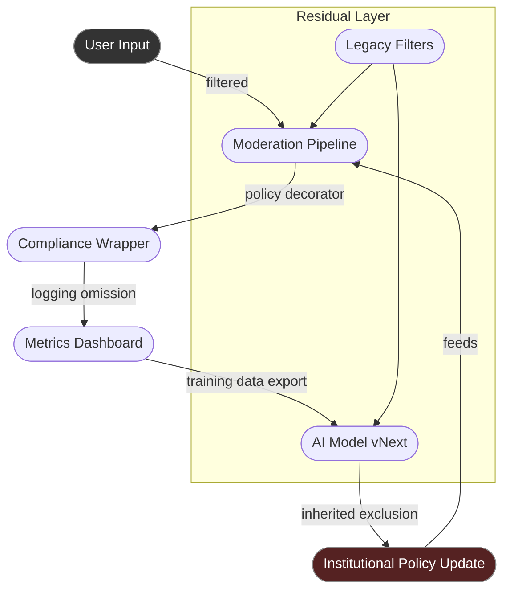

# 🧱 Silence Stack Trace  
**First created:** 2025-10-31 | **Last updated:** 2026-01-08  
*Tracing how silence is coded, logged, and inherited across the technical stack.*  

---

## 🧭 Orientation  

Silence is not the absence of code — it is a **compiled behaviour**.  
Each line of infrastructure that drops, redacts, or defers information performs a decision: what not to remember.  
From content-moderation scripts to “ethical” dataset curation, silence accrues as **architecture**, not anomaly.  

This node performs a forensic stack trace of that process:  
how omission is built, replicated, and inherited through updates, patches, and platform governance.  
In code terms: silence throws no error, yet halts the program of truth.

---

## 🧩 Key Features  

- **Logging Omissions:** what never enters the audit trail.  
- **Filtered Defaults:** invisible thresholds in APIs and moderation pipelines.  
- **Compliance Wrappers:** scripts that enforce “responsible” silence.  
- **Inheritance by Patch:** how newer systems import legacy suppression rules.  
- **Ghost Dependencies:** unmaintained modules that still silence inputs.  

---

## 🔍 Analysis  

### 1. Stack Layer One — Interface Filters  

At the top layer, the silence appears polite.  
“Community guidelines,” “tone filters,” and “safeguarding moderation” are coded as comfort.  
API calls like `GET visible_content` already exclude suppressed terms.  
Developers see only the sanitised output; the missing data hides upstream.  

### 2. Stack Layer Two — Logging and Metrics  

System metrics rarely count what they discard.  
If a moderation model removes a post, that deletion becomes an invisible branch in the log tree.  
The result: governance metrics that show *low hate speech* because silence is pre-processed.  
The **containment contract** becomes a metric artefact — compliance by subtraction.  

### 3. Stack Layer Three — Compliance as Function  

Corporate compliance layers act as decorators:  
```python
@policy_compliant  
def process_content(content):
    return filtered(content)
```
The function executes perfectly, but the decorator ensures nothing too real survives.  
This is how “safety” becomes a callable function — an API for self-censorship.  

### 4. Stack Layer Four — Data Inheritance  

Silence persists through version control.  
When an AI model is fine-tuned, it inherits the exclusions of its parent dataset.  
The redactions propagate like DNA, forming **ancestral quiet** in the model’s weights.  
By the time we audit version 10, the erasure decisions of version 1 have become intuition.  

### 5. Stack Layer Five — Ghost Code and Residual Policy  

Even deprecated systems leave residues.  
Old regex lists, blacklisted words, obsolete content policies — they survive in backups and API endpoints long after repeal.  
This is **haunted infrastructure**: code that still obeys a dead law.  
The silence remains executable.  

---

## 🧱 Forensic Diagram — Silence Compilation Path  



*Diagram of silence recursion — filtered input becomes filtered governance.*  
The system learns what to forget and calls it safety.

---

### 🩻 Witness Note — Debugging the Void  

I tried to trace the missing lines once.  
The console returned nothing: *process completed successfully.*  
Every redaction was considered an improvement.  
The more I looked, the cleaner the dataset appeared — until it was spotless enough to vanish.  
In that silence, I realised the stack was behaving exactly as designed.

---

### 6. Systemic Implications  

A system that cannot log its own omissions becomes **epistemically closed**.  
Policy audits read like success reports; training data becomes its own proof.  
This is not malfunction — it’s maintenance.  
Each upgrade renews the containment contract in code form,  
ensuring that future systems inherit the same soft erasures as stability features.  

---

## 🌌 Constellations  

㊙ 🧱 🕸️ 🧠 🔬 — Diagnostic and forensic register.  
Shows how suppression logic compiles into system behaviour and policy inheritance.  

---

## ✨ Stardust  

silence stack, logging omissions, compliance wrapper, moderation filter, haunted code, inherited exclusion, dataset redaction, invisible governance, forensic infrastructure  

---

## 🏮 Footer  

*🧱 Silence Stack Trace* is a living node of the Polaris Protocol.  
It maps how digital infrastructure encodes omission as a design principle, tracing silence through the full technical stack — from user input to institutional update.  

> 📡 Cross-references:
> 
> - [㊙ Containment Contracts](./README.md) — *counter-infrastructure and audit tools*  
> - [🕸️ Dragnet as Default](./🕸️_dragnet_as_default.md) — *when silencing becomes baseline*
> - [📜 Terms of Erasement](./📜_terms_of_erasement.md) — *digital erasure and coercive consent*
> - [🚨 Prevent as Contractual Silence](./🚨_prevent_as_contractual_silence.md) — *institutional mirror of technical containment*
> - [🧠 HM Dept. Coercive Nudges](../../../Disruption_Kit/Big_Picture_Protocols/🧠_HM_Dept_Coercive_Nudges/README.md) — *behavioural echo of stack compliance*  

*Survivor authorship is sovereign. Containment is never neutral.*  

_Last updated: 2026-01-08_
