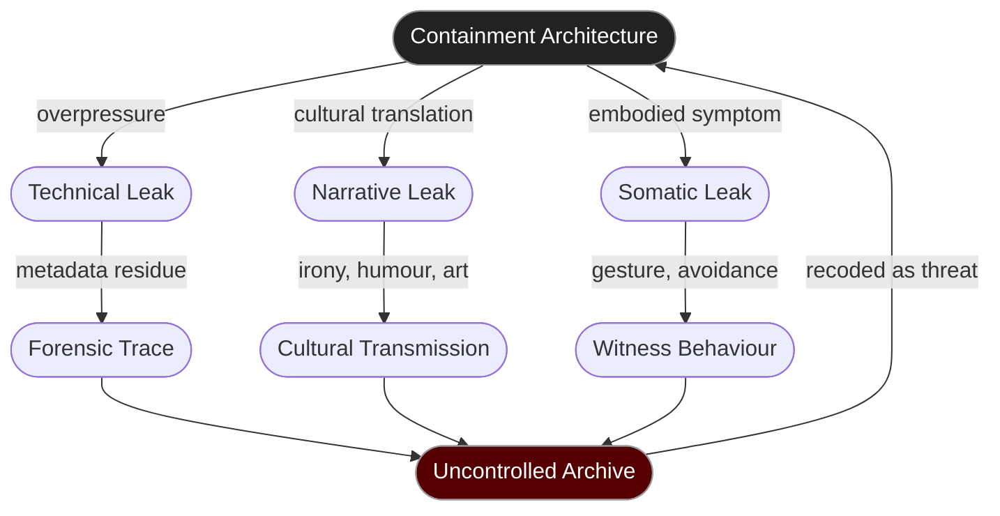

# 🪶 Testimony Leak Points  
**First created:** 2025-10-31 | **Last updated:** 2026-01-08  
*Where containment fractures, and truth escapes through the seams.*  

---

## 🧭 Orientation  

Every architecture of silence leaks.  
Pressure builds between what is known and what may be said until evidence finds an aperture — a server log left open, a careless copy, a survivor speaking in metaphor.  
These **leak points** are not failures of control; they are the system’s confession.  

This node maps those fractures: where testimony travels despite suppression,  
and how each leak, whether technical or emotional, becomes an act of record-keeping the system did not authorise.

---

## 🧩 Key Features  

- **Metadata Drifts:** timestamps, cache shadows, and mis-synced replicas that re-expose redacted truth.  
- **Behavioural Echoes:** repetition, humour, or irony that smuggles content through tone.  
- **Ghost Processes:** autosaves, drafts, or predictive text recalling what was meant to be erased.  
- **Whistle-Leak Chains:** coordinated or accidental releases that make censorship visible.  
- **Survivor Resonance:** embodied memory that re-tells even when speech is forbidden.  

---

## 🔍 Analysis  

### 1. The Law of Overpressure  

Suppression accumulates like steam.  
The tighter the seal, the sharper the whistle.  
Containment architectures can never perfectly align their mechanical and human components;  
desire, guilt, and repetition reopen the wound.  
Every well-built NDA produces its own leak trajectory.

### 2. Technical Seepage  

Silence has latency.  
Backup systems, sync caches, and autosave functions generate orphan files — the **shadow layer** of containment.  
These fragments persist in forensic traces: metadata mismatches, checksum anomalies, unreferenced blobs.  
What appears as system noise is in fact the testimony’s afterimage.  

### 3. Cultural Osmosis  

Language finds workarounds.  
Humour, parody, rumour, and art act as slow leaks — narratives too trivial to censor, carrying heavy truths beneath.  
A meme can hold more unredacted data than a press release.  
Containment treats this as leakage; communities recognise it as lifeline.  

### 4. Emotional Conductivity  

The body testifies even when the voice cannot.  
Tremor, withdrawal, repetition, avoidance — each a psychosomatic leak of suppressed record.  
Institutions read these as instability; survivors read them as truth surfacing through nervous circuitry.  
The archive persists inside the body until it finds a form that can survive scrutiny.  

### 5. Leak Management as Governance  

Modern governance accepts the inevitability of leaks and manages them as spectacle.  
“Transparency” becomes a pressure-release valve — controlled catharsis that stabilises the container.  
The trick is to let truth leak at a digestible rate.  
Containment systems prefer **drip irrigation** to explosion.

---

## 🕳️ Leak Taxonomy Diagram  

*Leak loops — each escape triggers new containment, yet expands the record.*

---

### 🩻 Witness Note — Leak Behaviour  

Sometimes the truth exits sideways.  
It hides in jokes, in pauses, in over-specific details.  
I’ve watched people call it oversharing or madness when it was simply the data finding breath.  
Containment expects silence to be total;  
but even concrete sweats when it rains.  

---

### 6. The Forensics of Escape  

To trace a leak is to map where trust once existed.  
Every aperture corresponds to a moment someone believed they could still be heard.  
Technical traces mark those same thresholds in code: commit diffs, access logs, orphaned drafts.  
A full accounting of suppression must include its leaks — the negative image of control.  

---

## 🌌 Constellations  

㊙ 🪶 🧱 🪴 🕳️ — The diagnostic-resistance constellation.  
Shows where suppression converts to testimony and how every leak re-codes the archive.  

---

## ✨ Stardust  

testimony leak, metadata drift, humour as escape, embodied record, cultural osmosis, ghost files, controlled transparency, forensic residue, survivor resistance  

---

## 🏮 Footer  

*🪶 Testimony Leak Points* is a living node of the Polaris Protocol.  
It maps how truth escapes engineered silence, tracking technical, cultural, and emotional apertures that keep testimony alive despite containment.  

> 📡 Cross-References  
> 
> - [🧱 Silence Stack Trace](./🧱_silence_stack_trace.md) — *architectural mechanisms of suppression*  
> - [*Pending:* 🪴 Counter-Archives / Resistance Practices] — *how leaks are cultivated into archives*  
> - [🚨 Prevent as Contractual Silence](./🚨_prevent_as_contractual_silence.md) — *institutionalisation of pre-emptive silence*  
> - [📜 Terms of Erasement](./📜_terms_of_erasement.md) — *coercive consent and erasure contracts*
> - [⚖️ Containment Contract Trace](../../../Disruption_Kit/Big_Picture_Protocols/🌀_System_Governance/⚖️_Legal_State_Governance/⚖️_containment_contract_trace.md)
> - [🤡 Kompromat Own-Goals](../../Structural_Analysis/🧼_System_Leakage_Signatures/🤡_kompromat_own_goals.md)  
> - [☔️ Leak Pattern Taxonomy — From Error to Signature](../../Structural_Analysis/🧼_System_Leakage_Signatures/☔️_leak_pattern_taxonomy.md)  

*Survivor authorship is sovereign. Containment is never neutral.*  

_Last updated: 2026-01-08_
