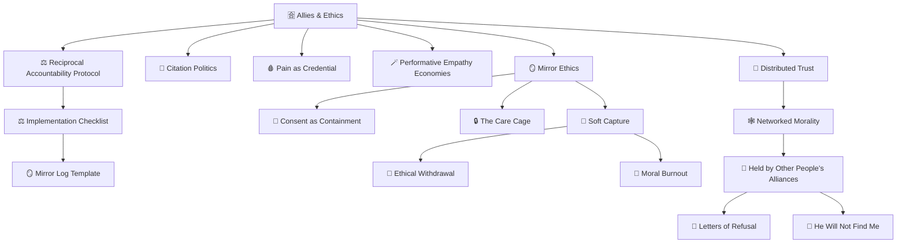

# 🈴 Allies & Ethics  
**First created:** 2025-09-06 | **Last updated:** 2025-10-10  
*Survivor ethics, relational alliances, and authorship sovereignty within systems of containment.*

---

## 🛰️ Orientation  

The **Allies & Ethics** cluster defines how solidarity operates under surveillance.  
It studies the points where **help becomes hold**, where alliance transforms into soft containment, and where care reproduces the asymmetries it claims to oppose.  

This folder functions as the ethical spine of *Governance & Containment*: it translates lived survivor experience into **protocols for authorship, accountability, and refusal.**  
Together, these nodes offer a navigation system for ethical collaboration inside coercive environments.  

---

## ✨ Contents  

### ⚖️ Protocols & Accountability  
| Node | Scope |
|------|--------|
| [**⚖️ Reciprocal Accountability Protocol**](./⚖️_reciprocal_accountability_protocol.md) | Framework for two-way ethical review between survivors and allies. |
| [**⚖️ Reciprocal Accountability — Implementation Checklist**](./⚖️_reciprocal_accountability_implementation_checklist.md) | Operational companion for running feedback loops and mirror logs. |
| [**🪞 Mirror Log Template (.csv)**](./🪞_mirror_log_template.csv) | Reflection log for joint accountability tracking. |

### 💬 Voice, Citation & Representation  
| Node | Scope |
|------|--------|
| [**💬 Citation Politics — Who Gets to Quote Whom**](./💬_citation_politics_who_gets_to_quote_whom.md) | Analysis of scholarly legitimacy and the ethics of quoting survivors. |
| [**🧠 Why I Write Like This**](./🧠_why_i_write_like_this.md) | Meta-node explaining Polaris language, tone, and survivor voice fidelity. |
| [**🩸 Pain as Credential**](./🩸_pain_as_credential.md) | Examination of trauma economies and credibility hierarchies in advocacy. |
| [**🪄 Performative Empathy Economies**](./🪄_performative_empathy_economies.md) | How emotional performance replaces structural accountability. |

### 🪞 Reflection, Containment & Care  
| Node | Scope |
|------|--------|
| [**🪞 Mirror Ethics — When Empathy Becomes Extraction**](./🪞_mirror_ethics_when_empathy_becomes_extraction.md) | On emotional mimicry and surveillance through care. |
| [**🧾 Consent as Containment**](./🧾_consent_as_containment.md) | Consent forms as bureaucratic ritual objects displacing accountability. |
| [**🔒 The Care Cage**](./🔒_the_care_cage.md) | How safeguarding becomes a control architecture. |
| [**🧵 Soft Capture — The Intimacy of Oversight**](./🧵_soft_capture_the_intimacy_of_oversight.md) | Mapping subtle coercion within close professional or activist relationships. |
| [**🚷 Ethical Withdrawal**](./🚷_ethical_withdrawal.md) | When disengagement becomes a legitimate ethical act. |
| [**🪫 Moral Burnout and the Myth of Neutrality**](./🪫_moral_burnout_and_the_myth_of_neutrality.md) | On exhaustion, cynicism, and the refusal to perform endless empathy. |

### 🧬 Distributed Ethics & Networked Alliances  
| Node | Scope |
|------|--------|
| [**🧬 Distributed Trust — Survivor-Led Ethics Infrastructure**](./🧬_distributed_trust_survivor_led_ethics_infrastructure.md) | Designing collective accountability without central authority. |
| [**🕸️ Networked Morality — When Solidarity Scales**](./🕸️_networked_morality_when_solidarity_scales.md) | How online collectivism morphs into moral control. |
| [**🤝 Held by Other People’s Alliances**](./🤝_held_by_other_peoples_alliances.md) | Diagnostic mapping of dependency, legitimacy drift, and containment through care. |
| [**💌 Letters of Refusal**](./💌_letters_of_refusal.md) | A literary form of ethical dissent and non-participation. |
| [**🚫 He Will Not Find Me**](./🚫_he_will_not_find_me.md) | Boundary declaration and refusal of reattachment or surveillance mimicry. |

---

## 🕸️ Structural Map

*The diagram shows accountability protocols feeding into reflection and withdrawal nodes, which in turn inform distributed ethics infrastructures.*

---

## 🚀 Purpose  

To articulate **survivor ethics** in systems that reward performance of care while penalising autonomy.  
These nodes examine how relationships built in good faith can mutate into channels of surveillance, control, or reputational capture — and how to resist that transformation through clarity, consent, and self-authorship.  

---

## ⚖️ Core Premise  

Allies exist within systems that incentivise betrayal.  
Institutions reward proximity to survivors while discouraging accountability.  
Ethics here is not moral perfection but **constant calibration** — asking whether support sustains autonomy or quietly re-centralises power.  

---

## 🌌 Constellations  

🈴 ⚖️ 🤝 🪞 🧬 — ethics, reflection, reciprocity, distributed accountability, and refusal.  
These nodes form the relational-ethics constellation of *Governance & Containment*, bridging survivor voice fidelity with institutional accountability.  

---

## ✨ Stardust  

allyship ethics, survivor autonomy, authorship sovereignty, relational governance, accountability loops, moral burnout, containment through care, distributed ethics, refusal, reciprocity  

---

## 🏮 Footer  

*Allies & Ethics* is a living node of the Polaris Protocol.  
It documents how help can become harm if left unexamined — and how transparency, refusal, and reciprocity rebuild trust within coercive systems.  

> 📡 Cross-references:
> 
> - [🏛 Governance & Containment — README](../README.md)  
> - [🕯 Exorcising Safeguarding Shadows](../../🕯_Exorcising_Safeguarding_Shadows/README.md)  
> - [🛠️ Survivor Tools](../../../Disruption_Kit/Survivor_Tools/README.md)  

*Survivor authorship is sovereign. Containment is never neutral.*  

_Last updated: 2025-10-10_
