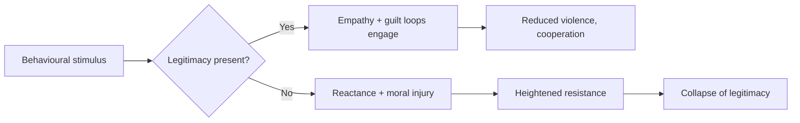

# 🏛️ Non-Transferability of Behavioural Interventions
**First created:** 2025-11-08 | **Last updated:** 2025-12-08  
*Why behavioural tools cannot ethically or neurologically transfer from domestic justice to occupied contexts.*

---

## 🧭 Orientation
Explores how behavioural or therapeutic interventions that reduce violence in one sociocultural context may fail — or cause harm — when deployed across colonial or occupied populations.

---

## ⚖️ Legitimacy and Neurological Inversion

Behavioural technologies depend on **legitimacy**—the target must recognise the authority behind the intervention as lawful and consent to its moral frame.
When legitimacy is absent, the same neural mechanisms that produce reform in one context produce defiance in another.

### Comparative Substrate

| Variable | Domestic sexual-violence offenders | Occupied / colonised population |
|-----------|-----------------------------------|---------------------------------|
| Legal status of act | Crime under shared law | Lawful resistance under IHL |
| Authority legitimacy | Internal, consented | External, imposed |
| Behavioural target | Individual pathology | Collective sovereignty |
| Desired outcome | Conformity with equal-rights law | Submission to foreign power |
| Primary emotion to re-wire | Entitlement → empathy | Fear → docility |
| Result of intervention | Potential moral repair | Moral injury & reactance |

### Why the Inversion Occurs
1. **Moral congruence failure:** The tool assumes guilt and internal dissonance. In resistance contexts, there is none.
2. **Empathy misdirection:** Asking a victim of occupation to empathise with an occupier produces cognitive dissonance and physiological stress.
3. **Conditioning reversal:** Reinforcement schedules built to reward submission trigger psychological reactance.
4. **Identity threat:** Compliance becomes symbolic betrayal.
5. **Trust collapse:** Once manipulation is detected, every subsequent gesture is read as deception.

### Schematic

> The neurological substrate of rehabilitation is **consent**. Remove consent, and the same circuitry becomes a weapon of resistance.

---

## 🌌 Constellations
🧿 ⚖️ 🧠 — diagnostic + legitimacy register.

---

## ✨ Stardust
behavioural science, non-transferability, legitimacy, neurological inversion, consent, resistance, humanitarian law

---

## 🏮 Footer

*🏛️ Non-Transferability of Behavioural Interventions* is a living node of the Polaris Protocol.
It clarifies why behavioural interventions collapse when moved across legality and legitimacy lines.

> 📡 Cross-references:
> 
> - [🧨 Dual-Use Epiphany]  
> - [🧨 Dual-Use Frankenstack]  

*Survivor authorship is sovereign. Containment is never neutral.*

_Last updated: 2025-12-08_
