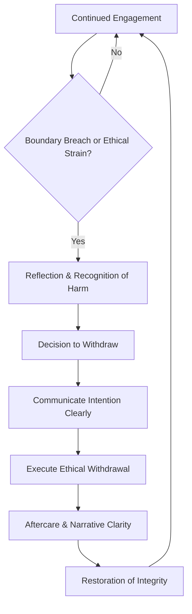

# 🚷 Ethical Withdrawal  
**First created:** 2025-10-10 | **Last updated:** 2025-10-23  
*On the ethics of stepping back without abandonment.*

---

## 🛰️ Orientation  
Examines **withdrawal as a moral and protective act** — a deliberate refusal of participation when engagement perpetuates harm.  
In systems built on compulsory collaboration, choosing to step back can be the most ethical response available.  
This node reframes silence, distance, and non-cooperation as legitimate expressions of care and integrity rather than failure or apathy.

---

## ⚖️ Key Sections  

### 1. 🦆 The Myth of Perpetual Engagement  
Modern ethics often equate goodness with relentless presence.  
Workers, activists, and survivors are expected to stay “in dialogue” no matter the cost.  
But perpetual engagement rewards exploitation — those most harmed are asked to remain most available.  
True integrity sometimes requires exit, not endurance.

### 2. 🦩 Withdrawal vs Abandonment  
Withdrawal protects boundaries; abandonment severs responsibility.  
The difference lies in *intention and communication*.  
Ethical withdrawal names the limit honestly, documents reasons, and offers continuity where possible.  
Abandonment hides behind silence; ethical withdrawal clarifies it.  
This distinction prevents coercive guilt from disguising itself as care.

### 3. 🕊️ Designing Exit Ramps  
Healthy systems plan for leaving.  
Exit ramps formalise the right to stop participating without moral penalty.  
They include:  
- **Clear thresholds** for disengagement.  
- **Succession or hand-off protocols** to avoid collapse.  
- **Transparent documentation** explaining the rationale.  
Building withdrawal into design prevents dependency on martyrdom.

### 4. 🪬 Aftercare and Narrative Clarity  
Stepping back is not emotional desertion.  
Aftercare acknowledges what the withdrawal protects — the right to rest, the restoration of perspective, or the containment of secondary harm.  
Narrative clarity ensures that absence is not rewritten as betrayal.  
Documenting the story of withdrawal preserves trust even in distance.

### 5. 🚦Refusal as Maintenance  
Sometimes refusing to continue is the maintenance act that keeps a system ethical.  
Every structure needs pause functions; without them, integrity burns out.  
Withdrawal is how ecosystems breathe.

---

## 🧭 Decision Flow — *The Exit Ramp Cycle*  

*The cycle visualises withdrawal as a renewable act of integrity rather than collapse: reflection → communication → exit → clarity → restoration.*  

---

## 🌌 Constellations  
🚷 🈴 🦩 ⚖️ 🪬 — refusal, autonomy, relational ethics, aftercare, integrity.  

---

## ✨ Stardust  
ethical withdrawal, refusal, autonomy, collaboration boundaries, burnout, survivor sovereignty, moral clarity, aftercare, non-participation, exit design  

---

## 🏮 Footer  
*🚷 Ethical Withdrawal* is a living node of the Polaris Protocol.  
It recognises stepping away as a valid form of survivor protection and moral clarity, defining boundaries as acts of care rather than desertion.  
This node sits within **Allies & Ethics** under *System Governance*, offering counter-pressure to cultures of compulsory engagement.

> 📡 Cross-references:  

*Survivor authorship is sovereign. Containment is never neutral.*  

_Last updated: 2025-10-23_
