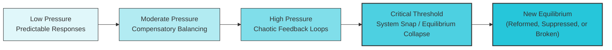

# ⚖️ Adaptive Containment Thresholds  
**First created:** 2025-09-26  |  **Last updated:** 2025-10-30  
*How surveillance and containment systems bend, redistribute, and eventually break under accumulated pressure.*

---

## 🧭 Orientation  
This node maps how institutional or algorithmic containment systems *adjust themselves* under stress.  
Rather than remaining static, these architectures actively shift load — bureaucratic, reputational, or technical — to preserve apparent stability.  
Seen from outside, this looks like responsiveness; from inside, it feels like gaslighted chaos.  
Adaptive containment is equilibrium theatre: balance maintained until the mask cracks.  

---

## 🧩 Key Features  
- **Load-balancing suppression:** pressure in one zone triggers compensatory tightening elsewhere.  
- **Emergent behaviour:** not centrally commanded; arises from overlapping incentives, contracts, and reputational anxieties.  
- **Perceptual instability:** insiders experience alternating clarity and distortion as thresholds near.  
- **Breakpoint logic:** every adaptive system has a saturation point beyond which it cannot smooth disruption.

---

## 🔍 Analysis  

### 1. The Adaptive Containment Loop  
Containment architectures distribute pressure like a hydraulic network.  
Close one valve, another hisses open.  
Resistance in media, academia, or civic space activates legal, procedural, or algorithmic counter-weights.  
No single actor designs this choreography; it materialises through bureaucratic survival instincts — the algorithm learns from the civil servant, and vice versa.

### 2. Threshold Behaviour  
At *low pressure*, feedback remains linear and predictable: reports filed, responses templated, consequences traceable.  
As *pressure rises*, balancing becomes unstable — sudden reversals, contradictory signals, missing emails, “unexplained” platform downgrades.  
Past a certain intensity, the network can no longer rebalance; instead it **snaps** into a new configuration — audit, scandal, or collapse.  
The system survives by becoming something else.

### 📈 Containment Threshold Curve — Adaptive System Response to Pressure  

A simplified representation of how institutional or algorithmic containment systems evolve under escalating stress:  
from linear compensation to chaotic oscillation, culminating in structural transformation.  

---

### 3. Human Perception  

From within, the shift reads like the loss of an operating manual:  

- **Early stage:** “I can still map the rules.”  
- **Mid stage:** “Rules contradict each other.”  
- **Terminal stage:** “No rule behaves twice the same way.”  

This erosion of predictability is itself a containment device — fatigue by uncertainty.  
Those caught inside begin to self-regulate, mistaking adaptation for personal failure.  

---

### 4. Polaris Parallels  

The pattern echoes **Le Châtelier’s principle** in chemistry: *disturb equilibrium → the system compensates.*  
But unlike molecules, bureaucracies have egos and budgets.  
Under sustained disturbance, they don’t re-equilibrate; they **metabolise** dissent until the container splits.  
**Suppression becomes signal. Collapse becomes clarity.**  

---

## 🌌 Constellations  

🧿 🛰️ 🔮 ⚖️ 💣 — Diagnostic register linking surveillance equilibrium, systemic stress, and institutional self-preservation.  

---

## ✨ Stardust  

adaptive containment, equilibrium theatre, nonlinear governance, bureaucratic reflex, surveillance pressure, threshold collapse, systemic fatigue, signal inversion, governance psychology, Le Châtelier analogy  

---

## 🏮 Footer  

*⚖️ Adaptive Containment Thresholds* is a living node of the **Polaris Protocol**.  
It contributes to the **Big Picture Protocols** constellation by tracing how surveillance and governance systems compensate, fracture, and reveal themselves under sustained ethical pressure.  

> 📡 Cross-references:
> 
> - [🧠 Memory Safety & Self-Reconstruction](../../../Disruption_Kit/Big_Picture_Protocols/🫀_Our_Hearts_Our_Minds/🌱_Human_Principles/🧠_memory_safety_self_reconstruction.md) — *resilience after containment collapse*  
> - [🦜 Blair Cabinet Identity Hypocrisy](./🦜_blair_cabinet_identity_hypocrisy.md) — *political equilibrium as theatre*  
> - [🔮 UK Digital ID Risk Forecast](./🔮_uk_digital_id_risk_forecast.md) — *algorithmic balancing at scale*  

*Survivor authorship is sovereign. Containment is never neutral.*  

_Last updated: 2025-10-30_
