# 📊 ID Claims vs. Realities  
**First created:** 2025-09-26 | **Last updated:** 2026-01-02  
*Comparative analysis of government justifications for ID schemes versus operational realities and underlying drivers.*

---

## 🛰️ Snapshot  

| **Government Claim** | **Reality in Practice** | **Likely Real Driver** |
|-----------------------|-------------------------|-------------------------|
| *Simplifies work checks* | Right-to-Work systems already scan passports, visas, and BRPs — an ID card would duplicate existing processes. | Vendor lobbying; “one-card” marketed as elegant simplification. |
| *Saves money* | Every national ID project to date has cost billions; hidden fees shift burden to citizens. | Long-term vendor contracts and remediation profit. |
| *Improves security* | Centralised IDs don’t stop terrorism or fraud — they create new, high-value data targets. | Symbolic “tough” politics; containment of migrants and claimants. |
| *Modernises public services* | Passports, visas, and licences remain necessary; the ID card simply adds another administrative layer. | Branding move; performance of “digital transformation.” |

🪶 *Summary:* The more persuasive the slogan, the weaker the evidence.

---

## 🔥 Why This Matters  

Because identity infrastructure defines who is legible to the state — and who is not.  
Because every “efficiency upgrade” becomes a **new perimeter of exclusion**.  
Because the distance between *claim* and *reality* is not a gap in competence but a space where control grows.  

Digital-ID programmes are sold as convenience but function as containment:  
to manage populations of interest, to choreograph citizenship itself.  
Knowing the difference between the story and the mechanism is the first act of civic self-defence.

---

## 🦉 Lessons and Patterns  

- **Claimed benefits collapse** when mapped against delivery data.  
- **Real drivers** are political theatre, vendor capture, and the optics of modernisation.  
- **System design follows narrative**, not need: every iteration of “efficiency” hides a new contract cycle.  
- **Containment logic** repeats: reduce friction for the compliant, raise it for the inconvenient.  
- **Visibility equals vulnerability** — the more integrated the system, the easier the throttling of rights.  

---

## 🧿 Containment Function Map  

| **Claimed Benefit** | **Containment Function** |
|----------------------|--------------------------|
| *Simplifies work checks* | Converts employers into soft-border agents; shifts surveillance to civilians. |
| *Saves money* | Normalises user-paid access to citizenship; monetises basic rights. |
| *Improves security* | Reframes exclusion as protection; embeds suspicion as policy default. |
| *Modernises services* | Centralises control over identity validation; enables throttled access by policy mood. |

📲 *Each claim hides a behavioural gate — a way to score, delay, or deny participation.*  

---

## 📤 Claims To Outcomes

```mermaid
flowchart TD
  %% 📊 ID Claims → Mechanisms → Containment Functions → Affected Groups → Outcomes

  subgraph C[Government Claims]
    C1[Simplifies work checks]
    C2[Saves money]
    C3[Improves security]
    C4[Modernises services]
  end

  subgraph M[Operational Mechanisms]
    M1[Employer RTW portals<br>API integrations]
    M2[Long vendor contracts<br>usage fees, remediation]
    M3[Centralised ID registry<br>risk scoring dashboards]
    M4[Single sign-on to services<br>ID wallet dependency]
  end

  subgraph F[Containment Functions]
    F1[Delegated policing<br>soft borders via employers]
    F2[Pay-to-participate<br>rights as subscriptions]
    F3[Exclusion as protection<br>suspicion-by-default]
    F4[Throttled access<br>policy mood gating]
  end

  subgraph G[Affected Groups]
    G1[Migrants & precarious workers]
    G2[Low-income & undocumented]
    G3[Claimants & dissenters]
    G4[Travellers, stateless,<br>non-digital natives]
  end

  subgraph O[Outcomes]
    O1[Increased friction<br>for the  so-called inconvenient]
    O2[Data concentration<br>high-value targets]
    O3[Normalised surveillance<br>via everyday checks]
    O4[Administrative overreach<br>with limited redress]
  end

  %% Edges: Claims → Mechanisms
  C1 --> M1
  C2 --> M2
  C3 --> M3
  C4 --> M4

  %% Mechanisms → Containment Functions
  M1 --> F1
  M2 --> F2
  M3 --> F3
  M4 --> F4

  %% Containment Functions → Affected Groups
  F1 --> G1
  F2 --> G2
  F3 --> G3
  F4 --> G4

  %% Affected Groups → Outcomes
  G1 --> O1
  G2 --> O3
  G3 --> O4
  G4 --> O2

  %% Cross-links (illustrate overlap)
  F1 -.-> G3
  F3 -.-> G1
  F4 -.-> G2
```

> **Legend:**  
> C = Government Claims → M = Mechanisms → F = Containment Functions → G = Affected Groups → O = Outcomes

---

## 🌱 Of the Land, Not of the Ledger  

Authoritarian governance needs friction it can assign.  
To control population flow, it must decide who counts as *verifiable* and who stays *conditional*.  
The category *indigenous* once meant simply “of the land.”  
Through colonial pseudoscience it became a justification for dispossession —  
proof, in the eyes of empire, that belonging without paperwork was illegitimate.

Digital-ID logic revives this instinct in software form.  
It treats personhood as a credential to be renewed, not a relation to be honoured.  
Those who live *of the land* — migrants, travellers, the stateless, the undocumented —  
are written out of the code or priced back into it.  

The lesson from indigenous and liberation struggles is clear:  
when identity becomes a licence, humanity becomes conditional.  
Freedom begins again in the refusal to be perfectly documented.  

---

## 🪶 Sumūd — Steadfastness as Indigenous Resistance  

Across Palestine, the word *sumūd* means **steadfastness** — the daily, deliberate act of remaining rooted on the land despite displacement, surveillance, and bureaucratic siege.  
It is not merely endurance; it is refusal with rhythm.  

Sumūd transforms waiting into presence.  
A family rebuilding the same house after each demolition,  
a farmer tending olives beside a new wall,  
a student continuing class while her internet is throttled —  
each is a coordinate of resistance,  
a reminder that existence itself can be an argument.

In governance terms, *sumūd* is the inversion of the ID logic.  
Where digital systems demand verification to prove worthiness,  
sumūd asserts worth through continuity.  
It treats belonging as relational, not transactional —  
anchored in community, care, and soil rather than in state-issued numbers.

Authoritarian power fears this form of proof because it cannot revoke it.  
You cannot cancel a people’s capacity to remain.  
You cannot delete an ethic that regenerates through practice.

As the old ID projects sought to number the “of the land” out of history,  
sumūd re-numbers history from below —  
a ledger written in footsteps, harvests, and shared breath.  
It is what governance forgets:  
that the opposite of control is not chaos, but trust.  

---

## 🌋 Expanding The Snapshot: A Fuller Set of Figures  

### 📝 Simplifies Work Checks — Examples  

| Example | Observation |
|----------|--------------|
| **Employer “Right to Work” portals (Home Office, 2021–)** | Duplicate existing visa/passport checks; integration failures produce false “no right to work” flags. |
| **NHS volunteer verification pilot (2022)** | Introduced vendor-run identity brokerage; failure rate hidden under “manual review” category. |
| **GOV.UK One-Login expansion (2024–)** | Combines tax, benefits, and immigration credentials; each new service adds scope creep and risk of cross-departmental error. |
| **University onboarding tools** | Use third-party ID verification APIs that store data outside UK jurisdiction. |

🪶 *Pattern:* “simplification” means adding a new intermediary that can charge for confusion.

---

### 💸 Saves Money — Examples  

| Example | Observation |
|----------|--------------|
| **2006–10 UK ID Card Programme** | Abandoned after £4.5 bn spend; maintenance contracts persisted for years under other names. |
| **Digital Identity & Attributes Trust Framework (2024)** | Public-private “trust” framework pushes verification fees onto users; no independent cost audit. |
| **Scotland Digital Wallet Pilot (2023)** | Vendor change orders tripled costs; savings recalculated as “future efficiency potential.” |
| **Cabinet Office “Spend Controls” reports** | Repeated waivers granted for ID projects despite cost-control rhetoric. |

🪶 *Pattern:* every pound “saved” becomes a future subscription to prove you exist.

---

### 🥷 Improves Security — Examples  

| Example | Observation |
|----------|--------------|
| **HMRC credential breach (2023)** | Single sign-on tokens reused across departments; exposed cross-service identities for months. |
| **NHS Login reuse for welfare access (2022)** | Expanded attack surface; privacy teams warned of cascading compromise risk. |
| **Biometric border kiosks** | High false-positive rate for darker skin tones; private contractors hold template data indefinitely. |
| **Police “digital passport” pilot (Met, 2024)** | Operated without statutory basis; trial data later absorbed into broader analytics pool. |

🪶 *Pattern:* “security” means centralising risk where no one can audit it.

---

### 🚂 Modernises Public Services — Examples  

| Example | Observation |
|----------|--------------|
| **Digital Transformation Dashboard metrics** | Counts successful logins as success; ignores service outcome or citizen satisfaction. |
| **Local-council ID sync pilots** | Dependent on US-based cloud vendors; data-sovereignty exemptions quietly added to contracts. |
| **Home Office AI triage tool for visa queues** | Automates profiling under “efficiency”; no public error-rate disclosure. |
| **Driver & Vehicle Licensing Agency digital shift (2023–)** | Back-end still manual; “modernisation” budget mostly rebranding spend. |

🪶 *Pattern:* modernisation theatre upgrades the poster, not the process.  

---

## 🌌 Constellations  

📊 💼 🏛️ 🔮 🌱 — This node sits in the *evidence, inversion, and ethical-resistance* constellation of the **Governance & Prevent** cluster, translating data analysis into containment diagnostics.  

**📚 Further content:**
- **[Big Brother Watch](https://bigbrotherwatch.org.uk), 2025**, in Home Affairs Select Committee, via [YouTube](https://youtu.be/WizqWi8_49g?si=xjoUNvICnQwJGuPY).
- **National Audit Office ([2006](https://www.nao.org.uk/reports/identity-and-passport-service-introduction-of-epassports), [2011](https://www.gov.uk/government/publications/expenditure-on-identity-cards-between-2011-and-2012/expenditure-on-identity-cards-between-2011-and-2012), [2019](https://www.nao.org.uk/press-releases/digital-services-at-the-border), [2021](https://www.nao.org.uk/reports/investigation-into-the-management-of-backlogs-in-driving-licence-applications)** — [Identity Cards Programme: Value for Money Reports, NAO.](https://www.nao.org.uk/?s=Identity+card&post_type=any), suplemented with GOV.UK data as appropriate.  
- **Public Accounts Committee (2007)** — [Progress and Cost Overruns in the UK ID Card Programme](https://privacyinternational.org/learn/identity/all).  
- **Computer Weekly** — [Government IT and the Mirage of Simplification](https://www.computerweekly.com/news/366623403/Will-the-government-be-able-to-achieve-its-45bn-savings-target-through-tech).  
- **Privacy International (2024)** — *Digital Identity Myths and Public Harm.*  
- **openDemocracy (2024)** — *How “Modernisation” Became an Excuse for Surveillance Expansion.*
- [Britain's Digital ID: I Followed The Money](https://youtu.be/Z8wJs-_3BGU?si=ozwAQlC1ju1HL9qo), Fine Print. Youtube.  

---

## ✨ Stardust  

identity cards, digital id, biometrics, right to work, vendor capture, data duplication, containment theatre, population management, governance lies, indigeneity  

---

## 🏮 Footer  

*📊 ID Claims vs. Realities* is a living node of the **Polaris Protocol.**  
It collates evidence undermining government justifications for digital-ID expansion  
and situates those claims within a wider pattern of political theatre, vendor dependency, and population containment.  

> 📡 Cross-references:
> 
> - [🔮 UK Digital ID Risk Forecast](./🔮_uk_digital_id_risk_forecast.md)  
> - [💼 Industry Capture in Identity Systems](./💼_industry_capture_identity_systems.md)  
> - [🦜 Blair Cabinet Identity Hypocrisy](./🦜_blair_cabinet_identity_hypocrisy.md)  
> - [🗺️ Coordinates for Safety](./🗺️_coordinates_for_safety.md)

*Survivor authorship is sovereign. Containment is never neutral.*  

_Last updated: 2026-01-02_
