```mermaid
flowchart TD
    A[🦊 Citizen Action or Behaviour] --> B[🔮 Rule or Policy Interpretation]
    B --> C[🌡️ Threshold Applied]
    C --> D{🪼 Misread or Miscommunication?}
    D -->|🔥 Yes 🔥| E[🧿 Unintended Breach or Sanction]
    D -->|💫 No 💫| F[🛰️ Compliant / Within Bounds]
    E --> G[☔️ Reflection & Advocacy]
    F --> H[🎋 Continued Participation]
    G --> I[🏛️ Policy Review or Reform]
    I --> B

    class A,B,C,I process;
    class D risk;
    class E risk;
    class F safe;
    class G process;
```

# 🧭 Threshold Literacy — Teaching Citizens to Read the Triggers  
**First created:** 2025-10-10 | **Last updated:** 2025-10-20  
*Public education on how thresholds operate.*

---

## 🛰️ Orientation  
Every automated decision system hides a **threshold** — a numerical cliff where possibility becomes punishment.  
Below the line: invisibility. Above it: intervention.  

Threshold literacy teaches citizens how these lines are drawn, and how they can move.  
It is not conspiracy training, but **civic inoculation**: learning to interpret systemic triggers without panic.  
To be literate in thresholds is to understand that governance is often conducted through metrics, not motives.

---

## 🌩️ Literacy vs Fear  
The purpose is not to reveal every mechanism, but to **translate complexity into comprehension**.  
When citizens can recognise how systems label, score, and escalate, they can navigate bureaucratic terrain more safely.  

Fear thrives where opacity rules.  
A literate public is not a paranoid one; it is simply less easy to manipulate.  
By reframing “risk flags” as **signals of procedural decision-making**, rather than personal suspicion,  
we de-weaponise visibility and restore agency to the observed.  

Workshops might use analogies drawn from everyday systems —  
bank overdrafts, energy tariffs, exam grading — to show how thresholds work.  
These familiar metaphors allow people to see that **“red flags”** are not prophecies,  
but parameters that can be audited, appealed, or redesigned.

---

## 🗺️ Public Workshops and Story Maps  
Effective threshold literacy begins with storytelling.  
Participants map where thresholds appear in their own lives:  
- credit scores,  
- medical triage,  
- welfare eligibility,  
- immigration status,  
- online moderation.  

Each map becomes a **threshold story**, showing where data passes from *signal* to *decision*.  
These maps can be anonymised and assembled into **Civic Atlases of Risk**,  
public visualisations that reveal shared infrastructures of control.

Facilitators adopt trauma-informed and accessibility-first design:  
no one is required to disclose personal data, and examples are drawn from public models, not personal records.  
By using simulation rather than disclosure, the workshops remain **safe for participation** while still building understanding.

---

## 👻 Threshold Transparency Simulations  
Simulations allow people to see **how thresholds move** —  
how a single input (income, postcode, keyword) can tip a classification.  
Digital tools can recreate simplified scoring engines where users adjust sliders and watch their “risk profile” change.  

The pedagogical goal: to **externalise the hidden logic** of data governance.  
Participants witness in real time how systemic fairness can hinge on arbitrary parameter settings.  
This transforms thresholds from invisible fences into **visible artefacts of design**.

When citizens can watch a model tip from *low* to *high risk* by changing one variable,  
they begin to grasp the politics encoded in every dataset.  
Transparency here is not disclosure of secrets but disclosure of **structure**.

---

## 📿 Evaluating Impact Safely  
Threshold literacy programs must tread carefully.  
To expose people to the architecture of surveillance without protection  
is to risk retraumatisation or fatalism.  

Safety protocols include:  
- **Emotional grounding**: open each session with clear disclaimers that these models are partial and pedagogical, not predictive.  
- **Collective interpretation**: encourage participants to interpret thresholds as *systems artefacts*, not personal diagnoses.  
- **Debriefing**: close with reflection on where civic advocacy or institutional reform might address unjust thresholds.  

Success is not measured by awareness alone, but by **confidence in navigation**:  
can participants recognise threshold language in policy?  
Can they question a score or request a review?  
Civic literacy is achieved when people understand *when and how a line was drawn against them.*

---

## 🐦‍🔥 Vulnerability, Clarity, and the Role of the Fool  
Thresholds do not affect all citizens equally.  
Those who struggle to recognise or interpret the rules —  
particularly people who are neurodivergent, traumatised, or simply confused by bureaucratic language —  
are most at risk of accidental non-compliance.  

For many autistic and otherwise neurodiverse individuals, thresholds can appear as **rules without purpose**:  
invisible lines that demand obedience without explanation.  
The danger is not only exclusion, but **misreading** — a system designed for rational compliance misinterprets honest confusion as resistance.  

This is why clarity is an ethical duty.  
Where coercion is ambiguous, people accustomed to danger or social uncertainty can be re-traumatised by grey zones.  
Being explicit is not patronising; it is protective.  

History shows how lawmakers have often pathologised those who ask *why*.  
The “court fool” once had a sanctioned role: the only person allowed to tell uncomfortable truths.  
In earlier centuries, “fool” denoted courage and candour, not incompetence —  
as reflected in the **Tarot’s Fool**, who steps forward into consequence without deceit.  

Modern ableism, shaped by centuries of eugenic thought, re-cast the fool as a figure of deficiency rather than honesty.  
Threshold literacy reclaims that lineage.  
It reminds institutions that the questioning mind — the person who cannot quite accept *because I said so* —  
is essential to democratic accountability.  

Protecting neurodiverse citizens is therefore a constitutional concern.  
Their questions keep systems human.  
When power seeks to erase those voices in the name of efficiency,  
the thresholds themselves become instruments of coercive control rather than governance.  

---

---

## 🌌 Constellations  
🧭 🉑 🧿 🛠️ — education, transparency, governance, citizen agency.  
This node bridges pedagogy, neurodiversity, and system design, translating technical governance into human comprehension.

---

## ✨ Stardust  
threshold literacy, civic education, neurodiversity, algorithmic governance, transparency, coercive control, harm reduction, clarity, tarot fool, eugenics history, pro-social behaviour, accountability

---

## 🏮 Footer  
*🧭 Threshold Literacy — Teaching Citizens to Read the Triggers* is a living node of the Polaris Protocol.  
It advances civic understanding of algorithmic thresholds as a form of harm reduction, not resistance.  
By teaching how systemic triggers operate, it helps communities interpret power without reproducing fear.  
It argues for explicit, trauma-informed communication — and for the protection of those whose questions keep truth visible.  

> 📡 Cross-references:
> 
> - [🉑 System Thresholds README](./README.md) - *on system thresholds, false pretexts, and escalation ladders*  
> - [🧾 Threshold Disclosure Protocols](./🧾_threshold_disclosure_protocols_forensic_transparency_tools.md) - *Making invisible criteria visible without creating new risk*  
> - [📊 Risk Scoring Architectures](../Structural_Analysis/🧿_Targeting_Logic_Metadata_Signatures/📊_risk_scoring_architectures.md) - *Quantifying suspicion through algorithmic arithmetic*  
> - [⚖️ Coercive Control in Border Policy](../../🦕_Elder_Influencers/🛟_Borders_Boats_Walls/⚖️_coercive_control_in_border_policy.md) - *how coercive control logics are embedded in border regimes, visa systems, and migration governance*  
> - [🫀 Genocide by Containment](../../🌀_System_Governance/👑_Ownership_Control/🫀_genocide_by_containment.md) - *how bureaucratic disposal mechanisms can escalate into genocidal practice*  

*Survivor authorship is sovereign. Containment is never neutral.*  

_Last updated: 2025-10-20_
