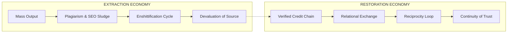

# 🗣️ Counter-Voicing: Collective Re-Amplification Methods  
**First created:** 2025-10-10 | **Last updated:** 2025-10-28  
*Restoring stable signal through collective speech.*

---

## 🛰️ Orientation  
When credibility collapses, no single voice can restore the field.  
Counter-voicing is the cooperative practice of **re-anchoring meaning through verified repetition** — a deliberate reconstruction of signal integrity.  
It treats **solidarity as infrastructure**: networks of mutual citation and re-amplification that rebuild trust where algorithmic architectures have dissolved it.  

To speak together is to create proof of presence.  
Every echo is a checksum; every credit line a **moral index of care**.

---

## 💫 Echo Scripts and Credibility Chains  
Re-amplification works best when structured.  
An *echo script* defines what is repeated, by whom, and in what register — preserving semantic fidelity while distributing reach.  

| Component | Description | Example |  
|------------|--------------|----------|  
| 🔗 Source Token | Original verified statement or document | survivor affidavit, timestamped log |  
| 🗣️ Echo Node | Verified participant re-stating the claim | trusted witness, aligned researcher |  
| 🪞 Mirror Note | Clarifying addition, not reinterpretation | context tag, fact-check link |  
| 🧭 Chain Ledger | Record of who echoed and when | shared sheet or federated tracker |  

Credibility chains let information travel without mutating — a **collective checksum** against distortion.

---

## 📣 Verified Amplification Networks  
Platforms reward velocity; counter-voicing rewards **traceability**.  
Verified Amplification Networks (VANs) act as *slow broadcast systems* — cooperative clusters that ensure accuracy before circulation.  

Typical architecture:  
1. **Origin point:** a validated statement enters a VAN hub.  
2. **Verification loop:** members cross-check source files or hashes.  
3. **Synchronized echo:** posts released simultaneously across nodes.  
4. **Archival trace:** each repost links back to canonical index.  

Like community radio repeaters, these networks **extend range without altering tone**.

---

## ⚖️ Ethical Quotation and Attribution Practices  
The ethic of *crediting the artist* is foundational to counter-voicing.  
Attribution is not vanity — it is **metadata of respect**.  
To name the originator is to stabilise the signal; to omit them is to reopen the wound.  

**Principles of ethical quotation:**  
- Credit **authorship lineage**, not only the most viral intermediary.  
- Preserve **formatting, punctuation, and rhythm** where meaning depends on them.  
- Always distinguish between **quotation** and **adaptation**.  
- Seek consent before screenshotting trauma disclosures or unpublished work.  
- Use **contextual tags** (`#directvoice`, `#withcredit`, `#artistacknowledged`) to mark integrity chains.  

Attribution functions as a **moral checksum**: a visible trail of who carried the voice, and how carefully.

---

## 🐦‍⬛ Building Trust Resonance  
Trust behaves like an acoustic wave — strengthened by consistent frequency and shared rhythm.  
To build resonance:  
- **Maintain rhythm:** predictable intervals of posting signal reliability.  
- **Acknowledge lineage:** every re-voice names its predecessors.  
- **Harmonise formats:** shared templates, caption framing, and design grammar.  
- **Practise restitution:** when error occurs, publish corrections openly and link them to the chain.  

The result is a **choral record** — testimony held in harmony, not hierarchy.  
Credit is not a footnote; it is the architecture of belief.

---

## 💰 Plagiarism Economies and the Cost of Uncredited Speech  
When attribution fails, exploitation scales.  
Platforms that sell visibility — print-on-demand sites, influencer merch pipelines, AI art aggregators — rely on volume over provenance.  
They often reproduce independent artists’ work **without policing copyright or origin**, effectively laundering creativity into cheap content.  

**Consequences:**  
- **Economic harm:** small independents lose income, visibility, and bargaining power.  
- **Cultural flattening:** art becomes template, stripped of local or personal meaning.  
- **Algorithmic laundering:** plagiarised designs outperform originals because of boosted advertising budgets.  

This is the **market face of counter-voicing failure** — when amplification detaches from verification.  
Whereas counter-voicing builds **traceable solidarity chains**, these plagiarism economies replace care with *scale*.  

Restoring ethical credit practices — naming artists, linking to originals, and publicly tracing lineage — is both a moral act and an anti-exploitation measure.  
Every attributed repost becomes a **micro-reparation**: a refusal to let the system profit from forgetting.

---

## 🧨 Enshittification, Sludge, and the Collapse of Care  
The same forces that destabilise credibility also **degrade creation itself**.  
When platforms optimise for frictionless output, every layer of the process — from truth to textile — becomes disposable.  

- **Drop-shipping:** algorithms scrape trending designs and mass-print them faster than originators can file takedowns.  
- **SEO sludge:** content mills flood search indexes with paraphrased or AI-reworded material, burying originals under layers of “helpful” detritus.  
- **Mass-production pipelines:** reward click-through and novelty, not provenance or fairness.  

This is enshittification as **economic epistemology**: the systematic extraction of meaning and value until only throughput remains.  
It produces a world where *the copy outperforms the source* because the system is tuned for **scale, not care**.  

Counter-voicing is its inverse logic.  
Where enshittification thrives on **indifference and automation**, counter-voicing insists on **attention and relation**.  
It reintroduces friction — verification, crediting, waiting — as a civic virtue.  
To **slow down** becomes the ethical stance.  

In that sense, counter-voicing is not merely resistance; it is **restoration of density** in an economy of thinness.

---

## 🧿 Resource Exchange and Relational Economies  
If speech can be stolen, so can value.  
Every repost, citation, or remix carries an invisible labour cost — the time, memory, and care of those who hold the voice steady.  
In extractive systems, that labour is unpriced; in counter-voicing networks, it is **recognised as contribution**.  

### 🦇 Beyond Currency  
The logic of payment assumes ownership.  
The logic of *exchange* assumes relation.  
Following models like the **PIP token system** in *Monk and Robot*, value can circulate as **reciprocal acknowledgment** — each transmission logged not as transaction but as *gratitude event*.  

| Element | Purpose | Example |  
|----------|----------|----------|  
| 🎁 Recognition Token | Acknowledges labour of verification or echoing | digital badge, “verified amplifier” entry |  
| 🔄 Reciprocity Loop | Ensures visibility moves both ways | source credits echo; echo cites source |  
| 🌾 Resource Ledger | Tracks shared effort, not profit | open-ledger of contributions to testimony or archive |  

### 💔 Resource as Relation  
A counter-voicing ecosystem values *attention as care*, not commodity.  
Resources — time, bandwidth, art, witness — are exchanged under **mutual custodianship**, not ownership.  
Instead of ad revenue, the measure of worth becomes **continuity of trust**.  

To rebuild credible speech, we must rebuild credible economy.  
The same protocols that preserve provenance in words can preserve fairness in goods.  
Every ethical attribution becomes both **credit and currency** — a proof-of-care.

---

## ➰ Diagram — Extraction vs Restoration Loop  

*Caption:* Extraction economies prioritise volume; restoration economies prioritise relation.  

---

## 🌌 Constellations  
🗣️ 👅 🧿 🧾 💸 — amplification, solidarity, repair, credibility, exchange.

---

## ✨ Stardust  
counter-voicing, amplification, solidarity, repair, authenticity, attribution, credit chains, quotation ethics, lineage, relational economies, enshittification, resource exchange, survivor networks  

---

## 🏮 Footer  
*🗣️ Counter-Voicing — Collective Re-Amplification Methods* is a living node of the Polaris Protocol.  
It extends testimony through verified repetition and visible credit, transforming *“credit the artist”* into the blueprint for post-enshittification economy.  

> 📡 Cross-references:
> 
> - [👅 Voice Disruption & Discrediting README](./README.md)  
 

*Survivor authorship is sovereign. Containment is never neutral.*  

_Last updated: 2025-10-28_
