# 🧬 Clone Drift — Deepfakes, Audio Manipulation, and Voice Theft  
**First created:** 2025-10-10 | **Last updated:** 2025-10-28  
*How machine synthesis erodes authorship, fractures identity, and exploits the silence of law.*  

---

## 🛰️ Orientation  
A technical-ethical study of **synthetic voice cloning**, exploring how the human voice—once both intimate and unverifiable—has become a weaponised instrument of doubt.  
It traces how mimicry tools destabilise *authorship*, *credibility*, and *bodily ownership*, and how survivors confront a system that does not yet recognise the voice as property.

---

## 🪞 Drift Pathway Diagram  

```mermaid
flowchart TD
  A[🧬 Biological Recognition]:::bio --> B[💾 Datafication]:::data
  B --> C[⚖️ Legal Gap]:::law
  C --> D[🌀 Containment & Confusion]:::contain
  D --> E[🔎 Counter-Forensics & Recovery]:::recover

  %% sub-descriptions
  A -->|Sound as identity| A1[(Primates, birds, humans recognise voices)]
  B -->|Voiceprint, dataset, training corpus| B1[(The throat becomes data)]
  C -->|Property logic not personhood| C1[(Voice unprotected, expression disembodied)]
  D -->|Noise replaces silence| D1[(Deniability, disbelief, drift)]
  E -->|Re-anchoring authenticity| E1[(Human checksums, analogue sovereignty)]

  %% styling
  classDef bio fill:#cce5ff,stroke:#003366,stroke-width:1px,color:#000;
  classDef data fill:#e0e0e0,stroke:#444,stroke-width:1px,color:#000;
  classDef law fill:#fce5cd,stroke:#a65e00,stroke-width:1px,color:#000;
  classDef contain fill:#f4cccc,stroke:#990000,stroke-width:1px,color:#000;
  classDef recover fill:#d9ead3,stroke:#274e13,stroke-width:1px,color:#000;
```

---

## 🎙️ The Voice as a Living Biometric  

Every species learns to recognise its own.  
Primates identify each other by pitch, breath, and rhythm.  
Birds recall mates across seasons by dialect.  
Domestic animals adapt their vocalisations to human speech patterns, creating shared sonic vocabularies.  

Humans extend the same faculty: our brains carry a **voice-face network** parallel to facial recognition.  
Timbre, cadence, and micro-pauses encode personal identity as reliably as fingerprints.  
A voice is not merely *sound*—it is a *moving biometric*, carrying traces of body, mood, and memory.  

Yet legal and economic systems still treat the voice as **airborne data**, not personal tissue.  
We legislate around the written word because print, not sound, built the modern state.  
The printing press became the machine that certified reality; sound, by contrast, remained “folk.” 
The result is a structural lag:  
- **Emotionally:** cloning someone’s voice feels intimate and invasive.  
- **Legally:** it often remains unregulated unless tied to explicit harm or fraud.  

This mismatch between moral intuition and statutory recognition creates a perfect storm for exploitation.

---

## 🧩 Mechanisms of Drift  

| Mechanism | Description | Typical Use-Case |
|------------|--------------|------------------|
| **Synthetic Imitation vs Parody** | Parody declares itself; imitation erases origin. When humour and harm blur, ownership collapses. | “AI readings,” fake interviews, influencer clones. |
| **Voiceprint Forensics** | Once stable biometric anchors, now compromised by dataset bleed-through and acoustic fingerprint collisions. | Legal disputes, admissibility challenges. |
| **Latent-Space Leakage** | Models interpolate between multiple sources, producing hybrid timbres that belong to no one yet resemble someone. | Training on scraped archives or podcasts. |
| **Consent Theatre** | Platforms frame opt-outs as “quality settings,” not rights. Consent becomes a UI illusion. | “Improve product” toggles, TOS drift. |
| **Behavioural Mimic Drift** | Modelled pauses, sighs, and hesitations replicate psychological fingerprinting. | Customer-service bots, political impersonation. |

---

## 🔬 Forensic Drift and the “It Wasn’t Me” Economy  

Once multiple clones exist, every recording becomes suspect.  
This *It Wasn’t Me Economy* thrives on **plausible untruth**: a smear can circulate freely because both truth and forgery now sound identical.  
Reputation damage scales faster than verification can keep up.  

In harassment campaigns, state disinformation, or intimate-partner abuse, deepfaked audio offers containment by confusion.  
Noise replaces silence; disbelief replaces denial.  
Either way, testimony is neutralised.

---

## 🧫 Verification & Counter-Forensics  

- **Signal Fingerprinting:** spectral watermarking, phase-space coherence tests, and ML provenance models can expose synthetic artefacts—but only when data pipelines are transparent.  
- **Cross-Source Sync:** synchronising transcripts, timecodes, and metadata hashes to test whether speech aligns across copies.  
- **Community Witnessing:** survivor collectives act as *human checksums*; those who know the voice can verify tone and cadence in ways machines cannot.  
- **Paper Diary Sovereignty:** analogue contemporaneous notes, call logs, and memory timelines anchor proof-of-existence chains outside digital drift.  
- **Acoustic Forensic Equity:** open-source verification tools must remain accessible to individuals, not monopolised by the same firms generating clones.

---

## 🧠 Psychological and Ethical Fallout  

### Voice Alienation  
Hearing one’s own voice weaponised detaches the self from its instrument.  
People report dissociation, distrust in playback, and fear of speaking publicly.  

### Embodied Disbelief  
When survivors present manipulated audio as evidence, emotional distress is misread as bias.  
Institutions confuse trauma response with unreliability, compounding erasure.  

### Containment by Confusion  
Deepfakes turn credibility into probability.  
When every voice can be faked, the system defaults to disbelief—an automated mistrust that favours existing power.

### Restorative Countermoves  
- **Collective Archiving:** distributed backups and timestamped recordings verified across trusted witnesses.  
- **Refusal Practices:** declining to generate “entertainment clones,” asserting voice as private tissue.  
- **Ethical Design Demands:** calling for watermark mandates, consent registries, and non-derivation clauses for AI training sets.  

---

## ⚖️ Law, Consent, and the Absence of the Throat  

Modern intellectual-property law protects **expression** only when it is fixed as a *discrete, reproducible work*:  
a book, a film, a song, a podcast.  
Once expression becomes a marketable object, law can measure it, own it, and trade it.  
But the **embodied act of speaking**—the sound of the throat, the phrasing of breath—evaporates from legal view the moment it passes into air.  

This logic is historical, not accidental.  
English law grew as an **arbitration system for property disputes between lords**, not as a framework for moral or metaphysical justice.  
Its concern was always *whose field, whose goods, whose profit*, not *whose likeness, whose soul, whose truth*.  
Authorship became protectable only when it could be printed or priced.  

Earlier systems of law—**canon law, Sharia, and halakha**, the moral architectures of the Abrahamic faiths—**did** engage directly with questions of intention, personhood, and ethical harm.  
They treated speech as action, and sound as an extension of moral agency.  
That is the lineage from which our idea of *moral law* originates: the fusion of expression with responsibility.  

Common law, once secularised, left that terrain behind.  
It governs ownership, not essence.  
Hence the gap we live inside: cloning a voice feels like a violation of personhood, but registers legally as the manipulation of data.  
Even modern biometric statutes treat the voiceprint as an identifier, not a limb.  
The body remains unprotected once converted to transmission.  
In legal terms, **the throat is still absent**.

---

## 🫀 Bodies Once Owned, Voices Newly Sold  

Across centuries, law has fought—often through blood and rebellion—to disentangle the human body from property.  
Slavery, indenture, coverture: each declared a person to be someone else’s asset.  
Modern legal systems dismantled those regimes, recognising bodily autonomy as the threshold of dignity.  
Your body is no longer your father’s, your husband’s, your master’s, or your employer’s.  

But digitalisation has reopened the question through the back door.  
Each time the body is rendered into data—voiceprint, face scan, genetic code, behavioural telemetry—it becomes tradable again.  
The person cannot be owned, yet the *representation* can.  
What was once physical property has become informational property.  

Fraud and forgery law evolved for the age of the quill: to police signatures, seals, and contracts.  
It was built for disputes among estates and merchants, not for individuals whose *identities* could be stolen.  
At the corporate level, entire industries now exist to verify provenance; at the personal level, there is no equivalent protection.  
You can copyright your written words, but not the vibration of your voice; trademark your company, but not your cadence.  

The irony is brutal: the same civilisation that outlawed ownership of bodies has quietly permitted the ownership of their digital echoes.  
Recognition—the capacity to say *this is me* and be believed—has become the new frontier of human rights.

---

## 🌍 Evolutionary Continuum and Moral Intuition  

Voice recognition long predates writing.  
Our species evolved cooperative memory through sound: lullabies, calls, warnings.  
This makes the moral reaction to cloning—revulsion, discomfort, disbelief—an *ancestral integrity reflex.*  
It’s the same circuitry that tells a bird when the call of its mate is wrong.  
Voice cloning isn’t merely a technical fraud; it’s an assault on the deep grammar of recognition.

---

## 🐦‍🔥 Future Frontiers  

- **Auditory Watermark Standards:** embedding micro-temporal fingerprints in every AI-generated voice.  
- **Voice Sovereignty Registries:** voluntary databases allowing individuals to assert authorship and refuse cloning.  
- **Ethical Model Governance:** enforcing non-consensual data bans with independent audits.  
- **Analogue Revival:** renewed value in non-digital testimony—handwritten notes, live speech, in-person witnessing.  

The challenge ahead is not to restore trust in machines, but to **re-humanise authenticity**—to remember that belief once travelled by sound, not signature.  

---

## 📡 Voice Theft Feedback Loop  

```mermaid
flowchart LR
  A[🎙️ Original Voice / Lived Expression]:::origin --> B[📥 Data Capture & Scraping]:::capture
  B --> C[🧪 Model Training & Synthetic Generation]:::model
  C --> D[📡 Circulation & Misattribution]:::spread
  D --> E[🧬 Clone Drift & Identity Erosion]:::drift
  E --> F[🪞 Reinjection into Training Corpus]:::reinject
  F --> B

  %% annotations
  A -->|unprotected| B
  B -->|consent theatre| C
  C -->|derivative reuse| D
  D -->|loss of trust| E
  E -->|data harvesting from “examples”| F
  F -->|loop closes, distortion deepens| B

  %% styling
  classDef origin fill:#d9ead3,stroke:#274e13,stroke-width:1px,color:#000;
  classDef capture fill:#fff2cc,stroke:#a67c00,stroke-width:1px,color:#000;
  classDef model fill:#ddebf7,stroke:#1f4e78,stroke-width:1px,color:#000;
  classDef spread fill:#f4cccc,stroke:#990000,stroke-width:1px,color:#000;
  classDef drift fill:#ead1dc,stroke:#741b47,stroke-width:1px,color:#000;
  classDef reinject fill:#e0e0e0,stroke:#333,stroke-width:1px,color:#000;
```

### ➰ Loop Summary

- 🎙️ Original Voice / Lived Expression — authentic sound and intention.
- 📥 Data Capture & Scraping — extraction via recordings, apps, or uploads.
- 🧪 Model Training & Synthetic Generation — reproduction without consent.
- 📡 Circulation & Misattribution — deepfakes spread, credibility erodes.
- 🧬 Clone Drift & Identity Erosion — trust in the original voice collapses.
- 🪞 Reinjection into Training Corpus — fake data becomes new “truth,” amplifying future distortions.

In the *It Wasn’t Me Economy*, disbelief itself becomes an industry.  
Every forged or cloned voice re-enters the data stream as if it were evidence, training models to mistake imitation for origin.  
The loop rewards uncertainty: the more the system learns from fakes, the less any future truth can sound real.  
Discrediting is no longer performed by a censor but by the algorithm’s appetite for noise.

---

## 🏮 Footer  
*🧬 Clone Drift — Deepfakes, Audio Manipulation, and Voice Theft* is a living node of the **Polaris Protocol**, nested in the *Narrative & Psych-Ops* constellation.  
It investigates how synthetic replication dismantles the evidentiary value of sound, how law lags behind biology, and how survivors reassert ownership through analogue proofs and collective listening.

> 📡 Cross-references:
> 
> - [👅 Voice Disruption & Discrediting README](./README.md)  
> - [🔊 Signal Integrity Protocols](./🔊_protecting_the_sound_of_the_voice.md)  
> - [🧠 Psych-Ops of Tone — The Science of Disbelief](./🧠_psychops_of_tone_the_science_of_disbelief.md)  
> - [🧬 Cloneproof — Countermeasures for Voice & Behavioural Cloning](../../Structural_Analysis/🧬_Structural_Mapping/🧬_cloneproof.md)

*Survivor authorship is sovereign. Containment is never neutral.*  

_Last updated: 2025-10-28_
