# 🪫 Credibility Collapse — How Noise Becomes Neutralisation  
**First created:** 2025-10-10 | **Last updated:** 2025-10-26  
*Information saturation as suppression tactic.*  

---

## ✨ Orientation  
Censorship today rarely takes the form of deletion.  
Instead, the flood replaces the filter: truth is buried under infinite commentary.  
Disinformation no longer depends on lies — it thrives on **volume**.  
When every claim is echoed, remixed, or parodied, clarity itself becomes a casualty.  

“Credibility collapse” names this systemic drift: the transformation of overexposure into erasure.  
By turning discourse into static, institutions and actors can **neutralise dissent without appearing to censor it**.  
Noise is the new silence.

---

## 🔥 Saturation vs Suppression  
Traditional suppression removed material; saturation buries it alive.  
Information is technically *available* yet practically *unrecoverable* — submerged beneath floods of near-identical copies, pseudo-leaks, or ironic “takes.” 
The tactic thrives in attention economies:  
- Each repetition drains urgency.  
- Each misquote or AI summary blurs authorship.  
- The archive fills faster than it can be read.  

In this landscape, control operates not through secrecy but through exhaustion.  
The more you scroll, the less you know.

---

## 🪼 The “Both Sides” Fallacy  
When contradiction becomes the aesthetic of fairness, doubt becomes the weapon.  
“Both sides” framing invites endless recursion: every statement must be met with its opposite to appear balanced.  
But this ritual parity converts asymmetry into entertainment — war crimes and think-pieces coexist in the same feed, flattened by algorithmic equivalence.  
Credibility collapse thrives here:  
- The moral weight of evidence dissolves into genre.  
- The journalist becomes a curator of confusion.  
- The survivor becomes a “source” rather than a person.  

Neutrality, in this mode, is not impartiality. It is abandonment.

---

## 🚀 Platform Amplification Bias  
Platforms promise amplification but deliver **selective audibility**.  
Their ranking systems reward the loud, not the verified — attention masquerades as legitimacy.  
Patterns include:  
- **Outrage acceleration:** anger travels faster than correction.  
- **Bot mirroring:** coordinated echo networks mimic “organic” debate.  
- **Semantic dilution:** tags like *#justice* or *#truth* become aesthetic, not evidentiary.  

When credibility is measured in clicks, the infrastructure of listening becomes an instrument of suppression.

---

## 🧨 Counter-Noise Ethics  
Silence can no longer be equated with absence.  
The ethical task is not to “speak louder” but to **speak precisely**, to maintain **signal integrity** against tactical distortion.  
Counter-noise ethics includes:  
- Refusing performative debate loops.  
- Archiving primary evidence outside algorithmic feeds.  
- Re-stating truth with minimal narrative drift.  
- Designing repositories that prioritise provenance over virality.  

Resistance to noise is not quietism; it is **careful transmission**.  
The work is to build audibility architectures that survive saturation.

---

## 🌀 Noise-to-Neutralisation Cycle  
Visualising how signal overload becomes a containment strategy.  

*Caption:* The flood replaces the filter: amplification converts attention into disbelief.  

---

## 🌋 Counter-Noise Ethics Stack  
Ethical architecture for preserving signal integrity across layers.  

```mermaid
flowchart TB
  subgraph L0[Layer 0 — Ground Truth]
    P0[Primary Evidence e.g. docs, raw files, timestamps, hashes]
  end

  subgraph L1[Layer 1 — Provenance]
    P1[Stable URNs / checksums]
    P2[Chain-of-custody notes]
    P3[Minimal metadata schema]
  end

  subgraph L2[Layer 2 — Transmission]
    T1[Plain-language restatements]
    T2[Redundancy across non-algorithmic stores]
    T3[Rate-limited releases, avoid info dumps]
  end

  subgraph L3[Layer 3 — Audibility Design]
    A1[Canonical index pages]
    A2[Link discipline e.g. relative paths]
    A3[House-style summaries; ≤ 120 words]
  end

  subgraph L4[Layer 4 — Engagement Hygiene]
    E1[Refuse performative both-sides loops]
    E2[Pre-bunk common distortions]
    E3[Escalation paths for corrections]
  end

  P0 --> P1 --> T1 --> A1 --> E1
  P3 --> T2 --> A2 --> E2
  P2 --> T3 --> A3 --> E3
```

*Caption:* A multi-layer model for counter-noise ethics: from evidence stability to engagement hygiene.  

---

## ♻️ Feedback Loops — Reinforcing vs. Balancing  
Mapping saturation and signal correction dynamics.  

*Caption:* Reinforcing loops create saturation; balancing loops sustain credibility.  

---

### 🗺️ Diagram Legend  
| Symbol | Meaning | Example |  
|--------|----------|----------|  
| 🔁 | Feedback loop | Algorithmic echo chamber |  
| 📡 | Transmission path | Platform sharing, reposting |  
| 🧩 | Countermeasure | Provenance tracking, canonical restatement |  
| 🧭 | Compass node | Directional concept, e.g., ethics layer |  

---

## 🌌 Constellations  
🪫 👅 🧿 🪞 — noise, confusion, suppression, perception management.

---

## ✨ Stardust  
credibility, noise, neutralisation, suppression, amplification, confusion, attention economy, platform bias, information warfare, counter-noise ethics

---

## 🏮 Footer  
*🪫 Credibility Collapse — How Noise Becomes Neutralisation* is a living node of the Polaris Protocol.  
It decodes distraction as a containment strategy and maps the moral physics of digital overwhelm.  

> 📡 Cross-references:
> 
> - [👅 Voice Disruption & Discrediting README](./README.md)  

*Survivor authorship is sovereign. Containment is never neutral.*  

_Last updated: 2025-10-26_
