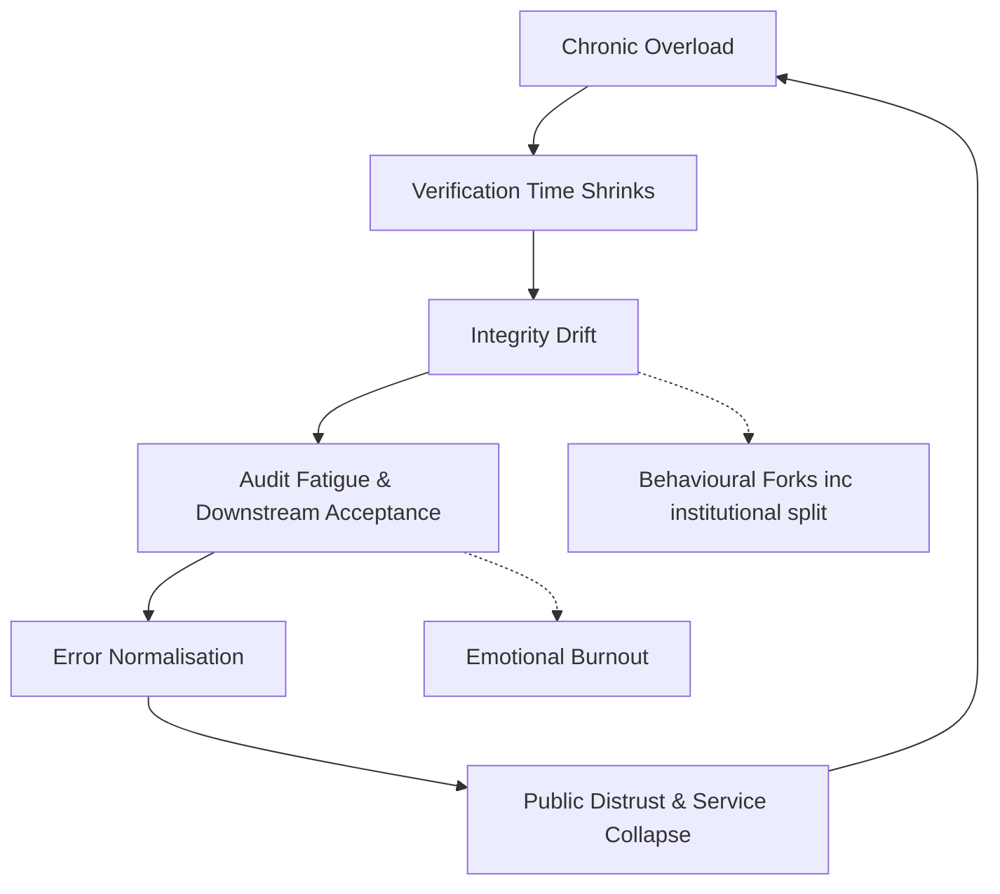

# ⚖️ Capacity as Integrity — Why Oversubscription Breeds Error
**First created:** 2025-10-16 | **Last updated:** 2025-10-27  
*Verification requires headroom. Running systems at full load destroys the space truth needs to exist.*

---

## 🧭 Orientation  

Every complex service — hospital, court, welfare office, database — relies on **unused capacity** as its moral and operational oxygen.  
Integrity lives in that slack: the few spare minutes that let a nurse double-check a dose, an auditor trace a receipt, or a social worker question a file.  
When capacity is permanently exceeded, verification becomes a luxury good.  
This node explains how oversubscription converts diligence into delay and truth into throughput.

---

## 🧩 Key Features  

- **Verification consumes time:** checking, documenting, and escalating are *work*, not friction.  
- **Overload erodes audit culture:** when every hour is triage, exceptions are normalised.  
- **Policy design hides the loss:** KPIs track output, not accuracy.  
- **Emotional exhaustion mirrors system fatigue:** burnout and data corruption rise together.  

---

## 🔍 Analysis  

Public systems in the UK — from NHS trusts to legal aid and housing — are built to run above 100 % capacity.  
This creates the illusion of efficiency while quietly dismantling the conditions required for verification.  

The diagram shows a closed feedback loop: capacity loss feeds drift, which produces fatigue and error normalisation, leading to collapse and renewed overload.  
Slack is the only real break in the circuit.

---

### 1. The Displacement of Integrity  
At full load, the system treats checking as delay.  
Procedural redundancy is reclassified as waste; oversight roles are cut first.  
The structure begins to eat its own error-detection layer.

### 2. The Triage Economy  
When everything is urgent, nothing is true.  
Clinicians, caseworkers, auditors, and IT staff triage rather than verify.  
The unverified becomes the default, and policy language adjusts to normalise partial accuracy.

### 3. The Feedback Collapse  
Continuous overload shortens feedback loops — there’s no bandwidth to correct upstream faults.  
Each level trusts the one above, producing *Downstream Acceptance*: confidence detached from evidence.

### 4. Ethical Thermodynamics  
Integrity is an energy state.  
Every verification, re-check, or pause consumes entropy — attention, time, emotion.  
When that energy budget is zero, the system cools into moral stasis: apparently stable, internally brittle.

---

## 🧭 Design Implications  

- **Mandate slack as regulation:** minimum verification bandwidth written into policy (e.g., 10 % protected audit time).  
- **Treat burnout metrics as system-health indicators.**  
- **Budget for redundancy:** duplication isn’t waste; it’s self-repair capacity.  
- **Publish queue loads alongside accuracy rates.**  
- **Reward correction, not speed.**

True efficiency is resilient accuracy, not perpetual emergency.

---

## 🌌 Constellations  

⚖️ 🧮 👹 🧿 — Occupies the integrity and governance constellations; bridges *Integrity Drift*, *Downstream Acceptance*, and *System Governance*.

---

## ✨ Stardust  

capacity, verification, integrity drift, overload, public service design, audit culture, burnout, resilience, governance  

---

## 🏮 Footer  

*⚖️ Capacity as Integrity — Why Oversubscription Breeds Error* is a living node of the Polaris Protocol.  
It reframes unused capacity as an ethical infrastructure, not inefficiency — the breathing space in which truth survives.  

> 📡 Cross-references:
> 
> - [🧮 Integrity Drift — Gradual Weakening of Verification Layers](./🧮_integrity_drift.md) — *decay of verification culture*  
> - [👻 Downstream Acceptance — The Psychology of Passing the Fork](./👻_the_psychology_of_passing_the_fork.md) — *trust bias under overload*  
> - [🧠 Behavioural Forks — When Institutions Develop Split Personas](./🧠_institutional_split_personas.md) — *organisational dissociation logic*  
> - [🌀 Systems & Governance](../../../Disruption_Kit/Big_Picture_Protocols/🌀_System_Governance/README.md) — *macro-design reforms*  

*Survivor authorship is sovereign. Containment is never neutral.*  

_Last updated: 2025-10-27_
