# 🧪 Hypothesis Cascade — When Fork Errors Replicate Themselves
**First created:** 2025-10-10 | **Last updated:** 2025-10-30  
*Recursive anomalies and chain-reaction containment.*

---

## 🛰️ Orientation  

A **Hypothesis Cascade** occurs when one false record or corrupted assumption seeds a self-replicating chain of dependent errors.  
Each verification layer copies the initial fault as fact, amplifying its authority with every repetition.  
This node serves as both a diagnostic and teaching model for auditors tracing propagation in complex systems.

---

## ✨ Key Sections  

### 🌱 Seed Error Identification  
Every cascade begins with a **seed anomaly** — a wrong field, missing timestamp, or misclassified event.  
The key diagnostic step is not locating the largest inconsistency, but the *earliest consistent one*: the first point where the system began to repeat its own error.  
Auditors mark this as **E₀ (error origin)**.  

Common E₀ types:  
- Mis-entered baseline data  
- Incorrect schema assumption  
- Legacy import with silent type coercion  
- Human translation error from one interface to another  

---

### 🧬 Replication Paths  
Errors spread through dependency chains.  

| Pathway | Mechanism | Result |
|----------|------------|--------|
| **Hierarchical** | Supervisory reports rely on corrupted sub-data | systemic narrative error |
| **Temporal** | backups replicate daily with unchanged anomaly | permanent archive pollution |
| **Algorithmic** | machine learning models ingest flawed training data | bias reinforcement |
| **Social** | departments quote prior summaries verbatim | mythologised accuracy |

Replication increases authority: every repetition makes the falsehood harder to contest.

---

### 🌋 Containment Cascade Diagrams  

```mermaid
flowchart TD
  A[E₀ — Seed Error] --> B[Replication Layer 1<br>Local Cache]
  B --> C[Replication Layer 2<br>Cross-System Export]
  C --> D[Replication Layer 3<br>External Reporting]
  D --> E[Public Policy or Media Narrative]
  E --> F[Feedback Reinforcement<br>Re-import to Source]
  F --> A

```

The diagram shows the recursive loop where the externalised error feeds back into the source as validation — the full *containment cascade.*

---

### 🍃 Verification and Rollback  

1. **Trace dependency tree** for every dataset referencing the suspect record.  
2. **Re-validate** against raw source or physical evidence.  
3. **Quarantine replicated copies** before correction.  
4. **Rollback propagation** in reverse order — from newest layer to oldest.  
5. **Document every repair** as a separate node in the audit log.  
6. **Publish the cascade map** to prevent silent re-infection.

Rollback is less about deletion than about *re-narration*: rewriting the story of how the error lived.

---

## 🌌 Constellations  

🧪 👹 🧿 🧮 — Forensic-diagnostic constellation connecting *Fork Audit Protocol*, *Integrity Drift*, and *Fork Anomaly Hypothesis*.  
Completes the verification-science branch of the Fork Behaviour constellation.

---

## ✨ Stardust  

fork error, replication, diagnostic, hypothesis, containment, audit, propagation, rollback, forensic methodology  

---

## 🏮 Footer  

*🧪 Hypothesis Cascade — When Fork Errors Replicate Themselves* is a living node of the Polaris Protocol.  
It demonstrates how falsehoods multiply inside containment systems and offers a method for tracing and reversing their spread.  

> 📡 Cross-references:
> 
> - [⚠️ Fork Anomaly Hypothesis — X,Y,Z](./⚠️_fork_anomaly_hypothesis_XYZ.md) — *precursor experiment*  
> - [🦩 Fork Audit Protocol — Structured Method for Verification Chains](./🦩_fork_audit_protocol_verification_chains.md) — *procedural framework*  
> - [🧮 Integrity Drift — Gradual Weakening of Verification Layers](./🧮_integrity_drift.md) — *context of decay*  

*Survivor authorship is sovereign. Containment is never neutral.*  

_Last updated: 2025-10-30_
