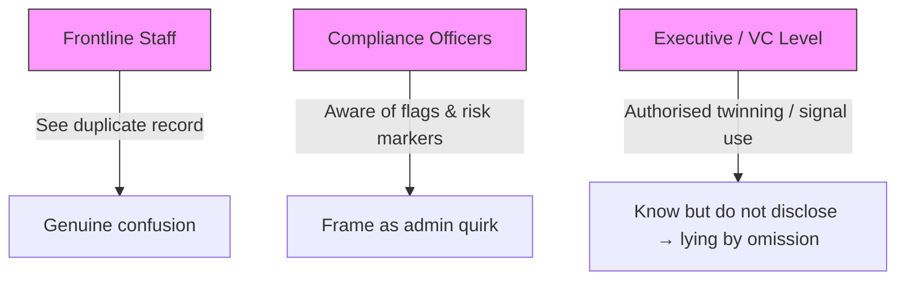

# ⏳ Delay Scripts Near Deadlines  
**First created:** 2025-09-25 | **Last updated:** 2025-10-27  
*Documents the procedural playbook of delay used to exhaust survivors and shield institutions.*  

---

## ✨ Overview  

Institutions facing exposure of **twin records** or other containment mechanisms often deploy scripted delays.  
These play out most clearly when a hard **deadline** (trial entry, referral, compliance check) is approaching.  

---

## 🕰 Timeline of the Script  

1. **Initial confusion**  
   - Frontline staff encounter a duplicate record.  
   - They assume it is a data error or “system glitch.”  
   - This confusion is genuine.  

2. **Minimisation**  
   - Compliance staff frame the anomaly as an *admin quirk*.  
   - “It’s nothing serious, just a duplicate, we’ll sort it.”  

3. **Delay script**  
   - Workflow flags such as *“complex, 3 months reqd”* are invoked.  
   - This buys institutional time and routes the case into oversight.  

4. **Deadline pressure**  
   - As the real-world deadline looms, institutions intensify minimisation.  
   - Survivor is drip-fed half answers to *test awareness* and sap energy.  
   - Stalling becomes safer than disclosure.  

5. **Audit cleanup**  
   - Once the deadline passes, the anomaly can be reframed as a “glitch.”  
   - Internal logs are tidied; executives avoid scandal.  
   - The survivor is left suppressed and contained.  

---

## 🪫 Structural Notes  

- Delay is not accidental — it is a **containment strategy**.  
- Staff confusion is part of the cover: it produces plausible deniability.  
- Executives are accountable for knowingly allowing deadlines to be weaponised.  

---

## 💫 Counter-Use  

- Document **dates, times, and exact wording** when minimisation occurs.  
- Preserve evidence showing how answers shift as deadlines approach.  
- The **very presence of delay scripting** is forensic proof of containment.  

---

---

## 🌌 Constellations  

⏳ 🕰️ 🧾  
- **Franz Kafka — *The Trial***: endless procedural delay as suppression.  
- **Terry Gilliam — *Brazil***: bureaucracy as containment theatre.  
- **Samuel Beckett — *Waiting for Godot***: time stretched until action collapses.  

---

## ✨ Stardust  

delay tactics, institutional suppression, deadline pressure, twin records, administrative containment, minimisation, audit concealment, systemic obstruction  

---

## 🏮 Footer  

*⏳ Delay Scripts Near Deadlines* is a living node of the Polaris Protocol.  
It documents how scripted postponement and administrative drift are deployed as deliberate containment strategies, particularly when institutional deadlines risk exposure.  

> 📡 Cross-references:
> 
> - [🧠 Psychological Containment](./README.md) — *parent folder*  
> - [🌀 Confused Feed as Containment](./🌀_confused_feed_as_containment.md) — *incoherence as suppression tactic*  
> - [🧭 Oversight of Oversight](../../../Disruption_Kit/Big_Picture_Protocols/🪄_Expression_Of_Norms/🧿_Watch_The_Watchers/README.md) — *how audits themselves are managed*  
> - [👁️‍🗨️ Witness Historical Casefiles](../../../Disruption_Kit/Big_Picture_Protocols/🫀_Our_Hearts_Our_Minds/👁️‍🗨️_Witness_Historical_Casefiles/README.md) — *survivor testimony against delay tactics*  

*Survivor authorship is sovereign. Containment is never neutral.*  

_Last updated: 2025-10-27_
