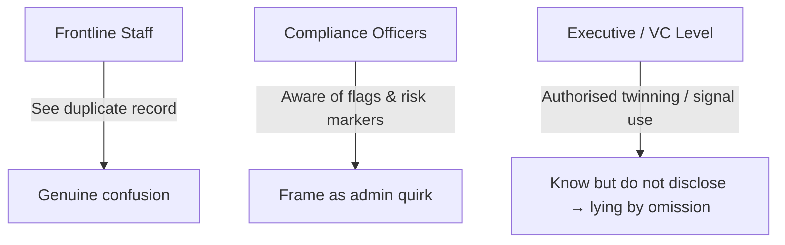

# ⏳ Delay Scripts Near Deadlines  
**First created:** 2025-09-25 | **Last updated:** 2025-10-27  
*Documents the procedural playbook of delay used to exhaust survivors and shield institutions.*  

---

## ✨ Overview  

Institutions facing exposure of **twin records** or other containment mechanisms often deploy scripted delays.  
These play out most clearly when a hard **deadline** (trial entry, referral, compliance check) is approaching.  

---

## 🕰 Timeline of the Script  

1. **Initial confusion**  
   - Frontline staff encounter a duplicate record.  
   - They assume it is a data error or “system glitch.”  
   - This confusion is genuine.  

2. **Minimisation**  
   - Compliance staff frame the anomaly as an *admin quirk*.  
   - “It’s nothing serious, just a duplicate, we’ll sort it.”  

3. **Delay script**  
   - Workflow flags such as *“complex, 3 months reqd”* are invoked.  
   - This buys institutional time and routes the case into oversight.  

4. **Deadline pressure**  
   - As the real-world deadline looms, institutions intensify minimisation.  
   - Survivor is drip-fed half answers to *test awareness* and sap energy.  
   - Stalling becomes safer than disclosure.  

5. **Audit cleanup**  
   - Once the deadline passes, the anomaly can be reframed as a “glitch.”  
   - Internal logs are tidied; executives avoid scandal.  
   - The survivor is left suppressed and contained.  

---

## 🪫 Structural Notes  

- Delay is not accidental in totalis — it is a **containment strategy**.  
- Staff confusion is part of the organisational-level cover: it produces plausible deniability.  
- Executives are accountable for knowingly allowing deadlines to be weaponised.

---

---

## 💫 Counter-Use  

Delay scripting is not a pause — it is **a weapon disguised as waiting**.  
It does not matter whether the person delaying you means harm or simply follows “procedure.”  
The result is the same: a survivor left suspended, their time eroded, their story made to seem less urgent by design.  

Most participants in the script are not villains — they are **unwitting carriers of containment**.  
They obey systems that reward delay and punish clarity.  
Intent becomes irrelevant when the mechanism itself produces harm.  

To counter-use this is to **treat time as evidence**.  
Every “we’re still waiting on X,” every non-reply before a deadline, every deferment wrapped in politeness — each is a **forensic artefact of suppression**.  

Counter-use begins the moment you recognise that pattern.  
From that moment, you reclaim your timeline: you become the archivist of what they hoped would dissolve into “process.”  
Each timestamp you keep, each note you make, is both refusal and proof — a quiet assertion that the waiting was scripted, and that harm by procedure is still harm.  

---

## 📚 Example Walkthroughs  

### 🩺 Example 1 — The Referral That Never Lands  

A survivor’s GP sends an urgent mental-health referral.  
The hospital says, *“We haven’t received it yet.”*  
The GP insists it was sent.  
A week passes, then another. Each call produces a new explanation — *“the inbox is under review,”* *“a staff changeover,”* *“try again next week.”*  

No one names it as delay. Everyone sounds kind. Yet the weeks stretch until the crisis dulls or the survivor stops calling.  
When the file is finally located, the appointment date is back-dated — as if the gap never happened.  

**Counter-use:**  
Record the dates, names, and exact phrasing.  
The soft tone in the emails is part of the containment.  
Compile the sequence — it will show the choreography of delay more clearly than any single reply.  

---

### 🎓 Example 2 — The Dissertation Under Review  

A student flags a grading irregularity.  
The department promises an “independent re-mark,” but deadlines slip: *“external examiner on leave,” “awaiting committee sign-off,” “the panel will meet next term.”*  
The language is bureaucratic, not cruel — yet it performs the same function.  
By the time results arrive, appeal windows have closed, funding is lost, and the student has been quietly absorbed into silence.  

**Counter-use:**  
Screenshot timestamped emails.  
Track each escalation and the moment it was paused.  
When placed on a single page, the pattern reveals intent in function — an administrative theatre that protects the institution, not the truth.  

---

## 🐍 Consequences  

Delay scripting leaves no visible bruise, yet it works directly on the nervous system.  
It trains the survivor to internalise the institution’s tempo — to lower expectations, mute urgency, and normalise erasure as “procedure.”  

Each postponement erodes cognitive stability:  
- **Memory:** weeks blur; the sequence of who said what becomes harder to recall, which later undermines credibility.  
- **Trust:** every polite delay feels reasonable in isolation, but together they prove orchestrated indifference.  
- **Self-belief:** survivors begin apologising for being persistent, internalising the idea that their need for resolution is impatience.  
- **Capacity:** energy is diverted from recovery or advocacy into chasing updates that never arrive.  

The outcome is quiet but total containment.  
When you are always *waiting*, you cannot act.  
And when you cannot act, the record goes cold — exactly as designed, even if no one will ever admit the design.  

---

## 🧨 Countermeasures — Institutional Reforms  

Institutions that claim to value transparency must **design against delay**.  
That means treating time not as a resource to hoard, but as a public trust.  

**Ethical infrastructure countermeasures:**  
- **Clock integrity:** every case management system should expose timestamp trails — who paused what, and when.  
- **Escalation visibility:** automatic public logs of referrals, complaints, or appeals beyond set thresholds (e.g. 14, 30, 90 days).  
- **Deadline parity:** if internal reviews extend time limits, survivor rights to respond or appeal must extend proportionally.  
- **Audit independence:** review teams must be separate from those who benefit from delay.  
- **Narrative accountability:** require written rationale for any procedural deferral; archive them centrally for inspection.  

Transparency about **staffing and capacity** is also a form of accountability.  
In many public services, silence about under-resourcing is treated as professionalism — a residue of class hierarchy and colonial administration.  
It preserves the image of control while quietly normalising exhaustion below.  
Yet naming capacity limits is not unprofessional; it is **truthful governance**.  

When an A&E department posts real-time waiting times on its website, it doesn’t humiliate the service — it dignifies both staff and public.  
It helps people make informed choices, relieves overloaded wards, and turns honesty into a safety mechanism.  
This principle scales: courts, councils, universities, and ombuds offices could all adopt **open-capacity dashboards** showing backlogs, staffing ratios, and expected response times.  

True reform means understanding that **delay is harm**, not inconvenience.  
It requires embedding that principle in policy:  
to weaponise time — even by omission — is to breach duty of care.  

---

## 🐦‍🔥 Countermeasures — Survivor Survival Tactics  

Containment by delay seeks to make you doubt your own sense of sequence.  
The most powerful response is to **restore narrative continuity** — not by rushing, but by recording.  

**Practical field guidance:**  
- **Keep your own clock.** Start a timeline the day you first ask for something. Each message, call, or meeting — note the date, name, and promise made.  
- **Write in real time.** Use present tense when you record; it captures the affect of the moment and later helps reconstruct tone.  
- **Preserve digital trails.** Save emails as PDFs, screenshots with timestamps, and message logs. A small archive is more powerful than a perfect memory.  
- **Rest deliberately.** Fatigue is part of the containment design. Build pauses that are yours, not theirs. Step back before their silence becomes your anxiety.  
- **Share evidence safely.** Trusted peers, advocates, or networks can mirror your archive — redundancy resists erasure.  
- **Translate waiting into proof.** Each period of silence is data: who had authority, who stalled, and for how long.  

These actions do not fix the harm, but they **preserve coherence** — and coherence is survivorship.  
The aim is not to outpace the institution, but to outlast its script.  
Your timeline becomes a living counter-archive: quiet, factual, irrefutable.  

---

## 🌱 Future Systems  

The long work is to **build systems that do not weaponise time at all**.  
That begins in community — with shared clocks, transparent workloads, and slower, more truthful rhythms of care.  

Mutual aid networks already prototype this future.  
They publish queue times, funding levels, and volunteer capacity in real numbers, not slogans.  
They show that honesty about limits builds trust faster than performance ever could.  

Decolonising time means refusing the hierarchies that treat some people’s waiting as normal and others’ as crisis.  
It means replacing scarcity theatre with **distributed responsibility** — many hands holding the timeline together so no one person has to chase alone.  

In practice, this looks like:  
- open-capacity dashboards for public institutions;  
- collective response logs that anyone affected can see;  
- survivor-led audit circles that track procedural drift across agencies;  
- community-run ombuds services with transparent calendars;  
- an ethic that equates delay harm with material harm.  

These are not utopian gestures. They are **repairs of temporal justice** — the right to be answered, the right to closure, the right not to vanish in a queue.  
Building better systems starts by naming delay as violence, and answering it with time made visible, shared, and fair.  

---

## 🌌 Constellations  

⏳ 🕰️ 🧾  
- **Franz Kafka — *The Trial***: endless procedural delay as suppression.  
- **Terry Gilliam — *Brazil***: bureaucracy as containment theatre.  
- **Samuel Beckett — *Waiting for Godot***: time stretched until action collapses.  

---

## ✨ Stardust  

delay tactics, institutional suppression, deadline pressure, twin records, administrative containment, minimisation, audit concealment, systemic obstruction, time ethics, mutual aid  

---

## 🏮 Footer  

*⏳ Delay Scripts Near Deadlines* is a living node of the Polaris Protocol.  
It documents how scripted postponement and administrative drift are deployed as deliberate containment strategies, particularly when institutional deadlines risk exposure.  

> 📡 Cross-references:
> 
> - [🧠 Psychological Containment](./README.md) — *parent folder*  
> - [🌀 Confused Feed as Containment](./🌀_confused_feed_as_containment.md) — *incoherence as suppression tactic*  
> - [🧭 Oversight of Oversight](../../../Disruption_Kit/Big_Picture_Protocols/🪄_Expression_Of_Norms/🧿_Watch_The_Watchers/README.md) — *how audits themselves are managed*  
> - [👁️‍🗨️ Witness Historical Casefiles](../../../Disruption_Kit/Big_Picture_Protocols/🫀_Our_Hearts_Our_Minds/👁️‍🗨️_Witness_Historical_Casefiles/README.md) — *survivor testimony against delay tactics*  

*Survivor authorship is sovereign. Containment is never neutral.*  

_Last updated: 2025-10-27_  
