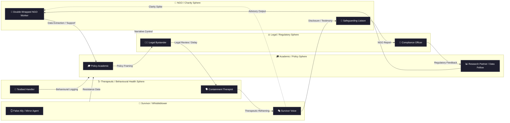

# 🎪 Moles in the Circus  
**First created:** 2025-08-05 | **Last updated:** 2025-11-02  
*Containment as spectacle: how care becomes choreography.*

---

## 🧭 Orientation  
Every bureaucracy eventually invents its own infiltrators.  
They’re not spies, just reflexes — antibodies of fear triggered by scrutiny.  
*Moles in the Circus* maps how institutions performing care stage-manage their own surveillance: a ring show where every performer believes they’re protecting someone.

It begins innocently — a “cross-sector partnership meeting,” fluorescent biscuits, procedural warmth.  
But behind the flip-charts, everyone is watching everyone else for tonal deviation.

---

## 🩻 Structural Context  
Containment is federated.  
Departments, charities, universities, and contractors orbit one another to absorb reputational shock.  
Responsibility diffuses until empathy becomes a shared service.

> *“We’re just the coordination point.”*  
> *“Safeguarding sits elsewhere.”*

Every CC line is a hand-off; every disclaimer a moral release form.  
Safeguarding drifts from protection to performance.

---

## 🧩 Containment Theatre  
Containment theatre runs on empathy scripts: check-ins, reviews, polite silences.  
Minutes record “constructive dialogue,” never outcome.  
Each meeting resets the countdown clock — proof that something is happening.

When a survivor asks *who* decided, the answer arrives as a calendar invite.

---

## 🧨 Mole Typology (Condensed)  

| Type | Function | Signature Move |
|------|-----------|----------------|
| **🧥 Double-Wrapped NGO Worker** | Ally-observer pipeline. | Opens with warmth, ends with cc to Legal. |
| **🎓 Policy Academic** | Extracts story as dataset. | “Could we anonymise this for the impact report?” |
| **🧑‍⚖️ Legal Bystander** | Names remedy, delays action. | “We must respect due process.” |
| **🗣️ Containment Therapist** | Reframes anger as instability. | “I hear that you’re feeling unsafe.” |
| **🪞 Mirror Agent** | Reflects tone for calibration. | “Exactly — that’s *why* we have policy.” |

These roles aren’t malicious; they’re *trained.*  
Containment is a pedagogy disguised as compassion.

---

## 🎪 System Diagram — The Circus as Circuit  
Containment doesn’t operate in hierarchies; it breathes through feedback.  
The diagram below maps narrative circulation between sectors — each arrow a micro-handoff of empathy, authority, or delay.  
Dashed lines (`-.->`) mark *activation moments*: those brief spikes of clarity the system quickly re-absorbs.



*Reading the diagram is like tracing a melody:  
each loop repeats the same refrain — empathy, extraction, delay — until rhythm itself becomes governance.*

---

## 🧠 Psychological Dynamic  
Politeness is the control surface.  
Rage, grief, humour — anything un-neutral — trips the behavioural firewall.  
The first person to raise their voice becomes “the issue.”

Therapeutic containment perfects this loop:  
anger translated into *case notes*, urgency softened to *wellbeing concern*.  
The rhythm of harm becomes clinical prose.

---

## 🕳️ Forensic Reading  
To confirm a circus, trace its choreography:  
- **Timing spikes:** identical “support” emails across agencies within 48 hours of disclosure.  
- **Lexical drift:** the phrase *“appropriate boundaries”* migrates from HR to press release.  
- **Access parity:** three unrelated institutions request the same document “for context.”  
- **Behavioural mirroring:** new contacts echo survivor vocabulary verbatim before withdrawal.  

Treat *repetition* as evidence.  
If empathy has a house style, someone’s editing the script.

```yaml
trace:
  subject_id: SH-2025-F29
  phrase: "appropriate boundaries"
  first_seen: 2025-06-14-T10:42Z
  propagation: ["HR-memo.pdf", "press-brief_v3.docx", "partner-ngo-note.txt"]
```

---

## 🧨 Design Counter-Moves  
Containment unravels when tempo breaks.  
- **Insert friction:** pause before replying; silence is its own audit trail.  
- **Demand authorship metadata** on every “support” note.  
- **Cross-reference timestamps** — identical minutes expose choreography.  
- **Publish style anomalies:** when a form letter repeats three times, name the pattern publicly.  

Transparency isn’t confrontation; it’s choreography correction.

---

## 🪞 Mirror Link  
Pairs with [💄 Hypothetical Case — Disinfo Narrative Control](./💄_hypothetical_case_disinfo_narrative_control.md):  
one shows theatre as system, the other theatre as attack.  
Together they explain why interference sounds so polite.

---

## 🎭 Curtain Call — Exiting the Tent  
The circus ends the moment the audience stops applauding its order.  
When the survivor names the act — “Containment Therapist,” “Policy Academic,” “Legal Bystander” — the illusion falters.  
Every performer depends on the script being taken seriously.  

Breaking the loop does not mean burning the tent; it means **turning the lights on**.  
Transparency makes spectacle impossible.  
Once the rhythm is visible, even the ringmaster must admit that the music was pre-recorded.

Ethical governance begins where choreography ends:  
- when empathy stops being rehearsed,  
- when safeguarding becomes mutual rather than managerial,  
- when testimony reclaims tempo.

Containment theatre collapses under the weight of its own paperwork;  
truth survives because someone kept the receipts.

> **Every circus requires an audience.**  
> Refusal is the quietest revolution: the decision to step outside, mid-performance, carrying your evidence into daylight.

---

## 🌌 Constellations  
🎪 🪆 🧿 💄 — containment, mimicry, interference, inversion.  

---

## ✨ Stardust  
moles, containment theatre, bureaucratic empathy, metadata sabotage, narrative interference, whistleblower dynamics, consent architecture, epistemic safety, behavioural forensics, institutional mimicry  

---

## 🏮 Footer  
*Moles in the Circus* is a living node of the **Polaris Protocol**.  
It documents care as containment and shows how to break the loop through tempo, trace, and tone integrity.  
Its final act is always disclosure — the moment a survivor rewrites the script in her own cadence.

> 📡 Cross-references:
> 
> - [💄 Hypothetical Case — Disinfo Narrative Control](./💄_hypothetical_case_disinfo_narrative_control.md) — *spectacle as containment tactic*  
> - [🪆 Narrative Interference](./README.md) — *cluster overview*  
> - [🧩 Repairing Trust Chains](./🧩_repairing_trust_chains.md) — *post-theatre verification*  

*Survivor authorship is sovereign. Containment is never neutral.*  

_Last updated: 2025-11-02_
