# 🎪 Moles in the Circus  
**First created:** 2025-08-05 | **Last updated:** 2025-11-02  
*How institutions create their own infiltrators — and how vulnerability-aware power design can prevent authoritarian drift.*

---

## 🛰️ Orientation  
The term *“mole”* evokes espionage; in practice, most are bureaucratic artefacts of fear.  
When containment systems scale, their search for risk produces its own theatre — a **circus** of mirroring, observing, and reframing behaviours that appear conspiratorial but are often systemic.  

This node examines how **mole dynamics** emerge not from secret plots but from *institutional nervous systems* trying to regulate uncertainty.  
By studying these roles — NGO liaisons, academic observers, legal bystanders, and therapeutic translators — we can see where power becomes vulnerable, and where safeguards must evolve to prevent coercive or authoritarian abuse.  

---

## 🦁 Structural & Systemic Context  
Containment environments are rarely monolithic.  
They are federations of departments, charities, think tanks, and private contractors that share reputational risk.  
When one actor carries politically sensitive data — whistleblower, audit lead, survivor researcher — others orbit to **absorb shock** or **control narrative velocity**.

- **Governance Drift:** the more entities share responsibility, the less any single body feels duty to intervene.  
- **Institutional Osmosis:** staff rotate between NGO, academia, and consultancy roles, carrying insight — and bias — across silos.  
- **Performance of Care:** “support” becomes simulation; empathy delivered through form letters and wellness check-ins.  

These overlapping loyalties form the *ring* of the circus. Within it, specific archetypes perform the same moves over and over again — predictable, rehearsed, and measurable.

---

## 🩻 Mole Typology  
Each performer in this theatre has a function.  
Some soothe, others delay, some mirror. All translate risk into procedure.  

| Mole Type | Function | Telltale Behaviour |
|-----------|----------|--------------------|
| 🧥 **Double-Wrapped NGO Worker** | Poses as ally, reports laterally | Starts warm, cools when clarity increases |
| 🎓 **Policy Academic** | Harvests insight under research guise | Sends articles, absorbs narrative, disappears |
| 🧑‍⚖️ **Legal Bystander** | Supposed to advocate, maintains delay | Mentions remedies without activating them |
| 🗣️ **Containment Therapist** | Nudges docility, reframes anger | Uses institutional language of concern |
| 🪞 **False Ally / Mirror Agent** | Reflects voice for data alignment | Validates surface, undermines momentum |
| 🧪 **Testbed Handler** | Observes behavioural response patterns | Present at inflection points, de-escalates clarity |

Each role occupies a **legible niche** within compliance culture:  
they are risk-managers, not villains.  
But when accountability fails, these same mechanisms become vectors for harm.  

The following diagram visualises how these roles interconnect across sectors — a map not of people, but of pathways.

---

```mermaid
flowchart LR
    subgraph NGO_Sphere["🌱 NGO / Charity Sphere"]
        A1["🧥 Double-Wrapped NGO Worker"]
        A2["💬 Safeguarding Liaison"]
    end

    subgraph Academic_Sphere["🎓 Academic / Policy Sphere"]
        B1["🎓 Policy Academic"]
        B2["📊 Research Partner / Data Fellow"]
    end

    subgraph Legal_Sphere["⚖️ Legal / Regulatory Sphere"]
        C1["🧑‍⚖️ Legal Bystander"]
        C2["📄 Compliance Officer"]
    end

    subgraph Health_Sphere["🩺 Therapeutic / Behavioural Health Sphere"]
        D1["🗣️ Containment Therapist"]
        D2["🧪 Testbed Handler"]
    end

    subgraph Survivor_Node["🧿 Survivor / Whistleblower"]
        S1["🪞 False Ally / Mirror Agent"]
        S2["🎭 Survivor Voice"]
    end

    %% Cross-Domain Flows
    A1 -->|Data Extraction / 'Support'| B1
    B1 -->|Policy Framing| C1
    C1 -->|Legal Review / Delay| D1
    D1 -->|Therapeutic Reframing| S2
    S2 -->|Disclosure / Testimony| A2
    A2 -->|NGO Report| C2
    C2 -->|Regulatory Feedback| B2
    B2 -->|Advisory Output| A1

    %% Feedback Loops
    S2 -.->|Clarity Spike| A1
    D2 -->|Behavioural Logging| Academic_Sphere
    NGO_Sphere -->|Narrative Control| Legal_Sphere
    Survivor_Node -->|Resistance Data| Academic_Sphere

    classDef molenet fill:#1e1e2e,stroke:#aaa,stroke-width:1px,color:#fff;
    class A1,A2,B1,B2,C1,C2,D1,D2,S1,S2 molenet;
```

### 🐝 Reading Notes  
The diagram above functions like an x-ray of an ecosystem: not hierarchical but **circulatory**.  
- **Loops** show where power becomes vulnerable — where genuine safeguarding and control blur.  
- **Arrows** depict data and narrative movement; dashed arrows (`-.->`) indicate *activation events* like “clarity spikes.” 
- The **survivor node** anchors both origin and mirror, showing how systems study their own projection of the person they claim to protect.  

To read it properly, trace one full loop — notice how easily empathy becomes telemetry.

---

## 🧨 Mole Network Flow Table  
To translate that circulatory map into diagnostics, the table below dissects each key flow: what risk it carries, how it tends to fail, and what could interrupt the cycle.  

| Flow Path | Risk Type | Failure Mode | Safeguard Action |
|------------|------------|---------------|------------------|
| NGO → Academia | **Epistemic** | Testimony reclassified as “data” without consent | Establish reciprocal research ethics; survivor retains copy and veto rights over quotes and anonymisation. |
| Academia → Legal | **Legal / Interpretive** | Policy brief reframes lived evidence as “trend insight” | Require source-of-origin metadata and confirm citation accuracy before policy translation. |
| Legal → Therapeutic | **Psychological / Institutional** | Legal delay disguised as concern for mental health | Separate wellbeing contact from case progress contact; enforce transparent record hand-offs. |
| Therapeutic → Survivor | **Psychological** | Anger reframed as instability; consent eroded through empathy script | Mandate plain-language consent refreshes and survivor-chosen advocates during “safeguarding” meetings. |
| Survivor → NGO | **Procedural** | Disclosure reused to justify further observation | Implement “one-way consent” logs: survivor disclosure cannot trigger new data processing without explicit opt-in. |
| NGO → Regulator | **Governance** | Reputation management replaces safeguarding | Require conflict-of-interest statements and dual-channel reporting (governance + survivor audit). |
| Regulator → Academia | **Epistemic / Policy Drift** | Closed feedback loop of credibility metrics | Publish open audit of how survivor data informs research metrics; create standing oversight board. |
| Academia → NGO | **Narrative** | Cross-institutional storytelling erases primary voice | Insert survivor-authored executive summary in any derivative report; enforce acknowledgment chain. |
| Therapist / Testbed → Academia | **Behavioural / Surveillance** | Observational data used to refine coercive models | Classify behavioural logging as research; apply ethics review and withdrawal rights. |
| Survivor ↔ All Domains | **Systemic** | Emotional or informational capture under banner of care | Embed *epistemic safety clause*: the right not to be reframed, tested, or mirrored without explicit and ongoing consent. |

### 🧿 Summary Insight  
The circus is not about villains infiltrating a tent — it is about **feedback loops without ground rules.**  
Each flow reveals how benevolent functions (care, policy, regulation) can become extractive when reflexivity disappears.  

Safeguarding authoritarian drift means treating every cross-domain exchange as a consent event, not a formality.  
Institutional self-awareness, not secrecy, is the true security measure.  

---

## 🧠 Psychological & Narrative Dynamics  
Once we understand the structure, we can see how it feels.  
Containment often masquerades as care.  
Mole behaviours exploit **the etiquette of empathy** — the tone of concern that discourages scrutiny.  

- *Therapeutic containment*: recoding justified anger as pathology.  
- *Academic mirroring*: transforming testimony into “data.” 
- *Legal deferral*: citing empathy while waiting for jurisdictional clarity that never comes.  

These are **scripts of pacification**, where reassurance replaces remedy.  
Survivor narratives then risk being split between “credible victim” and “unstable subject,” a polarity that keeps institutions comfortable.  

---

## 📊 Forensic Signals  
If psychology shows *why* it happens, forensics shows *where*.  
Synthetic collaboration trails leave metadata clues.  
To separate paranoia from pattern, look for:  

- **Timing correlation:** supportive outreach appears immediately after disclosure spikes.  
- **Lexical drift:** multiple correspondents adopt identical phrasing (“so proud of your resilience”).  
- **Inverted escalation curves:** visibility drops after contact from “ally” nodes.  
- **Access parity:** identical documents requested across separate organisations.  

Mapping these traces is not witch-hunting — it is **safeguarding information ecology**, ensuring truth has somewhere to stand.

---

## ⚖️ Legal-Policy Dimensions  
Every pattern sits inside a statute.  
The *mole phenomenon* overlaps **whistleblower protection**, **data-protection law**, and **duty of care**.  

- **GDPR / DPA 2018:** covert data sharing without lawful basis = unlawful processing.  
- **Public Interest Disclosure Act (UK):** offers protection only when the “internal” body is not itself conflicted.  
- **Safeguarding law:** meant to prevent harm, often repurposed to contain reputational risk.  

**Reframing recommendation:**  
> Safeguarding should include *epistemic safety* — the right not to be misrepresented, mined, or medically reframed without consent.

---

## 🧬 Survivor Counter-Strategies  
The counter-move to institutional mimicry is precision.  

- **Document tone shifts** — warmth followed by chill marks data extraction.  
- **Name institutional scripts** — reduces their performative power.  
- **Use cross-domain FOIs** — trace repeated phrasing or templated deferrals.  
- **Invoke lawful basis checks** — ask who authorised processing.  
- **Build solidarity networks** — pattern recognition is protection.  

The aim is not exposure but integrity: to understand **how bureaucracies mimic intimacy** and stay whole within that theatre.  

---

## 🛠️ Design Implications  
If systems create their own infiltrators, they can also re-design them.  

- Power can be both strong and *open to correction.*  
- Treat **vulnerability as diagnostic**, not dangerous.  
- Regular cross-audits between safeguarding and oversight bodies reduce exploitative secrecy.  
- Replace loyalty oaths with *reciprocity contracts* between survivor and system.  

In healthy governance, moles become mentors: those who listen, report truthfully, and hold institutions to their own ethics.  

---

## 🌌 Constellations  
🧿 🪆 🧠 🛰️ 🎪 — containment logic, narrative interference, behavioural forensics, institutional mimicry, survivor sovereignty.  

---

## ✨ Stardust  
moles, containment, metadata sabotage, narrative interference, whistleblower dynamics, false ally, epistemic safety, testbed handler, safeguarding reform, vulnerability-aware power  

---

## 🏮 Footer  
*🎪 Moles in the Circus* is a living node of the Polaris Protocol.  
It reinterprets infiltration as a systems-design challenge, mapping how power reacts to vulnerability and how ethical safeguards can prevent authoritarian abuse.  

> 📡 Cross-references:
> 
> - [🪆 Narrative Interference](./README.md) — *on synthetic storylines and projection loops*  
> - [⚖️ Containment Contract Trace](../../../Disruption_Kit/Big_Picture_Protocols/🌀_System_Governance/⚖️_Legal_State_Governance/⚖️_containment_contract_trace.md) — *comparative governance logics*  
> - [👅 Voice Disruption & Discrediting](../👅_Voice_Disruption_Discrediting/README.md) — *companion on credibility erosion and speech distortion*  

*Survivor authorship is sovereign. Containment is never neutral.*  

_Last updated: 2025-11-02_
