# 🧱 Keystone Dependency Trace  
**First created:** 2025-11-02 | **Last updated:** 2025-11-02  
*Structural analysis of institutional reliance points and how dependency shapes containment behaviour.*

---

## 🧭 Orientation  
A *keystone dependency* is an individual, dataset, or mechanism upon which multiple institutions quietly rely.  
Like an architectural keystone, it carries disproportionate weight: remove it and systems wobble; overprotect it and systems stagnate.  

This node examines how dependency itself becomes a containment engine.  
By tracing how reliance on a single point—human or informational—creates bottlenecks, we reveal where governance turns from distributed accountability into authoritarian reflex.  

---

## 🏗️ Dependency Mapping Table  

| Dependency Type | Example Context | Institutional Behaviour | Risk Mode | Safeguard Action |
|------------------|-----------------|--------------------------|------------|------------------|
| **Data Dependency** | Whistleblower dataset or audit key | Excessive replication, delayed deletion | Information sprawl | Build escrow protocols, controlled disclosure pipelines |
| **Human Dependency** | Specialist/consultant with privileged access | Over-reliance → hero/villain framing | Emotional or reputational volatility | Create rotation and redundancy plans |
| **Narrative Dependency** | Survivor or case study as “proof object” | Institutional mimicry of lived story | Ethical erosion through over-symbolisation | Use polyphonic evidence sets; share authorship |
| **Political Dependency** | Policy tied to single champion or donor | Crisis of legitimacy when figure withdraws | Governance void; reactive overreach | Create multi-node accountability chains |

Each dependency pattern creates both comfort and risk. Comfort, because it simplifies power. Risk, because it centralises fragility.  

---

## 🔍 Forensic Reading  
Keystone dependencies produce what Polaris calls **bottleneck theatre** — the illusion that progress or collapse hinges on one crucial actor.  
In reality, dependency is distributed: information, emotion, and reputation form invisible load-bearing structures.  
When institutions conflate *person* with *platform*, they transform resilience into surveillance.  

Keystones therefore attract containment theatre: “moles” orbit them, and “synthetic narratives” protect or vilify them.  
Every crisis is repackaged as personality management rather than structural correction.  

---

```mermaid
flowchart LR
    A["🧱 Keystone Dependency"] --> B["🪞 Narrative Amplification"]
    B --> C["🎪 Containment Actors (Moles)"]
    C --> D["🌀 Synthetic Narratives"]
    D --> E["⚖️ Policy Feedback Loop"]
    E --> A

    A -.-> F["💡 Transparency Intervention"]
    F --> B
    classDef dep fill:#1e1e2e,stroke:#aaa,stroke-width:1px,color:#fff;
    class A,B,C,D,E,F dep;
```

### 🧩 Reading Notes  
The diagram shows dependency as the **hidden motor** of containment.  
Narratives orbit the keystone, recruiting moles and justifying control.  
Policy reacts to the distortion rather than the data, feeding new dependency cycles.  
Breaking the loop requires transparency: converting secrecy into documented interdependence.  

---

## 🧬 Safeguard Principles  
- **Redundancy is ethical.** No survivor, whistleblower, or dataset should bear a system’s full moral or procedural load.  
- **Transparency is stabilising.** Make interdependencies visible so that failure is collective, not scapegoated.  
- **Distributed competence.** Train across boundaries to prevent single-point authoritarian control.  
- **Consent-based reliance.** Recognise that depending on a human keystone requires informed reciprocity, not extraction.  

---

## 🌌 Constellations  
🧿 🧱 🧠 🛰️ — structural reliance, governance risk, systemic containment, survivor sovereignty.  

---

## ✨ Stardust  
keystone dependency, institutional reliance, containment, whistleblower leverage, data trust, redundancy, structural integrity, power loops, transparency, epistemic safety  

---

## 🏮 Footer  
*🧱 Keystone Dependency Trace* is a living node of the Polaris Protocol.  
It maps how institutional reliance becomes both strength and vulnerability, proposing design principles for transparency and distributed power.  

> 📡 Cross-references:  
> 
> - [🎪 Moles in the Circus](./🎪_moles_in_the_circus.md) — *on containment actors and feedback loops*  
> - [🌀 Synthetic Narratives](./🌀_synthetic_narratives.md) — *on projection and narrative distortion*  

*Survivor authorship is sovereign. Containment is never neutral.*  

_Last updated: 2025-11-02_
