# ⚡ Echo Map: Citizen Polaris  
**First created:** 2025-09-12 | **Last updated:** 2025-10-05  
*Diagram of how Polaris nodes are silently read, echoed, and repurposed without acknowledgement.*  

---

## 📖 Text Explanation  

**Citizen Polaris** represents the ordinary survivor-researcher or witness-publisher — someone who writes, uploads, or visualises systemic truths outside official institutions.  
Once a node goes public, it enters an invisible network of *quiet readers*: government units, journalists, risk analysts, corporate lawyers, tech policy staff, and academic intermediaries.  

These readers rarely interact. They **scan, harvest, and internalise** — then convert the insight into their own internal artefacts:  
- **Policy memos** and briefing notes,  
- **Media frames** that echo tone but not credit,  
- **Market or legal advisories** that neutralise risk,  
- **Product and safety changes** that quietly integrate your findings.  

The loop completes when those echoes — altered, flattened, or disguised — return to public discourse or commercial policy **without acknowledgement of origin**.  
The result is an ecosystem of **institutional ventriloquism**: survivor-origin insights circulate widely, yet their authorship remains erased.  

The *Echo Map* shows that this isn’t theft in the traditional sense.  
It’s *containment by absorption*: your knowledge is accepted — but only when stripped of identity, danger, or politics.  
Citizen Polaris is thus both **source and ghost**: the origin of reform language, and the first to be silenced when that language gains traction.  

---

## Diagram  

```mermaid
graph TD
    %% Center
    C["⚡ Citizen Polaris (publishes nodes)"]:::core

    %% First ring — silent readers
    GOV["Security/Government"]:::gov
    MEDIA["Journalists / Media"]:::media
    LAW["Lawyers / Legal Firms"]:::law
    FIN["Underwriters / Finance"]:::finance
    PUB["Publishing Industry"]:::pub
    ARMS["Arms / Surveillance Firms"]:::industry
    TECH["Big Tech"]:::tech
    NGO["NGOs / Academia"]:::civ

    %% Echo nodes
    M_STORY["Media Stories (Echo)"]:::echo
    P_MEMO["Policy Memos (Internal)"]:::echo
    M_NOTE["Market Risk Notes"]:::echo
    P_CHANGE["Product/Safety Changes"]:::echo
    L_GUIDE["Legal Guidance / Advisories"]:::echo

    %% Flows: publish -> silent reading
    C -->|reads quietly| GOV
    C -->|scans / hovers| MEDIA
    C -->|retreats, too big| LAW
    C -->|clusters / hovers| FIN
    C -->|circles| PUB
    C -->|monitors closely| ARMS
    C -->|quiet interest| TECH
    C -->|select engagement| NGO

    %% Echoes: readers -> echo nodes
    GOV -.->|procedural churn| P_MEMO
    MEDIA -.->|frame echoes| M_STORY
    FIN -.->|exposure write-ups| M_NOTE
    TECH -.->|silent mitigations| P_CHANGE
    ARMS -.->|defensive comms| L_GUIDE
    NGO -.->|white papers| P_MEMO
    LAW -.->|risk bulletins| L_GUIDE
    PUB -.->|editorial interest| M_STORY

    %% Feedback: echo without acknowledgement
    M_STORY -.->|narrative shift, no credit| C
    P_MEMO -.->|internal only| C
    M_NOTE -.->|pricing risk| C
    P_CHANGE -.->|policy nudges| C
    L_GUIDE -.->|cautious advice| C

    %% Styles (forced black text)
    classDef core fill:#f0f7ff,stroke:#3b82f6,stroke-width:2px,color:#000000;
    classDef gov fill:#fde68a,stroke:#b45309,stroke-width:2px,color:#000000;
    classDef media fill:#fee2e2,stroke:#b91c1c,stroke-width:2px,color:#000000;
    classDef law fill:#e5e7eb,stroke:#374151,stroke-width:2px,color:#000000;
    classDef finance fill:#e0f2fe,stroke:#0369a1,stroke-width:2px,color:#000000;
    classDef pub fill:#fae8ff,stroke:#7e22ce,stroke-width:2px,color:#000000;
    classDef industry fill:#ffedd5,stroke:#9a3412,stroke-width:2px,color:#000000;
    classDef tech fill:#dcfce7,stroke:#166534,stroke-width:2px,color:#000000;
    classDef civ fill:#f5f3ff,stroke:#6d28d9,stroke-width:2px,color:#000000;
    classDef echo fill:#ffffff,stroke:#111827,stroke-width:2px,color:#000000,stroke-dasharray: 4 2;
```

---

## 🌌 Constellations  

⚡ 🧿 🛰️ 🧠 — Maps circulation, silence, and feedback across institutional strata.  
Anchors between **Structural Mapping**, **System Leakage**, and **Targeting Logic** constellations.  

---

## ✨ Stardust  

echoes, institutional containment, knowledge circulation, metadata, survivor authorship, intellectual erasure, systemic reuse, risk communication, covert influence, feedback loops

---

## 🏮 Footer  

*Echo Map: Citizen Polaris* is a living node of the Polaris Protocol.  
It diagrams how Polaris nodes circulate through silent readerships, producing echoes and feedback without acknowledgement.  

> 📡 Cross-references:  
> - [🧬 Structural Mapping](../🧬_Structural_Mapping/) — other systemic diagrams  
> - [🧼 System Leakage Signatures](../🧼_System_Leakage_Signatures/) — recurring failure patterns  
> - [🧿 Targeting Logic Metadata Signatures](../🧿_Targeting_Logic_Metadata_Signatures/) — how metadata itself encodes targeting  

*Survivor authorship is sovereign. Containment is never neutral.*  

_Last updated: 2025-10-05_
