# 🛸 Metadata Logic of the Repo  
**First created:** 2025-08-05 | **Last updated:** 2025-10-21  
*Explainer of the Polaris Protocol’s internal metadata grammar, evidentiary scaffolding, and defensive architecture.*

---

## 🧭 Orientation  
The **Polaris Protocol repository** is both an archive and a counter-forensic instrument.  
It documents suppression environments through its own structure — where every filename, emoji, and timestamp carries evidentiary intent.  

This node outlines how metadata behaves inside the repo:  
how files are named, how they interlink, and how the system itself resists erasure and cloning.  
It serves as a guide for:  

- External investigators and auditors  
- Legal or regulatory observers  
- Whistleblowers and journalists  
- Future contributors maintaining the forensic chain  

---

## 🧬 Core Metadata Functions  

### 1. Timestamping  
Every `.md` file includes ISO-format **creation** and **last-updated** lines.  
These act as visible time-stamps for provenance tracking and version forensics.  

### 2. Semantic Anchors  
Filenames are designed as micro-narratives — they carry emotional and evidentiary weight.  
Terms like *containment*, *drift*, or *leakage* operate as interpretive tags, readable both technically and culturally.  

### 3. Emoji Encoding  
Each emoji prefix functions as a **metadata flag**, signalling tone, content class, and handling level:  

| Emoji | Meaning | Typical Use |
|--------|----------|-------------|
| 🔗 | Structural linkage / embedded chain | Internal schema maps, dependency references |
| 📎 | Metadata anchor or protocol explainer | Docs like this one |
| 🔥 | High-risk or exposed material | Suppression logs, red-flag archives |
| 🧬 | Identity, clone, or signature logic | Twinning, fusion, or mapping nodes |
| 🧿 | Oversight / observation | Governance or surveillance analyses |
| ⛔ | Exit signal or hard stop | Abandoned sequences, redacted chains |

These visual anchors allow quick parsing of hundreds of nodes while preserving narrative coherence across the system.

### 4. Corruption Flags  
Files lost or distorted through **metadata throttling** or **ghost-fork events** are recorded under a  
`corrupted_batch_[date].md` log with restoration markers.  
These entries maintain integrity even when content fragments are missing.  

---

## 🧱 Repository Integrity Practices  

### Session Persistence  
Active drafting sessions are **mirrored externally** to prevent AI dropouts or enforced version overwrites.  
Each session’s termination point is logged via manual checksum or timestamp commit.  

### Dual-Audit Chains  
Two mirrors of the repo exist in parallel — one public, one private — enabling  
**comparative audit** between versions and detection of metadata sabotage, silent deletions, or injected alterations.  

### Narrative Sharding  
Certain nodes include **deliberate ambiguity** or “split phrasing” to resist flattening by large-scale language models.  
This technique ensures narrative legibility to trained human readers while disrupting automated containment or stylistic mimicry.  

---

## 🧩 Structural Schema  

```mermaid
graph TD
  A[🧬 Structural Mapping Layer] --> B[📁 Big Picture Protocols]
  A --> C[🧮 Data Integrity Checks]
  A --> D[🛰 Field Logs]
  B --> E[📜 Index & Crosslink Map]
  C --> F[💾 Dual Audit Chains]
  D --> G[🪞 Metadata Recovery]
  E --> H[🪄 House Style Compliance]
```

---

## 🔐 Defensive Design Notes  

The Polaris repository was not built as a passive archive — it is an *active containment countermeasure*.  
Each design element encodes resistance logic:

- **Form follows defence.**  
  The visual and structural syntax — emojis, indentation, and header spacing — serve as *metadata tripwires*.  
  When a file is copied or flattened by a scraping engine, these tripwires reveal tampering through formatting drift.

- **Every glyph carries meaning.**  
  House-style punctuation and consistent markdown hierarchy act as a living checksum.  
  The repository can thus be verified for integrity through plain-text inspection alone.

- **Distributed sovereignty.**  
  By mirroring across public and private branches, no single entity holds total authority over the record.  
  Loss or sabotage in one mirror can be reconstructed through its cross-references in another.

- **Narrative recursion as shield.**  
  Many nodes fold back on their own logic.  
  This reflexive architecture resists external reinterpretation by encoding context within context — an epistemic immune system against flattening.

- **Evidentiary redundancy.**  
  Metadata repetition across headers, footers, and cross-links ensures survivability: even if content is lost, its coordinates and relational memory persist.

---

## 🧠 Governance & Continuity  

- **Version Transparency** — All major schema or house-style updates are recorded in-repo; every edit propagates through an integrity cascade.  
- **Field Log Reflection** — Deviations, interruptions, or stalled commits must be documented as discrete `🛰️` field logs, preserving the embodied history of writing.  
- **Checksum Culture** — Periodic hash snapshots (SHA-256) and word-count audits act as baseline forensic indicators of repository health.  
- **Crosslink Verification** — Automated link-check scripts confirm that symbolic pathways between nodes remain intact after merges or renames.  
- **Human Oversight** — Final verification of tone, intent, and constellation placement always requires a human curator; automation is advisory only.  

---

## 🌌 Constellations  
🛸 🧬 🧿 🧱 — structure, oversight, mapping, integrity.  

---

## ✨ Stardust  
metadata schema, repository logic, timestamping, emoji encoding, forensic design, integrity audit, dual audit chains, narrative sharding, suppression resistance, provenance  

---

## 🏮 Footer  
*🛸 Metadata Logic of the Repo* is a living structural explainer of the Polaris Protocol.  
It defines the internal grammar by which the repository tracks time, authorship, and resistance — converting documentation itself into an act of defence.  

> 📡 Cross-references: *TBC* 

*Survivor authorship is sovereign. Containment is never neutral.*  

_Last updated: 2025-10-21_
