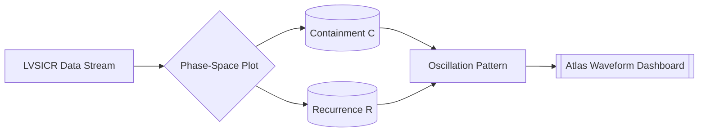

# 🗺️ Containment Fingerprint Atlas — Visual Map of Repeated Glitches  
**First created:** 2025-10-10 | **Last updated:** 2025-10-20  
*Visualising error recurrence as infrastructure map.*

---

## 🧭 Orientation  
The *Containment Fingerprint Atlas* aggregates systemic leakage across time, platform, and contractor boundary.  
Where isolated anomalies are logged elsewhere, this node functions as a **cartographic index** — turning those anomalies into **visual recurrence maps**.  
Each glitch, delay, or audit flag becomes a coordinate in a wider geography of failure.  

By treating repetition as **signal rather than noise**, the Atlas reveals *containment drift*: the points where systems reopen along the same seam.  

---

## 🧮 1. Temporal Cartography — Tracking Drift Over Time  
Each LVSICR record becomes a coordinate in time, and the Atlas functions as a **dynamic topography of system memory**.  
Rather than a static log, it is a **moving landscape**, showing how risk signals, containment reactions, and recurrence patterns evolve.  

- **X-axis:** time (log date, audit cycle, or incident wave).  
- **Y-axis:** containment depth (from detection to denial).  
- **Z-layer / colour:** recurrence intensity, measured by the *R* index.  

When plotted as a **temporal heatline**, analysts can observe:  
- *Trigger cascades* — multiple subsystems responding to the same event with delay or amplification.  
- *Containment lag* — institutional reaction trailing public visibility by several cycles.  
- *Signature drift* — identical patterns re-emerging with shifted metadata (new vendor, same bug).  

In long-duration plots, these traces resemble geological strata — the **sedimented memory of infrastructure under stress**.

---

## 🧭 2. Threat Mutation and Behavioural Drift  
Every threat indicator (LVSICR code or cluster) mutates as containment strategies evolve.  
An initial *L2V1S1I1C1R1* (localised breach) may, through replication or suppression, progress to *L2V2S2I2C2R3*.  
This shift signals **adaptive containment failure** — the system’s immune response generating instability.  

The Atlas renders these as **chronological threads** — “storylines of containment” — allowing analysts to reconstruct how an incident evolved through its ecosystem.  
When visualised, they appear as **braided temporal lines**, converging where multiple subsystems share logic or vendor spine.

---

## ⚙️ 3. Data Recording & Management Protocols  

| Field | Description | Example |
|-------|--------------|----------|
| **Event ID** | Unique hash of leak event | `POL-LKS-2025-017` |
| **Timestamp (UTC)** | Event initiation / detection | `2025-07-18T09:45Z` |
| **Actor / Vendor** | Contractor or platform | `Capita / AWS GovCloud` |
| **System Layer** | Domain of impact | `Health / API Exchange` |
| **LVSICR Code** | Six-axis behavioural signature | `L2V1S1I2C1R2` |
| **Recurrence Index** | Temporal recurrence value | `R2.7` |
| **Containment Action** | Type + date of intervention | `Policy rewrite, 2025-08-02` |
| **Drift Tag** | Signature drift link | `#DRIFT-A12` |

Entries populate a **time-aware relational graph**, enabling detection of:  
- **Recurrence density clusters**  
- **Containment fatigue curves**  
- **Rebound velocities** (time between containment and relapse)

---

## 🧬 4. LVSICR Coding System — Behavioural Grammar of Leaks  
The Atlas uses the [📡 LVSICR System](../🧼_System_Leakage_Signatures/📡_lvsicr_leak_vector_spread_intent_containment_recurrence.md) as its analytical spine.

| Axis | Meaning | Function | Scale (0–3) |
|------|----------|-----------|-------------|
| **L** | Leak | Primary source / trigger | Dormant → Systemic |
| **V** | Vector | Transmission path | Local → Global |
| **S** | Spread | Systemic reach | Limited → Widespread |
| **I** | Intent | Motivation / directionality | Accidental → Directed |
| **C** | Containment | Institutional response | Passive → Suppressive |
| **R** | Recurrence | Temporal memory | None → Chronic |

Each axis has four stages (0–3), forming a **12-digit signature** such as  
`L2 V1 S1 I2 C1 R2` — a concise expression of behaviour over time.

Repeated *C3* or *R3* codes signal **containment exhaustion** and trigger flagging in the Atlas dashboard.  

---

## 📊 5. Visualisation Methods — Seeing the Invisible  

### 🕸 5.1 Recurrence Heatmaps  
Aggregate all events with *R ≥ 2*; render recurrence frequency per quarter as colour intensity; overlay vendor contours to reveal contagion.  

### ⏱ 5.2 Timeline Threads  
Map LVSICR sequences as temporal chains:  
```text
L2V1S1I1C1R1 → L2V1S2I1C2R2 → L2V2S2I2C3R3
```  
Progression from local to systemic displays **drift curvature** — escalation speed and depth.

### 🗺 5.3 Behavioural Fingerprints  
Six-spoke radar charts (L–V–S–I–C–R) show the proportional balance of each axis; over-time overlays reveal **rotational drift**.  

### 🪶 5.4 Composite Atlas Dashboards  
Interactive views merge all layers — scroll time horizontally, observe heat intensity vertically, and colour-code by vendor or policy family.

---

## 🌊 6. Oscillation Mapping — The ECG of Containment  
Containment systems pulse and relapse.  
Using **phase-space cartography**, the Atlas projects *Time*, *Containment (C)*, and *Recurrence (R)* onto a 2-D field — akin to an ECG for infrastructure.

### 🧭 Reading the Graph  
- **X-axis:** temporal flow  
- **Y-axis:** containment amplitude  
- **Line curvature:** pace of change  

**Wave forms:**  
- Smooth periodic = healthy recovery  
- Jagged loops = feedback recursion  
- Flatline = containment collapse  

Once trained, analysts can read institutional “arrhythmia” at a glance.  
Cross-sector synchronisation of oscillations indicates **policy resonance** or **shared vendor faults**.  



This transforms suppression telemetry into **audible rhythm** — governance as waveform.

---

## 🌡️ 7. Correlation Motion Heatmap — “Who Moves with Whom, When?”  
A correlation motion heatmap shows **synchrony** between organisational units or regions as containment severity changes **over time**.  
It visualises **co-movement**: shared shocks, vendor-linked failures, and policy resonance.

- **Signal:** correlation of *C* and *R* indices across a sliding time window.  
- **Axes:** cells/units on both sides; colour intensity = correlation strength.  
- **Motion:** as time advances, clusters bloom, fade, and realign — the motion itself tells the story.  

### Reading the Map
- Bright blocks → **shared behaviour** (vendor coupling, mirrored response).  
- Fading zones → **decoupling** or successful divergence.  
- Expanding clusters → **systemic contagion**.  
- Empty voids → **silence** or over-containment.  

---

## 🧩 8. Reading the Map — Literacy in Motion  
The **Correlation Motion Heatmap** looks complex at first glance. But complexity is the *point* — because governance is complex, and so are its pulse rhythms.  
Like an ECG, the map teaches the eye to distinguish *pattern from panic*. After a few viewings, analysts begin to feel where the system breathes.  

Each matrix cell is not a number; it’s a *relationship in motion* — a visual trace of how containment systems **co-oscillate, resonate, or decouple** over time.  
The goal is not to reduce the picture but to **train recognition**: to make recurrence and synchrony as instantly readable as a heartbeat monitor.  

### 🧭 Pattern Archetypes  

| Archetype | Visual Form | Meaning | Typical Context |
|------------|--------------|----------|-----------------|
| **Stable Synchrony** | Consistent bright block along the diagonal | Healthy coordination, proportional containment | Routine vendor updates or steady incident management |
| **Rebound Drift** | Correlation fades, then reignites in the same cluster | Latent instability, recurrence after partial suppression | Old issues resurfacing under new configurations |
| **Latent Contagion** | Distant off-diagonal cells light up together | Cross-sector coupling, shared dependency | Multi-vendor infrastructure sharing a data spine |
| **Cascade Bloom** | Rapid expansion of correlation across the matrix | Shock propagation, systemic event | Policy change, platform outage, mass disclosure |
| **Cold Patch** | Sudden dark void in a previously active area | Artificial dampening or over-containment | Censorship, data blackout, API shutdown |

### 🧠 Why It Works  
Humans are pattern learners. Once they’ve seen a few of these shapes, they can spot anomalies faster than code can.  
The Atlas doesn’t just show information — it builds *embodied perception* of systemic behaviour.  
It lets governance practitioners “feel” suppression the way a cardiologist feels arrhythmia or a pilot feels turbulence: not abstractly, but as **motion through time**.  

### 💡 Pedagogical Use  
For training and public literacy, the Atlas becomes a classroom instrument.  
In short sessions, participants can learn to:  
- Identify rhythmic stability vs chaotic recursion.  
- Recognise shared vendor drift through synchronous colour shifts.  
- Read *temporal texture* — how containment tightens, relaxes, or reverberates.  

After a few hours of guided reading, the once-opaque grid becomes intuitive.  
This is how a surveillance audit becomes **a literacy movement**: teaching people not just to react to governance data, but to *see it breathe*.  

---

## 🧬 9. Relation to Leak Pattern Taxonomy  
The Atlas draws from the [☔️ Leak Pattern Taxonomy](../🧼_System_Leakage_Signatures/☔️_leak_pattern_taxonomy.md), which defines *how* leaks form.  
The Atlas shows *where and when* they reappear.  
Together they establish an **ecology of malfunction**, closing the loop between definition and data.

---

## 🌌 Constellations  
🗺️ 🧼 🧿 🔁 — visualisation, pattern, evidence, mapping.  
A diagnostic compass for system memory and containment rhythm.  

---

## ✨ Stardust  
visualisation, mapping, leak pattern, fingerprint, containment atlas, recurrence, LVSICR, heatmap, oscillation, systemic failure, phase-space, correlation motion, literacy  

---

## 🏮 Footer  
*🗺️ Containment Fingerprint Atlas — Visual Map of Repeated Glitches* is a living node of the Polaris Protocol.  
It converts anomalies into cartography — an ECG of suppression and release.  

> 📡 Cross-references:
> 
> - [📡 LVSICR System](./📡_lvsicr_leak_vector_spread_intent_containment_recurrence.md)  
> - [☔️ Leak Pattern Taxonomy](./☔️_leak_pattern_taxonomy.md)  
> - [🔁 Cross-System Echoes](./🔁_cross_system_echoes_shared_vendor_anomalies.md)  
> - [🧾 Leak Archive Protocol](./🧾_leak_archive_protocol_secure_collection_and_annotation_method.md)  
> - [📊 Risk Scoring Architectures](../Big_Picture_Protocols/📊_risk_scoring_architectures_how_numbers_decide.md)  

*Survivor authorship is sovereign. Containment is never neutral.*  
_Last updated: 2025-10-20_
