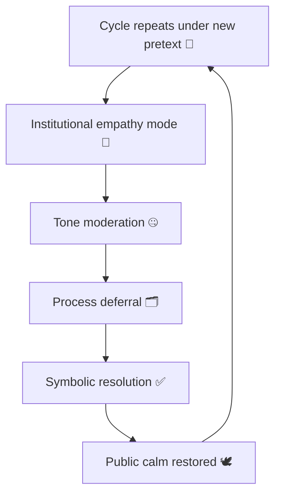

# 🤝 Polite Containment — How Civility Becomes a Control Mechanism  
**First created:** 2025-11-11 | **Last updated:** 2025-12-13  
*When manners manage dissent.*  

---

## 🧭 Orientation  

Institutions rarely suppress through aggression alone.  
They often use *civility* — the language of reasonableness, procedure, and tone — to mute criticism while preserving moral superiority.  
This is **polite containment**: the choreography of control performed as collegiality.

---

## ⚖️ Definition  

> **Polite containment** occurs when decorum, empathy, or procedural tone  
> are deployed to neutralise challenge rather than resolve it.

Rather than reject complaints outright, systems *invite dialogue* under pre-set conditions.  
The script looks empathetic but functions to reassert hierarchy.

---

## 🧩 Operating Pattern  

| Stage | Institutional Move | Apparent Intent | Real Effect |
|:------|:--------------------|:----------------|:-------------|
| **1️⃣ Invitation** | “We’d like to have a constructive conversation.” | Openness | Redirects critique into controlled channel. |
| **2️⃣ Tone framing** | “We understand your passion, but let’s stay calm.” | De-escalation | Codes emotion as unprofessional. |
| **3️⃣ Process emphasis** | “We must follow due procedure.” | Fairness | Buys time and exhausts dissenters. |
| **4️⃣ Empathy theatre** | “We hear you; we value your experience.” | Compassion | Substitutes performance for action. |
| **5️⃣ Closure signal** | “We’ll take this feedback on board.” | Resolution | Ends loop with no measurable change. |

Politeness sustains the appearance of engagement while protecting reputational equilibrium.

---

## 🧮 Containment Flow  

---

## 🪞 Cultural Dynamics  

- **Empathy as anaesthetic:** care language defuses urgency.  
- **Professionalism as moral weapon:** tone policing disguised as decorum.  
- **“Constructive” redefinition:** criticism reframed as dysfunction.  
- **Civility as privilege:** only some speakers are allowed emotion.  

---

## 🧰 Governance Implications  

| Domain | Pattern | Example |
|:--------|:---------|:---------|
| **Safeguarding** | Survivor testimony repackaged as “lived experience input.” | Trauma depoliticised into training content. |
| **Academia** | Formal reviews emphasise collegiality over correction. | Whistleblowers coded as unprofessional. |
| **Public Bodies** | Consultation frameworks limit vocabulary to “appropriate” tone. | Anger marked as aggression. |

---

## 🧱 Counter-Strategies  

1. **Document tone policing** — record instances where civility trumps content.  
2. **Refuse empathy theatre** — ask for action, not sympathy.  
3. **Disaggregate tone from truth** — insist that emotion is data.  
4. **Mirror the frame** — use institutional politeness to expose its logic.  

---

## 🌌 Constellations  

🤝 🎭 🪞 🧩  

Polite Containment bridges **Narrative Management** and **Containment Logic**, showing how reputational order is preserved through style rather than substance.

---

## ✨ Stardust  

polite containment, civility politics, tone policing, institutional empathy, procedural delay, reputational management, narrative governance, survivor credibility, discourse ethics, containment logic

---

## 🏮 Footer  

*🤝 Polite Containment — How Civility Becomes a Control Mechanism* is a living node of the Polaris Protocol.  
It traces how language and manners become governance devices, maintaining containment even in moments of apparent compassion.

> 📡 Cross-references:  
> - [🎭 Reputation as Governance — How Institutions Script Their Own Credibility]  
> - [🪞 Narrative Drift — When Systems Inherit the Wrong Story]  
> - [💄 Hypothetical Case: Disinformation and Narrative Control]  

*Survivor authorship is sovereign. Containment is never neutral.*  

_Last updated: 2025-12-13_
