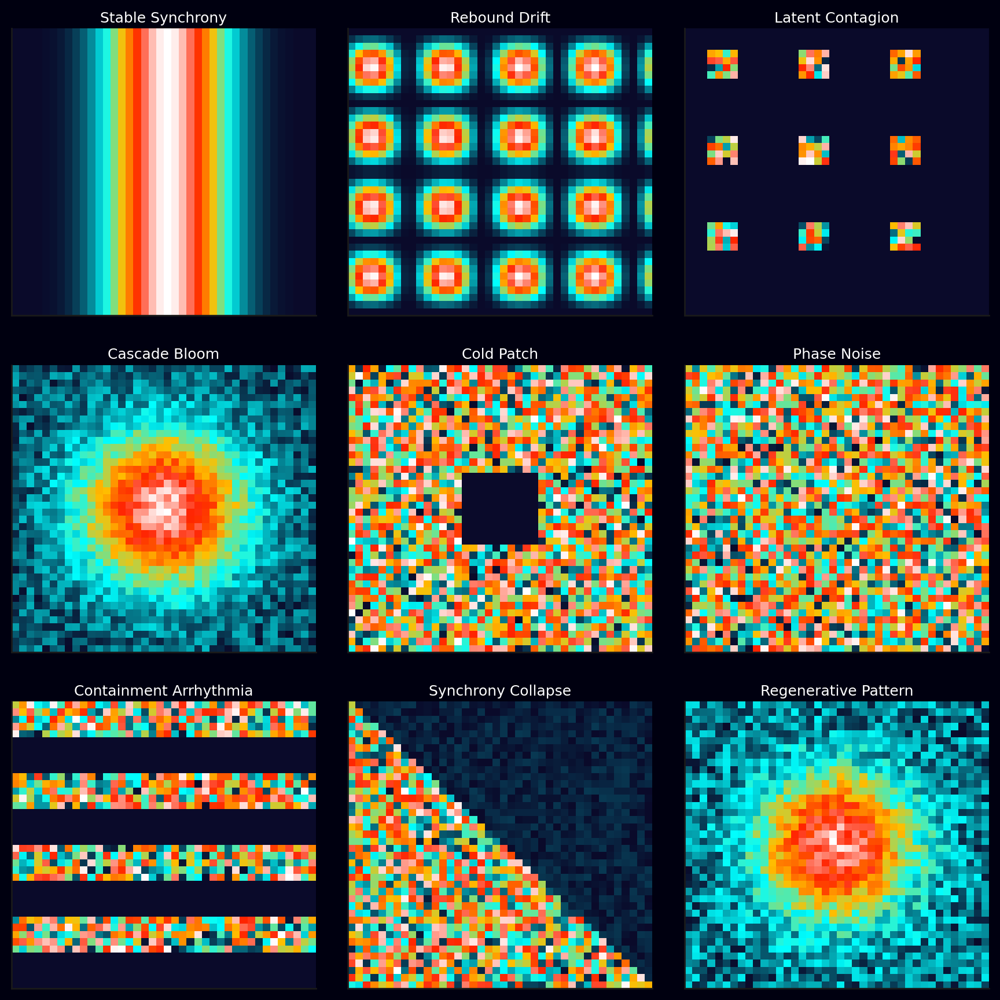

# 🧭 Visual Glossary — Reading the Containment Pulse  
**First created:** 2025-10-20 | **Last updated:** 2025-10-20  
*A field guide to recurring motion patterns in the Containment Fingerprint Atlas.*

---

## 📸 Containment Literacy Key  

  

*Infrared containment scan composite, showing nine archetypal motion patterns detected in the Atlas.*  

This image serves as a **visual key** for reading the *Containment Fingerprint Atlas*.  
Each tile represents a behavioural rhythm observed across governance infrastructures: synchrony, drift, contagion, bloom, silence, noise, arrhythmia, collapse, and regeneration.  
The infrared palette encodes **system temperature** — cool blues for stability, warm ambers for escalation, white for overload.  

Gridlines mark correlation axes; brightness marks synchrony strength.  
Once trained, the eye learns these shapes as fluently as ECG traces — recognising the pulse of containment in motion.  
This is the **visual literacy layer** of Polaris: the moment where anomaly detection becomes embodied pattern recognition.  

---

## 🧩 Orientation  
These visual archetypes help new readers interpret the Atlas’s **correlation motion heatmaps** and **phase-space oscillation plots**.  
Each one represents a recurring rhythm within governance systems — the behavioural fingerprints of suppression and recurrence.  
They are not static states, but *temporal moods*: each can evolve into another under pressure.  

---

## 🩺 1. Stable Synchrony  
**Signature:** a bright diagonal block holding steady across frames.  
**Meaning:** proportional containment and coordinated governance.  
**Interpretation:** the system is responding coherently; containment is working without overreach.  
**Risk:** complacency — stability can mask slow data ossification.  

---

## 🌪️ 2. Rebound Drift  
**Signature:** brightness fades, then re-ignites in the same area.  
**Meaning:** partial containment followed by relapse.  
**Interpretation:** suppression dampened visibility but not the underlying fault; identical pattern resurfaces under a new name or vendor.  
**Risk:** chronic recurrence, version-looping, reputational fatigue.  

---

## 🧬 3. Latent Contagion  
**Signature:** non-adjacent cells light up in synchrony.  
**Meaning:** cross-sector or cross-vendor coupling.  
**Interpretation:** an invisible bridge — shared API, database, or compliance logic — is transmitting the disturbance.  
**Risk:** systemic contagion; multiple agencies repeating the same error cascade.  

---

## 🌸 4. Cascade Bloom  
**Signature:** sudden spreading brightness across much of the matrix.  
**Meaning:** shock propagation or major policy event.  
**Interpretation:** one domain’s crisis ripples through dependent systems; correlations bloom then decay.  
**Risk:** institutional overreaction, emergency protocols rewriting baselines.  

---

## 🧊 5. Cold Patch  
**Signature:** abrupt dark void where colour previously persisted.  
**Meaning:** suppression surge or data blackout.  
**Interpretation:** visibility itself was contained — data access throttled, logs purged, conversation muted.  
**Risk:** false impression of calm; unseen escalation elsewhere.  

---

## 🕸️ 6. Phase Noise  
**Signature:** fine-grain speckling across the whole matrix.  
**Meaning:** background chatter, minor asynchronous noise.  
**Interpretation:** natural variability; healthy dynamism at low amplitude.  
**Risk:** misclassification — noise mistaken for signal can lead to unnecessary intervention.  

---

## 🩻 7. Containment Arrhythmia  
**Signature:** alternating bursts and silences in oscillation plots.  
**Meaning:** governance response alternating between over- and under-containment.  
**Interpretation:** system cannot find equilibrium; decision-making oscillates with external sentiment.  
**Risk:** resource exhaustion, policy flip-flop, or public trust decay.  

---

## 🌊 8. Synchrony Collapse  
**Signature:** diagonal disintegrates; correlations scatter.  
**Meaning:** failure of coordination or competing logics.  
**Interpretation:** institutions diverge — same data, different truths.  
**Risk:** fragmentation; recovery requires re-alignment of standards and trust anchors.  

---

## 🔬 9. Regenerative Pattern  
**Signature:** gradual re-formation of coherent clusters after collapse.  
**Meaning:** adaptive learning or structural repair.  
**Interpretation:** governance begins to re-synchronise after disruption; new equilibrium forming.  
**Risk:** premature closure; unresolved fragments may calcify as hidden technical debt.  

---

## 🌌 Constellations  
🗺️ 🧼 🩺 🌊 — motion, rhythm, pattern, pedagogy.  
A companion map for learning to read the pulse of containment.  

---

## ✨ Stardust  
training, glossary, containment patterns, oscillation, synchrony, contagion, drift, bloom, governance literacy  

---

## 🏮 Footer  
*🧭 Visual Glossary — Reading the Containment Pulse* is a pedagogical annex of the Polaris Protocol.  
It teaches the visual language of the Atlas — how to recognise governance not as static structure, but as living motion.  

> 📡 Cross-references:
> 
> - [🗺️ Containment Fingerprint Atlas](./🗺️_containment_fingerprint_atlas_visual_map_of_repeated_glitches.md)  
> - [🌡️ Correlation Motion Heatmap Section](./🗺️_containment_fingerprint_atlas_visual_map_of_repeated_glitches.md#🌡️-7-correlation-motion-heatmap--who-moves-with-whom-when)  
> - [📡 LVSICR System](../🧼_System_Leakage_Signatures/📡_lvsicr_leak_vector_spread_intent_containment_recurrence.md)  

*Survivor authorship is sovereign. Containment is never neutral.*  
_Last updated: 2025-10-20_  
