# ⚖️ DOB as Password  
**First created:** 2025-09-07 | **Last updated:** 2025-10-20  
*How date of birth functions like a banking password — because it can be used to unlock or back-calculate unique identifiers.*  

---

## 📑 Sections  
1. [Principle](#1-principle)  
2. [Why DOB Is Sensitive](#2-why-dob-is-sensitive)  
3. [Astrology as Demonstration](#3-astrology-as-demonstration)  
4. [Mermaid Flow](#4-mermaid-flow)  
5. [Closing Note](#5-closing-note)  

---

## 1. Principle  
DOB is often treated casually (forms, records, trivia), but it is **functionally equivalent to a password**:  
- It is unique per person.  
- It cannot be changed.  
- It links to multiple identity systems (banking, health, education).  
- Once disclosed, it allows inferences that collapse privacy.  

---

## 2. Why DOB Is Sensitive  
- **Banking & verification:** DOB is a standard security credential.  
- **Identity theft:** Paired with name/address, enables fraud.  
- **Profiling:** Insurance, health, marketing systems all hinge on age/DOB.  
- **Non-resettable:** Unlike a password, DOB cannot be changed if leaked.  

---

## 3. Astrology as Demonstration  
- Astrology charts use DOB (day + month + year, sometimes time/place).  
- With DOB → you can compute Moon sign & placements.  
- With placements → you can often back-calculate DOB (narrow down to exact day).  
- This makes DOB effectively a **one-way key**: once known, it unlocks unique identifiers; once seeded, it risks re-identification.  

---

## 4. Mermaid Flow  

```mermaid
graph TD
    DOB["📅 Date of Birth"]:::core
    BANK["🏦 Banking / Security Qs"]:::risk
    IDTHEFT["🕵️ Identity Theft"]:::risk
    ASTRO["🌙 Astrology Placements"]:::neutral
    UNI["🧩 Unique Identifier"]:::core

    DOB --> BANK
    DOB --> IDTHEFT
    DOB --> ASTRO
    ASTRO --> UNI
    UNI -->|Back-calc possible| DOB

    classDef core fill:#e6f0ff,stroke:#1f66ff,stroke-width:2px,color:#000;
    classDef risk fill:#ffe2e2,stroke:#cc0000,stroke-width:2px,color:#000;
    classDef neutral fill:#fff7d6,stroke:#e6b800,stroke-width:2px,color:#000;
```

---

## 5. Closing Note  
DOB is not trivia. It is a **high-value credential**.  
- In banking: a security check.  
- In profiling: an anchor for risk categories.  
- In harassment: a weapon when paired with synthetic narratives.  

*Treat DOB as you would a password: never casually disclosed, always protected. Once exposed, it cannot be reset.*  

---

## 🏮 Footer  
*⚖️ DOB as Password* is a living node of the Polaris Protocol.  
It frames date of birth as a credential equivalent to a password — demonstrating how astrology and identity systems both collapse into risk once DOB is exposed.  

*Survivor authorship is sovereign. Containment is never neutral.*  

_Last updated: 2025-10-20_  
