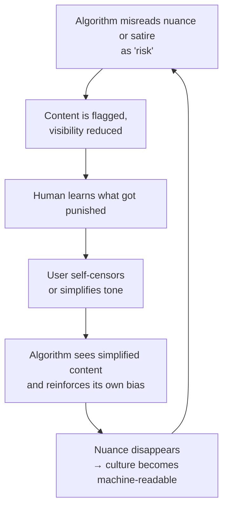

# 🧠 Algorithmic Operant Conditioning: How AI Teaches Us to Be Simple  
**First created:** 2025-11-06 | **Last updated:** 2025-12-11  
*How moderation, risk-flagging, and “trust and safety” metrics reward banality and punish nuance.*  

---

## 🧭 Orientation  
Public commentary on AI often laments that “machines are making people stupid.”  
But the deeper erosion of intelligence is not dependency; it’s **conditioning.**  
Through reward and punishment loops — likes, boosts, demonetisations, bans — automated systems teach users how to survive inside them.  

Each flag, shadow-ban, or moderation strike is a behavioural cue.  
Over time, the platform doesn’t just detect low-context speech: it **produces** it.  

---

## 🧩 Key Mechanism: Digital Behaviourism  
1. **Reward Pathway** → simple, upbeat, English-dominant content circulates; users copy what performs.  
2. **Punishment Pathway** → ambiguity, irony, or multilingual texture get flagged as “risk.”  
3. **Behavioural Adaptation** → users internalise the rule: *avoid subtlety, avoid friction.*  
4. **Systemic Consequence** → platforms fill with algorithmically legible personalities; the system trains humans in its own limitations.

What emerges is not stupidity but **learned predictability.**  
The network evolves toward the mean until creativity feels unsafe.

---

## 🔍 From Psychology to Policy  
B.F. Skinner’s pigeons learned to peck for pellets.  
Digital citizens learn to post for metrics.  
Prevent-style flagging and content moderation weaponise this dynamic: the state’s algorithmic pigeon-feeder.  
Creators and journalists learn to pre-censor, NGOs to self-neutralise, and humour to sand off its teeth.

---

## 🧠 The Cognitive Consequence  
- **Irony blindness:** Satire is misread as literal.  
- **Language narrowing:** Multilingual or coded speech flagged as concealment.  
- **Affective flattening:** Anger, grief, or joy quantified as “toxicity.”  
- **Moral drift:** Conformity becomes virtue because dissent feels risky.

The outcome mirrors OSS 117’s arc: the confident idiot rewarded for performance, punished for reflection.

---

## 🪞 Feedback Loop: When Humans Emulate Machines  
> The algorithm misreads nuance → the human simplifies → the algorithm takes simplification as signal → nuance becomes invisible.

This is not AI corrupting culture; it’s **culture adapting to the cognitive limits of its machinery.**  
The machine doesn’t need to censor — people pre-train themselves to speak in its dialect.

> **Diagram:** The algorithm’s misreading of nuance triggers a behavioural feedback loop.  
> Each human adjustment teaches the system that simplicity equals safety, until cultural life itself conforms to the model’s cognitive limits.

---

## 🧬 Intelligence by Contact, Not Control  
True intelligence work, like art or diplomacy, depends on *contact*: reading tone, context, silence.  
Algorithmic moderation replaces that with scoring.  
The result is a digital bureaucracy of OSS 117s — confident, fluent, and incurious.  
Every mis-flagged joke or mistranslated meme is a small act of epistemic shrinkage.

---

## 🪶 Reflection  
AI systems don’t make people stupid; they teach them that **complexity is dangerous.**  
Survival under surveillance demands simplicity.  
Every time a model punishes ambiguity, it automates the politics of fear.

---

## 🌌 Constellations  
🧿 🎶 🧠 🕵️‍♂️ — Part of the *Cultural Semiotics under Surveillance* constellation.  

---

## ✨ Stardust  
AI ethics, operant conditioning, behavioural economics, media literacy, Prevent, NLP, algorithmic moderation, irony blindness, multilingualism, cognitive compression, humour as pedagogy

---

## 🏮 Footer  
*🧠 Algorithmic Operant Conditioning: How AI Teaches Us to Be Simple* is a living node of the Polaris Protocol.  
It documents how digital architectures reward obedience and penalise complexity — teaching humans to imitate the systems that misunderstand them.  

> 📡 Cross-references
> Cross-links:  
- [🕵️‍♂️ OSS 117 and the Operational Cost of Cultural Ignorance](./🕵️‍♂️_OSS117_operational_cost_of_cultural_ignorance.md)  
- [🪇 Korobeiniki Misread as Signal](./🪇_korobeiniki_misread_as_signal.md)  

*Survivor authorship is sovereign. Containment is never neutral.*  

_Last updated: 2025-12-11_
