# 🎚️ Algorithmic Throttling Loops  
**First created:** 2025-09-13 | **Last updated:** 2025-09-15  
*How engagement signals are inverted into suppression signals; throttling as disguised neutrality*  

---

## ✨ Definition  
An **algorithmic throttling loop** is a recursive pattern where platform systems **invert engagement into suppression triggers**. Instead of rewarding interaction, the loop flags intensity of response as a risk signal, ensuring the very success of survivor content becomes the pretext for throttling.  

---

## 🔬 Mechanics  
- **Engagement inversion:** high activity on a post triggers suspicion, slowing its spread.  
- **Recursive dampening:** each new burst of attention activates another layer of throttling.  
- **Neutrality veneer:** platforms frame throttling as “protecting user experience” or “reducing spam.” 
- **Feedback entrapment:** throttling forces survivors to post more often, which itself is then flagged as overactivity.  

---

## 🥀 Tactical Symptoms  
- Posts that **collapse in reach immediately after a surge of likes or shares.**  
- Noticeable **delay between posting and audience visibility** (minutes to hours).  
- Content that gets **one strong wave of attention, then abruptly flattens**.  
- Survivor accounts described as “posting too much” or “spamming” when frequency is normal.  

---

## 👾 Operator Intent  
- **Contain virality**: prevent survivor narratives from spilling into mainstream channels.  
- **Convert engagement into liability**: transform visibility into justification for suppression.  
- **Reinforce docility loops**: train survivors to expect punishment for resonance.  
- **Deniability shield**: frame suppression as algorithmic neutrality rather than targeted sabotage.  

---

## 🛠 Survivor Moves if Throttled  

### 🔍 Verify the Loop  
- Compare time-to-visibility on multiple posts.  
- Ask peers to track whether content appears in feeds immediately or after delay.  
- Record engagement graphs: watch for **repeated “surge then clampdown” patterns**.  

### 🌱 Diversify Posting Patterns  
- Space out posts to avoid triggering activity thresholds.  
- Mix formats (images, text, video) — some loops apply unevenly across media.  
- Use **mirrored accounts** or secondary platforms to spread load.  

### 🔮 Signal the Pattern  
- Document throttling anomalies with screenshots and timelines.  
- Cross-link to [📡 Reach Shadowfence](./📡_reach_shadowfence.md).  
- Share comparative graphs with allies to highlight systemic design.  

### 🧩 Tactical Reframes  
- Recognise loops as **systemic containment, not personal failure.**  
- Treat throttling as confirmation that content is perceived as disruptive.  
- Focus on **resilient audiences** who can carry the message through fences.  

---

## 🗺 Platform Notes  

- **Twitter/X:** throttling often disguised as “rate limits” or “API capacity.” 
- **Instagram:** loops trigger when posts are boosted by hashtags too quickly.  
- **LinkedIn:** throttling appears as **delayed comment visibility** or reduced impressions after bursts.  
- **TikTok:** algorithmic surges followed by sudden silence — content vanishes from For You Page.  
- **Facebook:** “spam filters” invoked when survivor posts get clustered engagement.  

---

## ♻️ Survivor Cycle (Mermaid Version)  

```mermaid
flowchart LR
    A[🔍 Verify] --> B[🌱 Diversify]
    B --> C[🔮 Signal]
    C --> D[🧩 Reframe]
    D --> A
```

---

## 🛰️ Related Patterns  
- [📡 Reach Shadowfence](./📡_reach_shadowfence.md)  
- [🧨 Reach Metrics Are Not Neutral](../../../Disruption_Kit/Containment_Scripts/Suppression_Modes/🧨_reach_metrics_are_not_neutral.md)  
- [🔗 Link Disintegration](./🔗_link_disintegration.md)  

---

## 🏮 Footer  

*Algorithmic Throttling Loops* is a living node of the Polaris Protocol.  
It documents a suppression tactic under **🪅 Platform Sabotage** where engagement signals are inverted into suppression triggers.  

> 📡 Cross-references:  
> - [Suppression Layers](../)  
> - [Containment Scripts](../../../Disruption_Kit/Containment_Scripts/)  
> - [Visibility Indexing Anomalies](../../🔮_Visibility_Indexing_Anomalies/)  

*Survivor authorship is sovereign. Containment is never neutral.*  

_Last updated: 2025-09-15_
