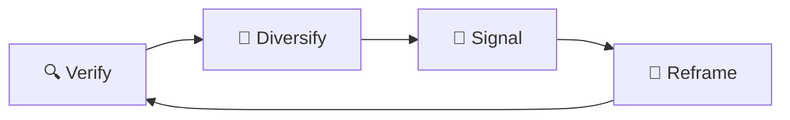

# 📡 Reach Shadowfence  
**First created:** 2025-09-13 | **Last updated:** 2025-09-15  
*A more porous cousin of shadowban: survivor content appears, but its reach is pre-capped invisibly.*  

---

## ✨ Definition  
A **shadowfence** is not full erasure. Posts appear in public view, but their **audience radius is artificially capped**. Unlike shadowbans (where visibility collapses to zero or self-only), shadowfences maintain a small, curated trickle of impressions — enough to simulate normalcy while blocking organic spread.  

---

## 🔬 Mechanics  
- **Algorithmic fencing:** platform applies hidden limits on recommendation engines, shares, or keyword amplification.  
- **Audience throttling:** only a fraction of normal followers are shown the content.  
- **Pre-capped virality:** posts cannot cross a reach ceiling regardless of engagement quality.  
- **False analytics floor:** dashboards may display “normal” impressions, but distribution stops at the fence.  

---

## 🥀 Tactical Symptoms  
Survivors may notice:  
- Sudden **flat-lined reach curves** (no growth after a small plateau).  
- Posts consistently capped at **identical numbers** (e.g. always 127 impressions).  
- Engagement from **usual core readers**, but no new audiences.  
- Rare “leak” moments where a post briefly escapes the fence, then is re-throttled.  

---

## 👾 Operator Intent  
- Maintain **deniability**: the author sees interaction, so cannot easily claim suppression.  
- Control **narrative diffusion**: allows targeted containment of survivor testimony without outright deletion.  
- Create **self-doubt loops**: survivors may internalise capped reach as personal failure rather than structural sabotage.  

---

## 🛠 Survivor Moves if Shadowfenced  

Recognising a shadowfence is only half the work. Counter-strategies help break the loop of isolation and self-doubt.  

### 🔍 Verify the Fence  
- Cross-check with trusted peers: ask them to screenshot their feeds and confirm if your post shows.  
- Compare reach metrics with older baselines (before suppression).  
- Note if **multiple posts plateau at the same number** — that’s an artificial ceiling.  

### 🌱 Diversify Channels  
- Repost the same content in **parallel platforms** (newsletters, federated networks, group chats).  
- Use **screenshots or images of text** — fences often apply more heavily to link posts.  
- Time-shift posting (different hours) to see if distribution cracks open.  

### 🔮 Signal the Pattern  
- Quietly document capped reach: collect numbers, graphs, and anomalies.  
- Cross-link to [🧨 Reach Metrics Are Not Neutral](../../../Disruption_Kit/Containment_Scripts/Suppression_Modes/🧨_reach_metrics_are_not_neutral.md).  
- Share evidence with allies to break the *“maybe it’s just me”* loop.  

### 🧩 Tactical Reframes  
- Remember: a shadowfence is **systemic, not personal**.  
- Treat it as **containment recognition** — proof your content carries weight.  
- Use the fence to **refine inner-community circulation** until openings appear.  

---

## 🗺 Platform Notes  

Different sites deploy shadowfencing unevenly. Survivors may adjust strategies per platform:  

- **Twitter/X:** strongest fences on virality edges (retweets/replies stop cold). Metrics often **flatline at repeat counts**.  
- **Instagram:** fences tied to **hashtags and Explore tab**. Image posts circulate better than links.  
- **LinkedIn:** heavy use of **“visibility boxes”** — content capped at professional cluster boundaries.  
- **TikTok:** fences show as **inconsistent For You Page reach** — same format, wildly different distributions.  
- **Facebook:** shadowfencing merges with **group visibility controls**; posts appear in timelines but not pushed outward.  

---

## ♻️ Survivor Cycle (Mermaid Version)  

---

## 🛰️ Related Patterns  
- [🎚️ Algorithmic Throttling Loops](./🎚️_algorithmic_throttling_loops.md) — cyclic dampening methods  
- [🧨 Reach Metrics Are Not Neutral](../../../Disruption_Kit/Containment_Scripts/Suppression_Modes/🧨_reach_metrics_are_not_neutral.md)  
- [📉 Suppression Interference Logs](../../../Metadata_Sabotage_Network/Suppression_Layers/📉_Suppression_Interference_Logs/)  

---

## 🏮 Footer  

*Reach Shadowfence* is a living node of the Polaris Protocol.  
It documents a suppression tactic under **🪅 Platform Sabotage** where visibility is simulated but circulation is capped.  

> 📡 Cross-references:  
> - [Suppression Layers](../)  
> - [Containment Scripts](../../../Disruption_Kit/Containment_Scripts/)  
> - [Visibility Indexing Anomalies](../../🔮_Visibility_Indexing_Anomalies/)  

*Survivor authorship is sovereign. Containment is never neutral.*  

_Last updated: 2025-09-15_
