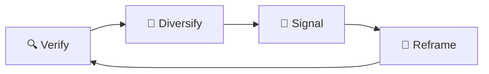

# 🔗 Link Disintegration  
**First created:** 2025-09-13 | **Last updated:** 2025-09-15  
*Subtle platform-side sabotage where survivor evidence links decay faster than normal*  

---

## ✨ Definition  
**Link disintegration** is the process by which evidence links — posts, archives, FOI disclosures, survivor blogs — **lose functionality or circulation prematurely**. While normal web rot happens over years, disintegration accelerates this timeline, targeting content that carries risk to institutional power.  

---

## 🔬 Mechanics  
- **Silent redirects:** links reroute to homepages or “content not found” without explanation.  
- **Accelerated expiry:** temporary or expiring links are shortened far beyond expected lifespans.  
- **Scraped preview removal:** thumbnails, titles, and metadata vanish, leaving unattractive bare URLs.  
- **Broken sharing loops:** links circulate once but then fail on subsequent attempts.  
- **Selective rot:** survivor links decay while mainstream or corporate links remain intact.  

---

## 🥀 Tactical Symptoms  
- Posts where **preview images disappear suddenly**, even though the content still exists.  
- Survivor archives that **work on direct paste**, but fail inside platform posts.  
- A link that used to resolve now produces **intermittent error codes**.  
- Content that **“fails to load” only in-app**, but works in an external browser.  

---

## 👾 Operator Intent  
- **Evidence containment:** prevent survivor documents from building persistence or credibility.  
- **Metadata erasure:** strip away the context that makes evidence searchable or shareable.  
- **Frustration loops:** wear down survivors who try repeatedly to circulate the same links.  
- **Historical amnesia:** accelerate the disappearance of politically inconvenient traces.  

---

## 🛠 Survivor Moves if Links Disintegrate  

### 🔍 Verify the Decay  
- Test links across devices and browsers.  
- Archive URLs at multiple services ([Wayback Machine](https://archive.org/web/), [Perma.cc](https://perma.cc/), local PDF).  
- Track when previews vanish — note timestamps for correlation with suppression events.  

### 🌱 Diversify Formats  
- Share **screenshots, text extracts, or PDFs** alongside links.  
- Use **link shorteners or redirect chains** to test which survive longest.  
- Convert vulnerable links into **images, zines, or offline packs** for community circulation.  

### 🔮 Signal the Pattern  
- Document failed previews and broken loops with screenshots.  
- Cross-link to [🖼️ Image Blur Sabotage](./🖼️_image_blur_sabotage.md) for related visual decay tactics.  
- Share compiled evidence with allies to show the sabotage is systemic, not isolated.  

### 🧩 Tactical Reframes  
- Treat link decay as a **signal of threat relevance**.  
- Use disintegration as a **cue to harden archives** before full erasure.  
- Remember: the faster they rot your links, the sharper your evidence edge.  

---

## 🗺 Platform Notes  

- **Twitter/X:** previews drop without notice; “unsafe link” warnings often appear only on survivor domains.  
- **Instagram:** external links mostly siloed to bios or stories; evidence circulation collapses fast.  
- **LinkedIn:** survivor documents often stripped of previews or flagged as “suspicious.”  
- **TikTok:** links frequently broken in comments, forcing screenshot-only circulation.  
- **Facebook:** silent redirect to “content unavailable” is common; group posts most vulnerable.  

---

## ♻️ Survivor Cycle (Mermaid Version)  

---

## 🛰️ Related Patterns  
- [🖼️ Image Blur Sabotage](./🖼️_image_blur_sabotage.md) — companion tactic targeting visuals  
- [🧵 Content Unravelling Protocols](./🧵_content_unravelling_protocols.md)  
- [🪞 Mirror Feedback Loops](./🪞_mirror_feedback_loops.md)  

---

## 🏮 Footer  

*Link Disintegration* is a living node of the Polaris Protocol.  
It documents a suppression tactic under **🪅 Platform Sabotage** where evidence links rot prematurely to limit circulation.  

> 📡 Cross-references:  
> - [Suppression Layers](../)  
> - [Containment Scripts](../../../Disruption_Kit/Containment_Scripts/)  
> - [Visibility Indexing Anomalies](../../🔮_Visibility_Indexing_Anomalies/)  

*Survivor authorship is sovereign. Containment is never neutral.*  

_Last updated: 2025-09-15_
